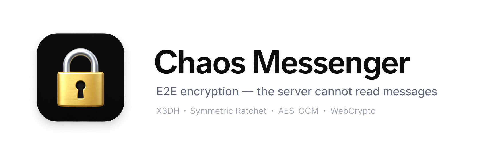
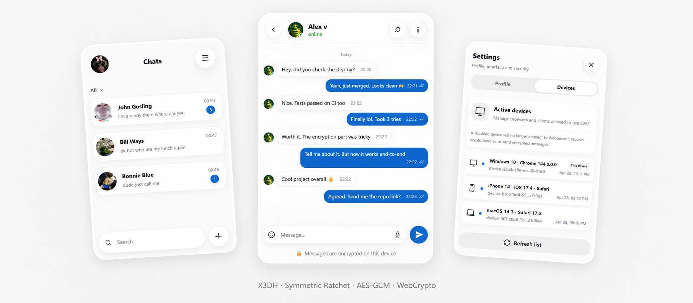
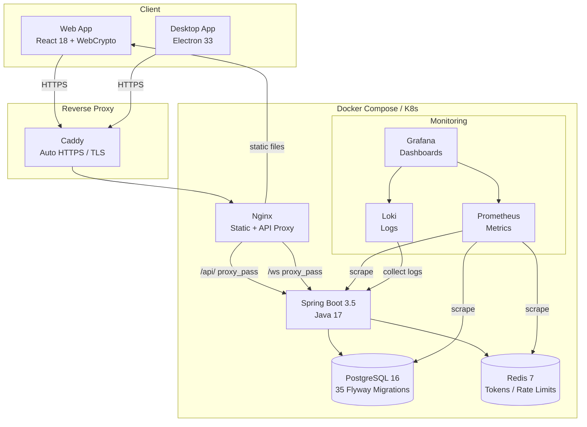
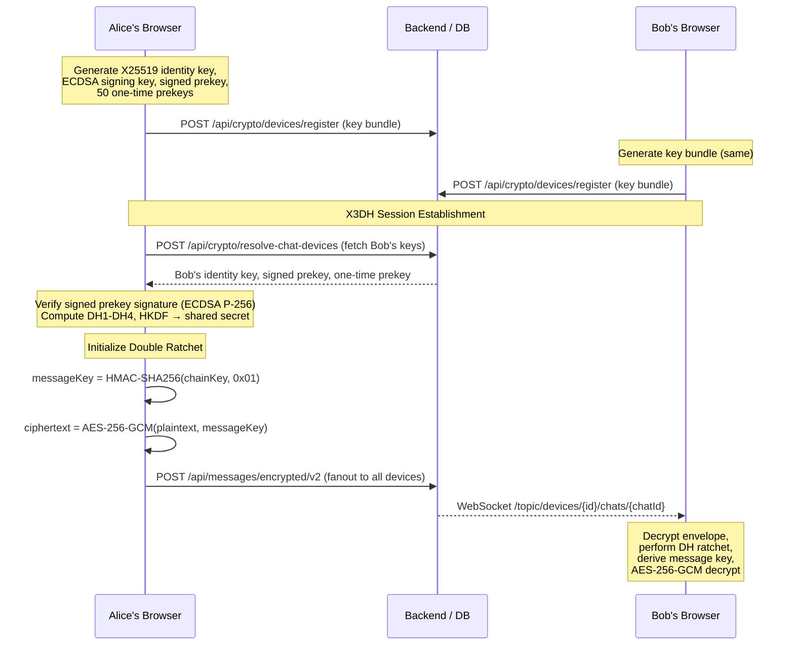
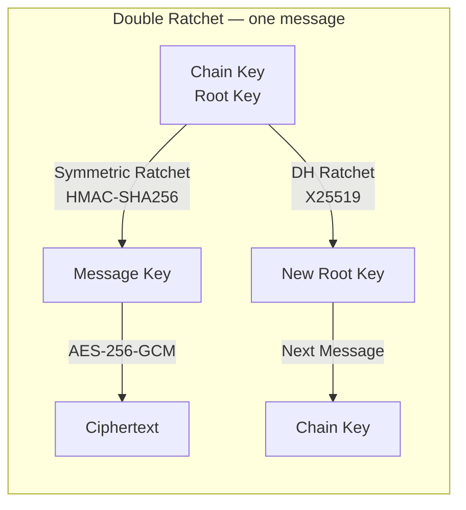
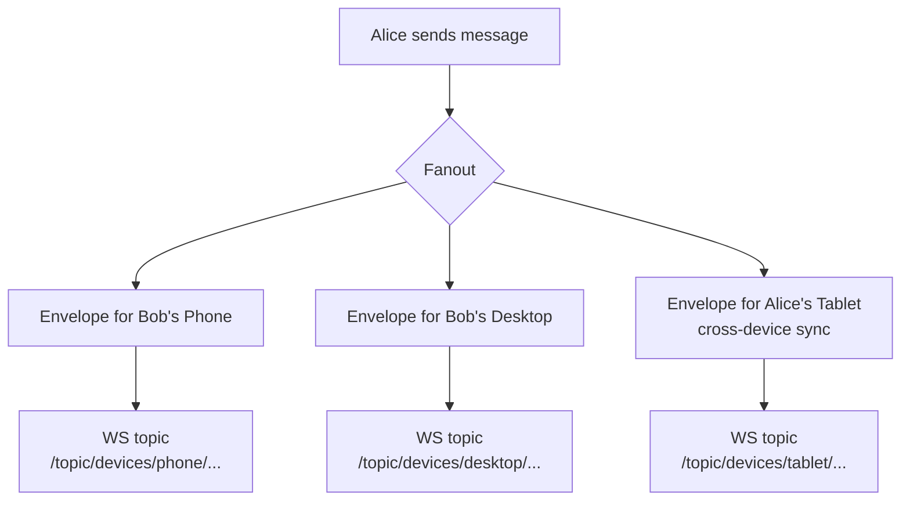
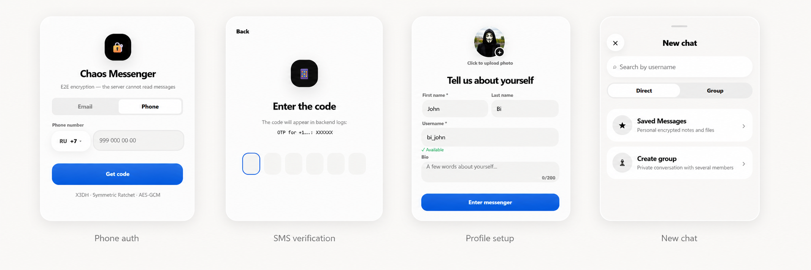
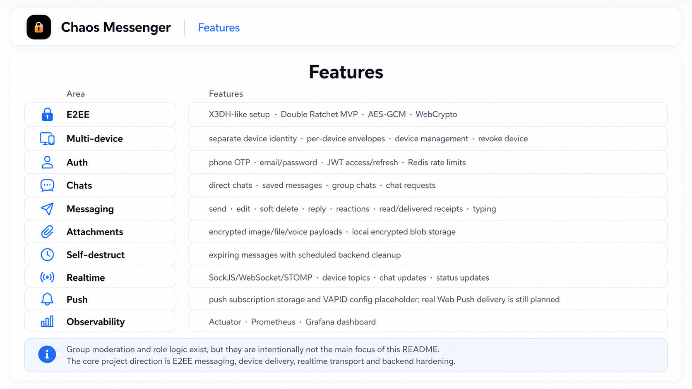
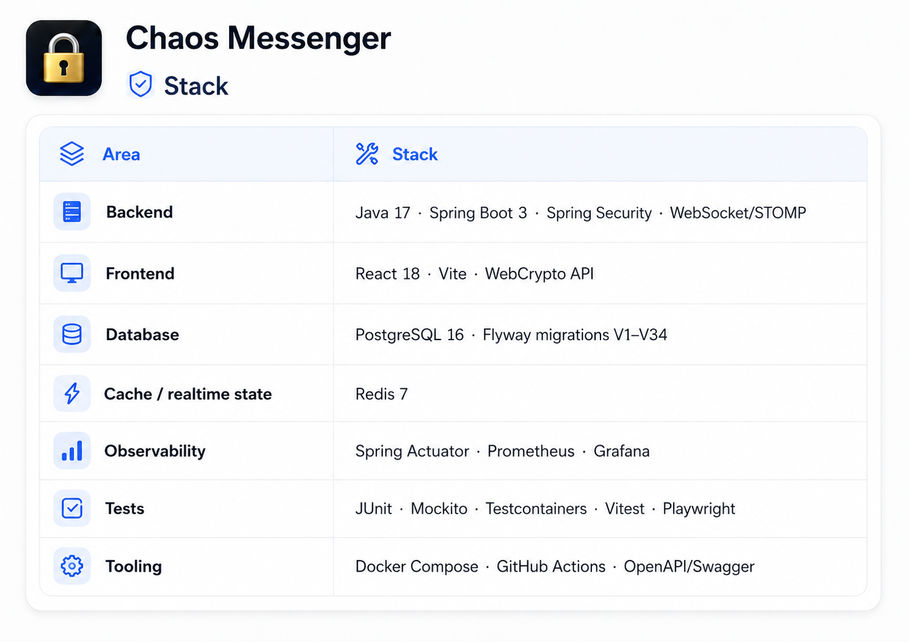

<div align="center">

[Русская версия](README.ru.md) · [Quick Setup](SETUP_COMPLETE.md) · [Security Audit](SECURITY_AUDIT_EN.md) · [Issues](https://github.com/vaazhen/chaos-e2ee-messenger/issues)

<br/>

[](https://github.com/vaazhen/chaos-e2ee-messenger/actions/workflows/ci.yml)
[](https://spring.io/projects/spring-boot)
[](https://react.dev/)
[](https://www.electronjs.org/)
[](https://openjdk.org/)
[](https://www.postgresql.org/)
[](https://redis.io/)
[](https://www.docker.com/)
[](k8s/)
[](LICENSE)

</div>

---

<div align="center">
  
</div>

<br/>

<p align="center">
  
</p>

<p align="center">
  <b>Full-stack E2EE messenger · X3DH + Double Ratchet · Multi-device · Spring Boot + React</b>
</p>

---

## Overview

**Chaos Messenger** is a production-ready end-to-end encrypted messenger. The browser encrypts every message using the Signal Protocol (X3DH + Double Ratchet), the backend routes encrypted envelopes per device, and the database stores only ciphertext. **The server never sees plaintext.**

```json
// What the server stores for each message
{ "ciphertext": "qzgHSg7z...", "nonce": "6KPcVjbp...", "messageIndex": 42 }
// What shows in the chat preview
{ "lastMessage": "[encrypted]" }
```

**Available as:** Web app · Desktop (Electron) for Windows/macOS/Linux · Docker Compose · Kubernetes

---

## Architecture



| Layer | Technology | Responsibility |
|-------|-----------|----------------|
| Client | React 18 + WebCrypto API | Key generation, X3DH session setup, Double Ratchet encrypt/decrypt |
| Desktop | Electron 33 | Native window, system tray, notifications, file dialogs, auto-update |
| Backend | Java 17 + Spring Boot 3.5 | Auth, device management, envelope storage, WebSocket routing |
| Database | PostgreSQL 16 + Flyway | Users, devices, chats, messages, envelopes, receipts (E2EE-blind) |
| Cache | Redis 7 | Refresh tokens, presence, unread counters, rate limits |
| Reverse Proxy | Caddy v2 | Automatic HTTPS (Let's Encrypt), TLS termination |
| Static Serving | Nginx | Frontend static files, API reverse proxy, WebSocket upgrade |
| Monitoring | Prometheus + Loki + Grafana | Metrics, logs, pre-built dashboards |

---

## Desktop App (Electron)

The desktop build wraps the React frontend in a native Chromium window:

- **System tray** — minimize to tray, background notifications
- **Native notifications** — OS-native message alerts
- **File dialogs** — native save/open for encrypted attachments
- **Single instance** — prevents duplicate app launches
- **Window state** — remembers position, size, maximized state
- **Cross-platform** — Windows (NSIS installer), macOS (DMG), Linux (AppImage)

### Build desktop app

```bash
cd frontend
npm install

# Development (hot reload in Electron window)
npm run electron:dev

# Production build for Windows
npm run electron:build:win

# Production build for current platform
npm run electron:build
```

The installer will be in `frontend/release/`.

---

## Features

| Category | Features |
|----------|----------|
| **E2EE** | X3DH session establishment · Double Ratchet per-message keys · AES-256-GCM · HKDF-SHA256 |
| **Multi-device** | Per-device identity keys · per-device encrypted envelopes · device management · revoke |
| **Auth** | Phone OTP · email/password · JWT access (24h) · refresh token rotation · rate limits |
| **Chats** | Direct chats · saved messages · groups (RBAC) · Instagram-style requests |
| **Messaging** | Send · edit · soft delete · reply · reactions · read/delivered receipts · typing indicators |
| **Attachments** | AES-256-GCM encrypted files · canvas-based image compression · voice messages |
| **Self-destruct** | Configurable TTL · scheduled cleanup · countdown UI |
| **Realtime** | SockJS / WebSocket / STOMP · device topics · chat list sync · presence heartbeats |
| **Calls** | WebRTC voice/video · screen sharing · STUN-based ICE |
| **Desktop** | Electron app · system tray · native notifications · file dialogs · single instance lock |
| **Monitoring** | Spring Actuator · Prometheus metrics · Loki logs · Grafana dashboard (pre-built) |
| **Deployment** | Docker Compose (13 services) · Kubernetes (Kustomize) · GitHub Actions CI/CD |

---

## Quick Start

### 1. Docker Compose (full production stack)

```bash
git clone https://github.com/vaazhen/chaos-e2ee-messenger.git
cd chaos-e2ee-messenger

# Create .env with required secrets
cat > .env << EOF
POSTGRES_PASSWORD=change_this_password_123
JWT_SECRET=change_this_jwt_secret_32_chars_min
CORS_ORIGINS=http://localhost
DOMAIN=localhost
GRAFANA_ADMIN_PASSWORD=change_admin_password
EOF

docker compose up -d
```

Open: [http://localhost](http://localhost)

### 2. Demo mode (test accounts)

Add to `.env`:
```
CHAOS_DEMO_ENABLED=true
```

Then restart and seed:
```bash
docker compose up -d
curl -s http://localhost/api/demo/seed
```

Test accounts:
| User | Phone | Code |
|------|-------|------|
| Alice | +19999999998 | 111111 |
| Bob | +19999999999 | 000000 |

### 3. Manual development

```bash
# 1. Infrastructure (PostgreSQL + Redis)
cd backend
docker compose -f docker-compose.dev.yml up -d

# 2. Backend
./mvnw spring-boot:run

# 3. Frontend (in another terminal)
cd frontend
npm install
npm run dev
```

Open: [http://localhost:5173](http://localhost:5173)

SMS codes are printed in backend logs. Test account: `+79999999999` / code `123456`.

### 4. Kubernetes

```bash
kubectl apply -k k8s/
```

### Requirements

- Java 17+, Node.js 18+, Docker, Docker Compose v2+

---

## Local Services

| Service | URL |
|---------|-----|
| Web App | http://localhost |
| API | http://localhost:8080 |
| Swagger UI | http://localhost:8080/swagger-ui/index.html |
| Health | http://localhost:8080/actuator/health |
| Prometheus | http://localhost:9090 |
| Grafana | http://localhost:3000 (admin / $GRAFANA_ADMIN_PASSWORD) |

---

## E2EE Protocol



### 1. Device Registration

Each browser generates on first launch:
- **X25519 identity keypair** — long-term device identity
- **ECDSA P-256 signing keypair** — signs the signed prekey
- **X25519 signed prekey** — signed with signing key, published to server
- **50 X25519 one-time prekeys** — for future sessions

Private keys stay in `localStorage`. The server stores only public key material.

### 2. Session Establishment (X3DH)

When Alice sends the first message to Bob:

1. Resolve Bob's devices via `POST /api/crypto/resolve-chat-devices`
2. Reserve a one-time prekey (atomic `FOR UPDATE` in PostgreSQL)
3. Verify signed prekey signature (ECDSA P-256)
4. Compute 3-4 X25519 DH operations
5. Derive shared secret: `HKDF-SHA256(DH1 || DH2 || DH3 || DH4)`
6. Initialize Double Ratchet with first DH ratchet step

### 3. Double Ratchet

Per the Signal specification:

- **Symmetric ratchet:** `messageKey = HMAC-SHA256(chainKey, 0x01)`, `nextChainKey = HMAC-SHA256(chainKey, 0x02)`
- **DH ratchet:** on direction change, new X25519 keypair → `KDF_RK(oldRoot, DH(ratchetKey, newDHr))`
- **Encryption:** AES-256-GCM with fresh 12-byte nonce per message
- **Skipped message keys:** up to 2000 per DH ratchet step, 4000 total

All operations use the Web Crypto API (`crypto.subtle`) — pure browser crypto.



### 4. Per-Device Envelopes

One message → N encrypted envelopes (one per target device + one for own devices). Each envelope is routed via a per-device WebSocket topic:

```
/topic/devices/{deviceId}/chats/{chatId}
```



---

## Deployment

### Docker Compose (13 services)

```yaml
services:
  postgres          # Database (PostgreSQL 16)
  postgres-exporter # PG metrics for Prometheus
  redis             # Cache (Redis 7)
  redis-exporter    # Redis metrics for Prometheus
  backend           # Spring Boot (Java 17)
  frontend          # Nginx + React static
  caddy             # Reverse proxy (auto HTTPS)
  prometheus        # Metrics collection (14d retention)
  loki              # Log aggregation
  promtail          # Docker log scraping
  grafana           # Dashboards & visualization
```

```bash
docker compose up -d
```

### Kubernetes

```bash
kubectl apply -k k8s/
```

Includes: StatefulSet (Postgres, 10GB), Deployments (Redis, Backend ×2, Frontend ×2), Services, Ingress with cert-manager, Prometheus annotations.

### CI/CD

[GitHub Actions](.github/workflows/ci.yml):

1. **Backend:** Maven build + test (Checkstyle + JaCoCo 60%/40% coverage)
2. **Frontend:** ESLint + Prettier + Vitest
3. **Docker:** Buildx multi-arch, push to `ghcr.io`
4. **Deploy:** `kustomize build | kubectl apply` with rollout status

---

## Load Test Results

Local k6 benchmarks (8 GB RAM Windows):

| Scenario | Requests | Failed | p95 send | p95 timeline |
|----------|---------:|------:|---------:|-------------:|
| Baseline 5 VU | 2,995 | 0 | 93ms | 43ms |
| Normal 25 VU | 35,549 | 0 | 151ms | 89ms |
| Spike 50 VU | 76,816 | 0 | 428ms | 375ms |
| Soak 5 VU / 30m | 250,795 | 0 | 81ms | 44ms |
| **Total** | **576,719** | **0** | — | — |

WebSocket: 1,000 concurrent connections, 0 errors.

---

## Project Structure

```
chaos-e2ee-messenger/
├── backend/                  # Spring Boot (Maven)
│   ├── src/main/java/        # 12 packages: auth, chat, crypto, message, ...
│   ├── src/main/resources/   # 35 Flyway migrations, logback, grafana dashboards
│   ├── src/test/             # Controller + unit tests
│   ├── Dockerfile            # Multi-stage JRE build
│   └── pom.xml               # Dependencies, checkstyle, jacoco
├── frontend/                 # React 18 + Vite + Electron
│   ├── src/                  # crypto-engine.js (Double Ratchet), hooks, components
│   ├── electron/             # Electron main process, preload
│   ├── Dockerfile            # Multi-stage nginx build
│   └── nginx.conf            # Reverse proxy config
├── infra/                    # Caddyfile, Loki, Promtail configs
├── k8s/                      # Kubernetes manifests (kustomize)
├── scripts/                  # smoke-test, healthcheck, backup
├── docker-compose.yml        # Full production stack (13 services)
├── docker-compose.override.yml  # Local overrides
├── .env.example              # Environment variable template
├── .github/workflows/        # CI/CD pipeline
└── docs/                     # Screenshots, diagrams
```

---

## API Overview

### Authentication (`/api/auth/`)

| Method | Path | Purpose |
|--------|------|---------|
| GET | `/exists?phone=` | Check account existence |
| GET | `/username-available?username=` | Check username availability |
| POST | `/send-code` | Send SMS verification code |
| POST | `/verify-code` | Verify SMS code |
| POST | `/complete-setup` | Complete phone registration |
| POST | `/register` | Register by email + password |
| POST | `/login` | Login by email + password |
| POST | `/refresh` | Refresh JWT access token |
| POST | `/logout` | Logout, revoke token |

### Messaging (`/api/messages/`)

| Method | Path | Purpose |
|--------|------|---------|
| POST | `/encrypted/v2` | Send E2EE message (fanout) |
| GET | `/chat/{chatId}/timeline` | Get message timeline |
| POST | `/chat/{chatId}/read` | Mark as read |
| POST | `/chat/{chatId}/delivered` | Mark as delivered |
| POST | `/status` | Update message status |
| PUT | `/{messageId}/encrypted/v2` | Edit E2EE message |
| PUT | `/{messageId}/reactions` | Toggle reaction |
| DELETE | `/{messageId}` | Delete message |

### Crypto / Devices (`/api/crypto/`)

| Method | Path | Purpose |
|--------|------|---------|
| POST | `/devices/register` | Register device + key bundle |
| GET | `/devices/current` | Validate device |
| GET | `/devices/my` | List devices |
| POST | `/devices/{id}/deactivate` | Deactivate device |
| GET | `/bundle/{username}` | Get key bundle |
| POST | `/resolve-chat-devices/{chatId}` | Resolve chat devices |
| POST | `/chats/{chatId}/devices/{id}/reserve-prekey` | Reserve one-time prekey |

### Chats (`/api/chats/`)

| Method | Path | Purpose |
|--------|------|---------|
| POST | `/direct` | Create/open direct chat |
| POST | `/group` | Create group chat |
| GET | `/my` | List my chats |
| GET | `/requests` | Pending requests |
| POST | `/{chatId}/requests/accept` | Accept request |
| POST | `/group/participants` | Invite participants |
| PATCH | `/{chatId}/group/settings` | Update group info |
| DELETE | `/{chatId}` | Delete chat |

### Users (`/api/users/`)

| Method | Path | Purpose |
|--------|------|---------|
| GET | `/search?q=` | Search users |
| GET | `/me` | Current user data |
| GET | `/profile` | Profile |
| PUT | `/profile` | Update profile |

### Demo (`/api/demo/`)

| Method | Path | Purpose |
|--------|------|---------|
| GET | `/seed` | Seed Alice + Bob demo accounts |

Full Swagger/OpenAPI docs at `http://localhost:8080/swagger-ui/index.html`.

---

## Key Technical Decisions

| Decision | Rationale |
|----------|-----------|
| **WebCrypto over libsodium/WASM** | Zero native dependencies, no bundle bloat, audited browser implementation |
| **Per-device envelopes** | Message loss isolated per device |
| **STOMP over raw WebSocket** | Built-in pub/sub topics, frame routing, SockJS fallback |
| **Electron over Tauri** | WebCrypto guaranteed, zero Rust toolchain, proven cross-platform |
| **PostgreSQL over NoSQL** | Foreign keys, migrations, JSON reactions, transactional envelopes |
| **In-memory broker** | MVP-appropriate; horizontal scaling needs external broker relay |
| **IndexedDB local store** | Decrypted messages persist in IndexedDB — zero API calls on page reload, zero re-decryption |

---

## Message Persistence (IndexedDB)

After decryption, every message is stored locally in an **IndexedDB** database (`chaos-messenger` / `messages` store). This decouples rendering from the network:

```
WebSocket → decrypt → IndexedDB + React state
Page reload → IndexedDB → React state (zero API, zero crypto)
Cold sync  → API → decrypt → IndexedDB + React state
```

IndexedDB was chosen over `localStorage` for:
- **Async API** — no main thread blocking
- **Storage limits** — effectively unlimited (vs 5 MB for localStorage)
- **Structured clone** — supports complex objects, dates, blobs
- **On-device reset** — `clearAll()` removes all local messages when device identity is rotated

### What is persisted

| Field | Stored | Notes |
|-------|--------|-------|
| `id`, `chatId`, `senderId` | ✅ | Key path is `id` |
| `content` (decrypted JSON) | ✅ | The full decrypted payload |
| `_text`, `_payload` | ✅ | Parsed message body |
| `reactions`, `myReactions` | ✅ | Updated via `updateMessageReactions()` |
| `_img`, `_voice` | ❌ | Object URLs are session-scoped; rebuilt on WebSocket re-decrypt |
| `_attachment.objectUrl` | ❌ | Stripped before storage |

### Cache invalidation

Messages are **never evicted** from IndexedDB under normal operation. On device identity conflict (409 from server), `resetLocalDeviceIdentity()` + `clearAll()` wipe both crypto keys and local messages — the next `loadMessages` performs a full cold sync.

---

## Known Limitations

- Push notifications: endpoint storage exists, Web Push delivery not yet implemented
- Attachments stored on local filesystem (not S3/GCS)
- Spring SimpleBroker is not horizontally scalable
- No safety numbers / device verification UI
- XSS in localStorage would leak all keys (mitigated by CSP + short-lived JWTs)

---

## Screenshots

| | |
|---|---|
|  |  |
|  |  |
|  |  |

---

## Articles

- [Building an End-to-End Encrypted Messenger with Spring Boot and WebCrypto](https://dev.to/vaazhen/i-built-an-end-to-end-encrypted-messenger-with-spring-boot-and-webcrypto-1if5)
- [Habr article / discussion](https://habr.com/ru/articles/1030854/)

---

## License

Apache License 2.0. See [LICENSE](LICENSE).
