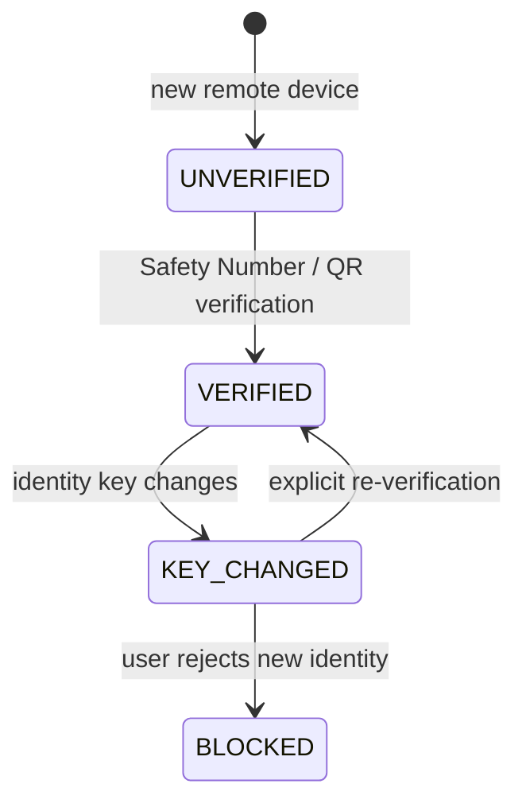
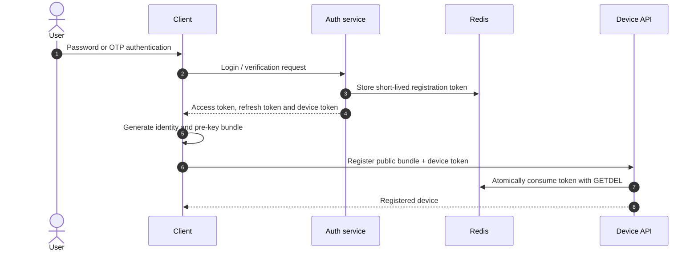
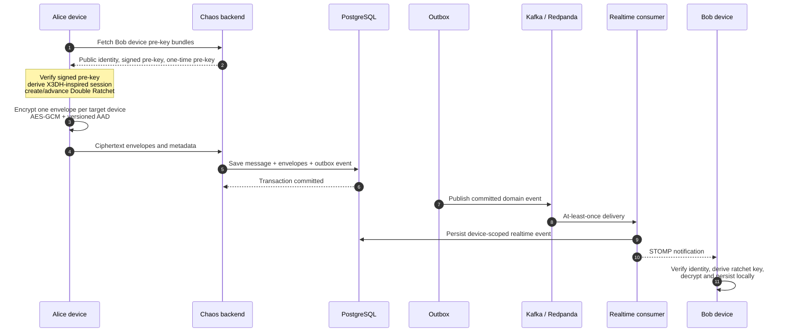
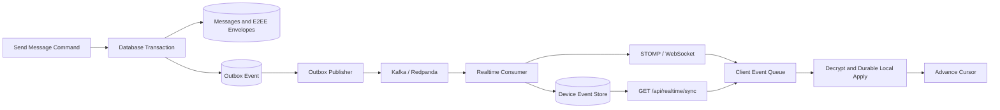
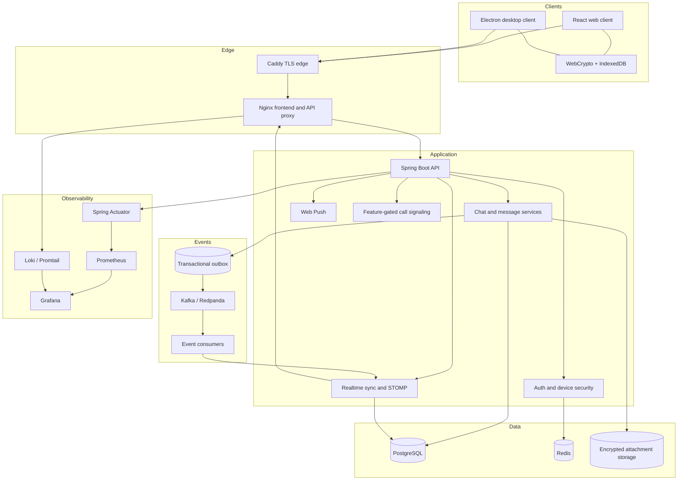
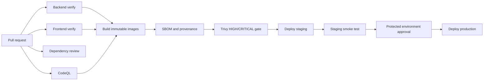

<div align="center">

# Chaos E2EE Messenger

**A production-oriented, multi-device encrypted messenger for web and desktop.**

Client-side cryptography · Durable realtime delivery · Security-focused authentication · Observable infrastructure

[](https://github.com/vaazhen/chaos-e2ee-messenger/actions/workflows/ci.yml)
[](backend/)
[](backend/)
[](frontend/)
[](frontend/src/crypto-engine.ts)
[](LICENSE)

[Русская версия](README.ru.md) · [Architecture](#architecture) · [Security model](#security-model) · [Quick start](#quick-start) · [Operations](#operations)

</div>

> [!IMPORTANT]
> Chaos implements an original X3DH-inspired pre-key handshake and Double Ratchet-style protocol using WebCrypto. It is **not affiliated with Signal**, is not a drop-in implementation of the Signal Protocol, and has not yet completed an independent cryptographic audit.

---

## Overview

Chaos is a full-stack encrypted messaging system designed around four engineering goals:

1. **Plaintext stays on endpoint devices.** Private keys, decrypted messages and attachment plaintext are processed by the client.
2. **Delivery survives failures.** Messages and device-scoped events use database transactions, a transactional outbox, Kafka-compatible delivery and cursor-based recovery.
3. **Authentication assumes token theft is possible.** Refresh tokens are single-use, token-family reuse is detected, and device enrollment uses a separate short-lived registration token.
4. **The system is operable.** The repository includes Docker Compose, Kubernetes manifests, metrics, logs, dashboards, alerts, runbooks and a staged CI/CD pipeline.

Chaos is built as an engineering project for secure messaging, distributed systems and production hardening—not as a claim of equivalence with mature audited products such as Signal, WhatsApp, Slack or Mattermost.

## Project status

| Capability | Status | Notes |
|---|---|---|
| Direct and group messaging | Active | Replies, edits, deletion, reactions, receipts and disappearing messages |
| Multi-device E2EE | Active | Per-device identities, pre-key bundles and encrypted fan-out |
| Durable realtime recovery | Active | Device-scoped sequence, cursor sync and at-least-once delivery |
| Encrypted attachments | Active | Client-side encryption; reference local ciphertext storage backend |
| Voice messages | Active | Encrypted media payloads |
| Encrypted key backup | Active | Restores identity material; does not claim to restore message history or ratchet sessions |
| Web client | Active | React/Vite application |
| Desktop client | Active | Electron packaging and secure endpoint validation |
| WebRTC calls | Experimental | Signaling is feature-gated; production TURN and hardened call state are separate work |
| Independent crypto audit | Pending | Required before high-risk use |

---

## Highlights

### Secure messaging

- X25519 device identity and pre-key material;
- ECDSA-signed pre-key verification;
- X3DH-inspired session bootstrap;
- Double Ratchet-style root, sending and receiving chains;
- HMAC-SHA-256 chain derivation and HKDF-SHA-256 root derivation;
- AES-256-GCM message and attachment encryption;
- versioned AAD binding for routing and ratchet headers;
- skipped-message-key handling for out-of-order delivery;
- per-device encrypted envelopes, including the sender's other devices;
- Safety Number verification and explicit `KEY_CHANGED` handling;
- client-side encrypted key backups whose passphrase never reaches the backend.

### Messaging product

- direct chats, groups and saved messages;
- replies, edits, deletion and reactions;
- delivery/read receipts and typing indicators;
- disappearing messages;
- encrypted files, images and voice messages;
- user profiles, aliases, device management and group administration;
- web push support;
- web and Electron clients.

### Backend and distributed delivery

- Java 17 and Spring Boot;
- PostgreSQL with Flyway migrations;
- Redis for rate limits, sessions and token state;
- transactional outbox;
- Kafka/Redpanda-compatible event transport;
- retry and dead-letter paths;
- durable device-scoped realtime event storage;
- durable device events combined with STOMP notification delivery;
- monotonic sequence and recovery cursor;
- idempotent event processing.

### Production engineering

- Docker Compose reference stack;
- Kubernetes/Kustomize manifests;
- readiness/liveness probes, HPA and PodDisruptionBudgets;
- non-root runtime containers;
- immutable image tags, provenance and SBOM generation;
- CodeQL, dependency review and Trivy security gates;
- staging deployment, smoke test and manually approved production promotion;
- Prometheus, Grafana, Loki and Promtail;
- operational alerts and incident runbooks.

---

## Security model

### What the server stores

| Server may observe or store | Server should not receive |
|---|---|
| Account and profile metadata | Message plaintext |
| Device identifiers | Private identity keys |
| Public identity keys and pre-key bundles | Private signed/one-time pre-keys |
| Chat membership and authorization data | Ratchet message keys |
| Encrypted message envelopes | Decrypted attachment bytes |
| Encrypted attachment blobs | Backup passphrase |
| Delivery, sequence and timing metadata | Decrypted backup contents |
| Push subscription metadata | Safety Number decisions made locally |

Chaos does **not** attempt to hide all metadata. The service can still learn relationships such as account membership, device count, chat membership, message timing and ciphertext size.

### Endpoint trust assumptions

E2EE protects content in transit and at rest on the server. It does not protect plaintext from:

- malware or a compromised operating system;
- a malicious browser extension;
- injected JavaScript from a compromised trusted origin;
- an unlocked or compromised Electron process;
- screen capture, clipboard capture or local forensic access while the client is active.

### Device identity lifecycle



A previously verified identity change is treated as a security event rather than silently trusted.

### One-time device enrollment



The registration token is short-lived and one-time. It is separate from the device's cryptographic identity and is consumed when the public key bundle is registered.

---

## Cryptographic message flow

Each device owns a separate cryptographic identity. A message is encrypted independently for every destination device and, when required, for the sender's other devices.



### Envelope authentication

AAD binds ciphertext to protocol context such as:

- protocol/message type;
- chat identifier;
- message index;
- previous chain length;
- ratchet public key.

Changing authenticated header fields causes AES-GCM authentication to fail.

### Backup semantics

Backups are encrypted in the client with a passphrase-derived AES-GCM key. The passphrase remains local.

A backup restores cryptographic identity material. It does **not** promise restoration of:

- locally cached message plaintext;
- previously consumed one-time pre-keys;
- all Double Ratchet sessions;
- complete historical message decryption on a fresh device.

---

## Durable realtime delivery

Chaos separates durable state from low-latency notification.



### Delivery guarantees

- Kafka transport is treated as **at least once**;
- every event has a stable `eventId`;
- device events have a monotonic sequence;
- device-scoped events are retained as the recovery source;
- reconnecting clients request events after their last cursor;
- duplicate delivery must be safe;
- the client tracks a recovery cursor and ignores previously seen event IDs.

Realtime notification is an optimization. Durable recovery is the correctness path.

---

## Architecture



### Technology stack

| Layer | Technologies |
|---|---|
| Web client | React 18, Vite, WebCrypto, IndexedDB, STOMP/SockJS |
| Desktop | Electron, electron-builder |
| Protocol types | TypeScript migration with a strict DTO gate |
| Backend | Java 17, Spring Boot 3.5, Spring Security, JPA/Hibernate |
| Primary data | PostgreSQL 16, Flyway |
| Coordination and auth state | Redis 7 |
| Event transport | Kafka-compatible broker / Redpanda |
| Edge | Caddy, Nginx |
| Observability | Actuator, Prometheus, Grafana, Loki, Promtail |
| Delivery | Docker, Kubernetes/Kustomize, GitHub Actions, GHCR |

### Repository layout

```text
.
├── backend/                 Spring Boot application and database migrations
│   ├── src/main/java/       Auth, users, chats, messages, crypto metadata,
│   │                        attachments, backup, outbox, realtime and push
│   └── src/test/            Unit and integration tests
├── frontend/                React web client and Electron package
│   ├── src/crypto-engine.ts Client-side E2EE engine
│   ├── src/hooks/           Auth, chat, message, WebSocket and WebRTC flows
│   ├── src/test/            Frontend unit/integration tests
│   ├── e2e/                 Mocked browser flows
│   └── e2e-real/            Real-stack E2EE browser scenarios
├── infra/                   Caddy, Prometheus, Loki and Promtail configuration
├── k8s/                     Stateless production manifests and dev dependencies
├── docs/runbooks/           Operational incident procedures
├── docker-compose.yml       Full reference stack
└── .github/workflows/       Verification, security scan and deployment pipeline
```

---

## Quick start

### Requirements

- Docker Engine;
- Docker Compose v2;
- OpenSSL for secret generation;
- at least 4 GB of free memory for the complete reference stack.

### 1. Configure secrets

```bash
cp .env.example .env
```

Generate replacement values for every `CHANGE_ME` entry:

```bash
openssl rand -base64 32   # POSTGRES_PASSWORD
openssl rand -base64 32   # REDIS_PASSWORD
openssl rand -base64 48   # JWT_SECRET
openssl rand -base64 32   # GRAFANA_ADMIN_PASSWORD
```

For local use:

```dotenv
DOMAIN=localhost
CORS_ORIGINS=https://localhost
CHAOS_DEMO_ENABLED=false
CHAOS_KAFKA_ENABLED=true
```

### 2. Start the stack

```bash
docker compose up --build -d
docker compose ps
```

Open:

```text
https://localhost
```

Caddy uses its local CA for `localhost` and obtains a public certificate when a real domain is configured.

### 3. Inspect logs

```bash
docker compose logs -f backend frontend caddy redpanda
```

### Stop

```bash
docker compose down
```

Remove local volumes as well:

```bash
docker compose down -v
```

---

## Local development

### Backend

Start PostgreSQL and Redis using the development compose file:

```bash
cd backend
docker compose -f docker-compose.dev.yml up -d
./mvnw spring-boot:run
```

The application API listens on `http://localhost:8080`. In production profile, management probes run on the separate management port `9091`.

### Frontend

```bash
cd frontend
cp .env.example .env
npm ci
npm run dev
```

The default development configuration targets:

```dotenv
VITE_BACKEND_URL=http://localhost:8080
VITE_API_BASE=http://localhost:8080/api
VITE_WS_URL=http://localhost:8080/ws
```

### Electron

```bash
cd frontend
cp .env.electron.example .env.electron
```

Set secure absolute endpoints:

```dotenv
VITE_BACKEND_URL=https://messenger.example.com
VITE_API_BASE=https://messenger.example.com/api
VITE_WS_URL=wss://messenger.example.com/ws
```

Run or package:

```bash
npm run electron:dev
npm run electron:build
```

The production desktop build validates endpoint presence and secure schemes. Public installers should be code-signed; macOS distributions also require notarization.

---

## Verification

### Backend

```bash
cd backend
./mvnw --batch-mode --no-transfer-progress verify
```

The Maven lifecycle includes compilation, Checkstyle, unit/integration tests and JaCoCo verification.

### Frontend

```bash
cd frontend
npm ci --ignore-scripts --no-audit --no-fund
npm run lint
npm run typecheck
npm run typecheck:crypto
npm run typecheck:protocol
npm run test:coverage -- --run
npm run build
```

### Browser E2E

```bash
cd frontend
npx playwright install --with-deps chromium
npm run test:e2e
npm run test:e2e:real
```

The real-stack suite requires the backend and its dependencies to be running.

---

## CI/CD



The workflow includes:

- backend `mvn verify`;
- frontend lint, three TypeScript gates, coverage and production build;
- dependency review on pull requests;
- CodeQL for Java and JavaScript/TypeScript;
- immutable images published to GHCR;
- SBOM and build provenance;
- blocking HIGH/CRITICAL container scan;
- staging rollout and health smoke test;
- protected manual promotion to production.

---

## Kubernetes

The root `k8s/` configuration deploys stateless application workloads. Production stateful dependencies are intentionally external.

Required production services:

- PostgreSQL 16 with backup and point-in-time recovery;
- authenticated Redis 7 with persistence and failover;
- a multi-replica Kafka/Redpanda cluster;
- durable encrypted attachment storage;
- an external secret manager;
- metrics-server, cert-manager and an Ingress controller.

Render manifests:

```bash
kubectl kustomize k8s/
```

Apply after replacing image placeholders, hostnames, connection addresses and secrets:

```bash
kubectl apply -k k8s/
```

Disposable development dependencies are available under `k8s/dev/`. They are not a high-availability production database or cache.

See [k8s/README.md](k8s/README.md).

---

## Operations

### Observability

The reference stack includes:

- Spring Boot Actuator health and application metrics;
- Prometheus collection;
- PostgreSQL and Redis exporters;
- structured container logs;
- Loki and Promtail;
- a provisioned Grafana dashboard;
- alerts for delivery, database, authentication and recovery failures.

### Runbooks

Operational procedures are maintained in [`docs/runbooks/`](docs/runbooks/):

- database outage;
- outbox backlog;
- realtime recovery failure;
- refresh-token reuse spike;
- rollback.

### Production checklist

Before a public deployment:

- use an external secret manager and rotate all initial secrets;
- use managed or operator-backed PostgreSQL, Redis and Kafka;
- configure tested backups, PITR and restore exercises;
- run browser E2E against staging;
- configure alert routing and an incident owner;
- sign desktop releases;
- validate resource limits under load;
- perform an independent application-security review and cryptographic audit.

Current hardening status is tracked in [docs/PRODUCTION_READINESS.md](docs/PRODUCTION_READINESS.md).

---

## Configuration

<details>
<summary><strong>Core environment variables</strong></summary>

| Variable | Purpose |
|---|---|
| `POSTGRES_PASSWORD` | PostgreSQL password used by the reference compose stack |
| `REDIS_PASSWORD` | Redis authentication password |
| `JWT_SECRET` | JWT signing secret; use high-entropy material |
| `DOMAIN` | Public hostname used by Caddy |
| `CORS_ORIGINS` | Exact trusted web origin |
| `CHAOS_DEMO_ENABLED` | Enables optional demo endpoints |
| `CHAOS_KAFKA_ENABLED` | Enables Kafka/outbox event delivery |
| `KAFKA_BOOTSTRAP_SERVERS` | Kafka-compatible broker addresses |
| `CHAOS_ATTACHMENTS_STORAGE_PATH` | Reference ciphertext storage directory |
| `CHAOS_ATTACHMENTS_MAX_BYTES` | Maximum encrypted upload size |
| `VAPID_PUBLIC_KEY` | Web Push public key |
| `VAPID_PRIVATE_KEY` | Web Push private key |

See `.env.example`, `backend/.env.example` and `frontend/.env.example` for complete development examples.

</details>

---

## Design principles

1. **Ciphertext is not an excuse to ignore metadata security.** Authorization is checked independently of encryption.
2. **Realtime is not durable storage.** WebSocket delivery is backed by a recoverable event log.
3. **Retries are normal.** Consumers and clients are designed for duplicate delivery.
4. **A token is not a device identity.** Device enrollment uses a separate one-time registration credential and a client-generated key bundle.
5. **Green checks are part of the product.** Build, tests, types, security scans and deployment gates are treated as release requirements.
6. **Security claims must remain bounded.** Experimental or unaudited components are labeled as such.

---

## Roadmap

- complete strict TypeScript migration for the full cryptographic engine;
- make real-browser reconnect/full-resync E2E mandatory in CI;
- production object-storage adapter for ciphertext attachments;
- hardened WebRTC state machine, TURN and authenticated signaling;
- key-transparency and stronger cross-device verification research;
- external pentest and independent cryptographic review;
- formal protocol specification and interoperable test vectors.

---

## Contributing

Focused pull requests are preferred over broad refactors.

Before opening a PR:

```bash
cd backend && ./mvnw verify
cd ../frontend && npm run lint && npm run typecheck && npm run test:coverage -- --run && npm run build
```

Security-sensitive changes should include:

- the protected invariant;
- a concrete failure scenario;
- tests for success, replay, tampering and failure paths;
- migration or compatibility notes;
- operational impact.

For vulnerabilities, avoid public disclosure before a coordinated fix is available.

---

## License

Licensed under the [Apache License 2.0](LICENSE).

---

<div align="center">

**Chaos is an engineering exploration of secure messaging under real distributed-system failure modes.**

</div>
