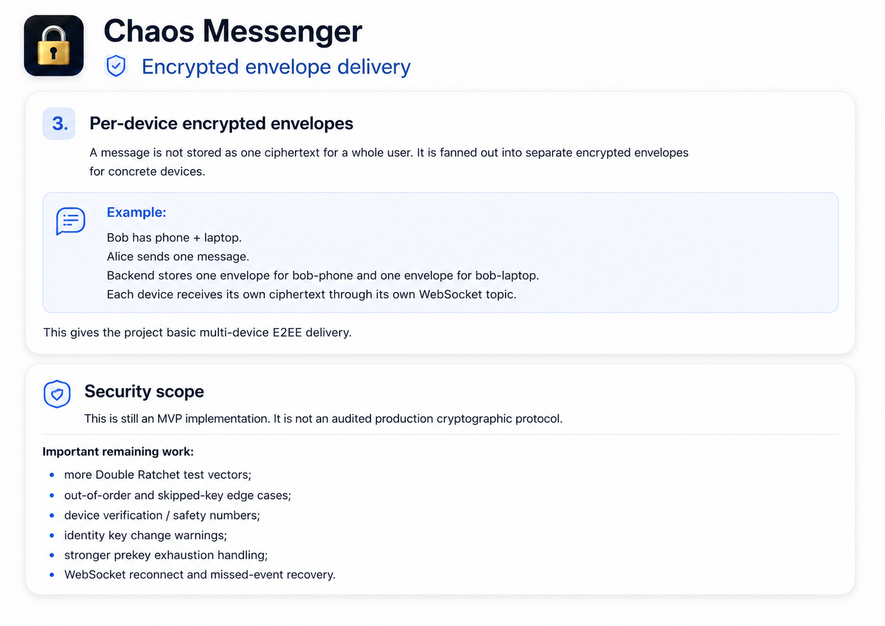

<div align="center">

[Русская версия](README.ru.md) · [Quick Setup](SETUP_COMPLETE.md) · [Security Audit](SECURITY_AUDIT_EN.md) · [Issues](https://github.com/vaazhen/chaos-e2ee-messenger/issues)

<br/>

[](https://github.com/vaazhen/chaos-e2ee-messenger/actions/workflows/ci.yml)
[](https://openjdk.org/)
[](https://spring.io/projects/spring-boot)
[](https://react.dev/)
[](https://www.postgresql.org/)
[](https://redis.io/)
[](LICENSE)

</div>

---

<div align="center">
  
</div>

<br/>

<div align="center">
  
</div>

<p align="center">
  <sub>End-to-end encrypted messenger MVP · Spring Boot · React · WebCrypto · WebSocket/STOMP</sub>
</p>

---

## What is Chaos Messenger

**Chaos Messenger** is a full-stack E2EE messenger MVP.

The browser encrypts and decrypts messages locally.  
The backend authenticates users, stores encrypted envelopes and routes them to recipient devices.

The server is not supposed to know message plaintext.

Current status: **strong solo MVP / portfolio project**.  
It is not positioned as a production-ready Signal replacement.

---

## Stack

<div align="center">
  
</div>

---

## Architecture

<div align="center">
  
</div>

---

## E2EE model

<div align="center">
  
</div>

The current encryption model is an MVP implementation of:

- X3DH-like session setup;
- Double Ratchet core;
- AES-GCM message encryption;
- per-device encrypted envelopes.

Private key material stays on the client side.  
The backend stores public prekey material and encrypted envelopes only.

---

## Encrypted envelope delivery

<div align="center">
  
</div>

Messages are delivered per device, not just per user.  
If a user has multiple devices, each device receives its own encrypted envelope.

This is the base for multi-device E2EE delivery.

---

## Features

<div align="center">
  
</div>

Group moderation and role logic exist, but they are not the main focus of this README.

The main project direction is:

- E2EE messaging;
- multi-device delivery;
- realtime transport;
- backend hardening;
- crypto protocol improvement.

---

## Backend hardening after review

After external review, several demo-friendly backend paths were reworked.

Main changes:

- profile and chat update notifications moved away from N+1 repository loops;
- read/delivered status handling moved to bulk SQL operations;
- timeline reactions are loaded in batches;
- chat list supports pagination and database-side ordering;
- key REST responses use typed DTOs instead of `Map<String, Object>`;
- hot-path indexes were added in Flyway migrations;
- device/prekey lookups were batched where possible;
- frontend supports bulk status updates.

This does not make the project production-ready, but it moves the backend closer to a real MVP architecture.

---

## Local load-testing snapshot

<div align="center">
  
</div>

The benchmark results are local development-machine results.  
They are useful for regression tracking, not as production capacity claims.

The direct-chat HTTP/API path was tested separately from WebSocket hold scenarios.

---

## Quick Start

Clone the repository:

```bash
git clone https://github.com/vaazhen/chaos-e2ee-messenger.git
cd chaos-e2ee-messenger
```

One-command start:

```bash
./START.sh        # macOS / Linux
START.bat         # Windows
```

Manual start:

```bash
# 1. Infrastructure
cd backend
docker compose -f docker-compose.dev.yml up -d

# 2. Backend
./mvnw spring-boot:run

# 3. Frontend, in a new terminal
cd frontend
npm install
npm run dev
```

Open:

```text
http://localhost:5173
```

In dev mode, SMS codes are printed in backend logs.  
No real SMS provider is required.

Requirements:

```text
Java 17+
Node.js 18+
Docker + Docker Compose
```

---

## Local URLs

Application:

```text
http://localhost:5173
```

Backend API:

```text
http://localhost:8080
```

Swagger UI:

```text
http://localhost:8080/swagger-ui/index.html
```

OpenAPI JSON:

```text
http://localhost:8080/api-docs
```

Health:

```text
http://localhost:8080/actuator/health
```

Prometheus:

```text
http://localhost:9090
```

Grafana:

```text
http://localhost:3000
admin / admin
```

---

## API overview

<div align="center">
 
</div>

Protected requests require:

```text
Authorization: Bearer <jwt>
X-Device-Id: <deviceId>
```

---

## Tests

Backend:

```bash
cd backend
./mvnw test
```

Frontend:

```bash
cd frontend
npm install
npm test -- --run
npm run build
```

E2E:

```bash
cd frontend
npm run test:e2e
```

---

## Project status and roadmap

Chaos Messenger is an MVP.

The strongest current area is direct-chat E2EE delivery and backend hardening.  
The next engineering areas are:

1. **WebSocket delivery benchmark**  
   Measure real `MESSAGE` frame delivery latency, not only connection hold.

2. **Preloaded 10k-message chat benchmark**  
   Validate timeline, read/delivered and send-after-10k on large existing history.

3. **Group fanout benchmark**  
   Measure envelope creation and WebSocket fanout for 10/50/100 participants.

4. **Double Ratchet hardening**  
   Add test vectors, out-of-order tests, skipped-key handling and key-change warnings.

5. **Production realtime strategy**  
   Evaluate broker relay, WebSocket gateway and backpressure beyond Spring SimpleBroker.

6. **Observability**  
   Add more domain metrics for message operations, WebSocket sessions and fanout.

See [Issues](https://github.com/vaazhen/chaos-e2ee-messenger/issues) for the structured roadmap.

---

## Known limitations

- The project is not a production-ready secure messenger.
- Double Ratchet is implemented as an MVP and needs more edge-case testing.
- WebSocket delivery latency is not fully benchmarked yet.
- Group chat fanout needs dedicated load testing.
- Spring SimpleBroker is suitable for MVP, but not the final answer for large production realtime traffic.
- Attachments are encrypted, but storage/access-control hardening is still required.
- Push subscriptions exist; full Web Push delivery is still planned.
- Local load-test results are not production capacity guarantees.

---

## Articles

Technical write-ups:

- [Building an End-to-End Encrypted Messenger with Spring Boot and WebCrypto](https://dev.to/vaazhen/i-built-an-end-to-end-encrypted-messenger-with-spring-boot-and-webcrypto-1if5)
- [Habr article / discussion](https://habr.com/ru/articles/1030854/)

---

## Contributing

Contributions are welcome: backend, frontend, crypto, docs, tests and performance work.

Good starting points:

- documentation and setup improvements;
- frontend empty/loading/error states;
- WebSocket connection state UI;
- additional backend tests;
- k6 load-test documentation.

Harder areas:

- WebSocket delivery latency benchmark;
- group chat fanout;
- Double Ratchet edge cases;
- device verification;
- production observability.

Start with [Issues](https://github.com/vaazhen/chaos-e2ee-messenger/issues).

---

## License

Apache License 2.0. See [LICENSE](LICENSE).
