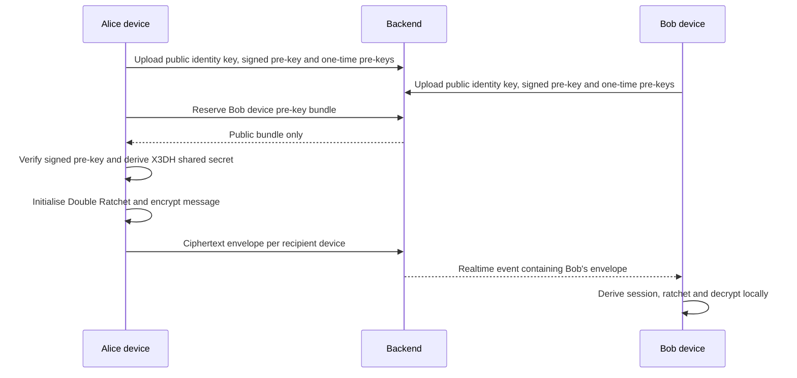
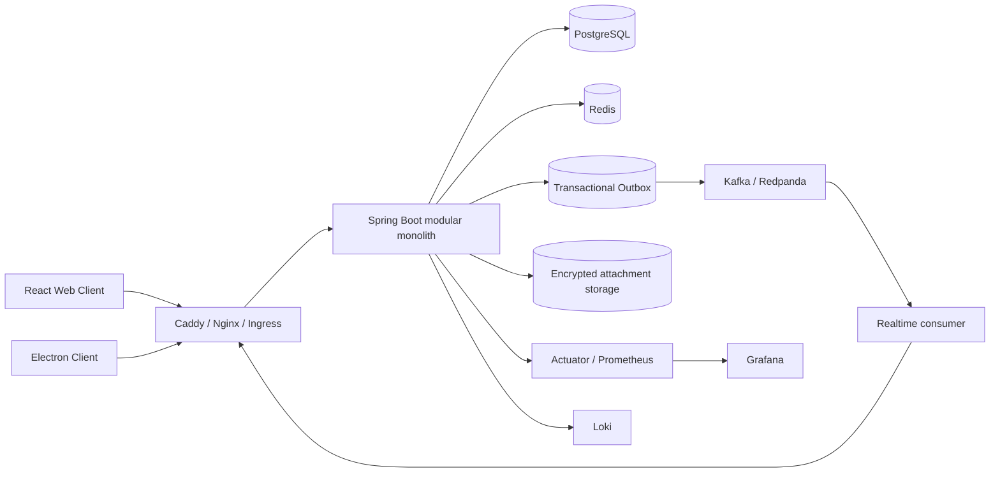

<div align="center">

# Chaos Messenger

### A full-stack, multi-device end-to-end encrypted messenger foundation

Web + Electron clients · X3DH-style session setup · Double Ratchet · Spring Boot · PostgreSQL · Redis · Kafka/Redpanda · Docker · Kubernetes

[Русская версия](README.ru.md) · [Production readiness](PRODUCTION_READINESS.md) · [Validation report](VALIDATION_REPORT.md) · [Hardening changelog](HARDENING_CHANGELOG.md)

</div>

> **Engineering status:** security-hardened source release suitable for product evaluation, white-label development, staging, and further commercialisation. Before a high-risk public launch, complete an independent cryptographic review, penetration test, managed-stateful deployment, object-storage integration, load testing, and operational readiness gates described in [PRODUCTION_READINESS.md](PRODUCTION_READINESS.md).

## Why this project is valuable

Chaos Messenger is not a UI mock-up or a basic CRUD chat. It is a working product foundation with client-side cryptography, multi-device key distribution, realtime delivery, transactional event publishing, desktop packaging, observability, tests, and deployment manifests in one repository.

It is a strong starting point for:

- a private community or team messenger;
- a white-label secure communications product;
- an internal collaboration platform;
- an E2EE reference implementation for further audited development;
- a portfolio or acquisition-ready source-code asset with clear module boundaries.

The code remains a **modular monolith** by design. It can be deployed as one backend today and later separated into API, realtime, worker, attachment, push, or call services when measured load justifies the operational cost.

## Product capabilities

| Area | Included |
|---|---|
| End-to-end encryption | Per-device encrypted envelopes, X3DH-style pre-key setup, Double Ratchet, AES-256-GCM, HKDF-SHA-256 |
| Device trust | Safety Number per device, persisted verification state, `KEY_CHANGED` warning and send/decrypt blocking |
| Multi-device | Identity, signed pre-key and one-time pre-key registration; delivery to every active participant device |
| Messaging | Direct chats, saved messages, groups, replies, edit/delete, reactions, delivery/read status, typing events |
| Attachments | Client-side encrypted payload support, bounded backend storage, traversal protection and rollback cleanup |
| Expiring content | Message TTL and scheduled cleanup support |
| Realtime | STOMP/WebSocket, per-device topics, presence, at-least-once event deduplication by `eventId` |
| Calls | WebRTC signalling, audio/video and screen-sharing foundations |
| Authentication | Email/password and phone flows, short-lived JWT access token, HttpOnly refresh cookie, rotation and reuse detection |
| Desktop | Electron for Windows/macOS/Linux, sandboxed renderer, constrained IPC, native notifications and system tray |
| Operations | Flyway, Actuator, Prometheus, Grafana, Loki, Docker Compose, Kubernetes and GitHub Actions |

## Security model

### What the server does not receive

Message plaintext and client private-key material are not sent to the backend. The backend stores public device material, ciphertext envelopes, message metadata, membership data, delivery state and encrypted attachments.

### Client key storage

Private E2EE state is stored in IndexedDB as AES-GCM-encrypted records. The wrapping key is a non-extractable WebCrypto key stored by IndexedDB. Legacy secrets are migrated out of `localStorage`; the access JWT is held in process memory only; the refresh token is delivered as a `Secure`, `HttpOnly`, `SameSite=Strict`, host-only cookie.

This materially improves at-rest and opportunistic storage theft resistance. It does **not** make a compromised endpoint safe: JavaScript executing in the trusted origin, a malicious extension, OS malware, or a modified application build can still access plaintext while the client is operating. E2EE protects data in transit and on untrusted server storage; it cannot protect an already-compromised endpoint.

### Identity verification

Each remote device has an independent trust state:

```text
UNVERIFIED -> VERIFIED -> KEY_CHANGED
```

Users can compare a Safety Number out of band. If a previously verified identity key changes, the client records `KEY_CHANGED` and blocks encrypted operations until the device is explicitly re-verified.

### Metadata boundary

The server still observes operational metadata required to route the service, including accounts, devices, chat membership, timestamps, message sizes, delivery status, IP/network metadata and attachment object metadata. Key transparency and metadata-hiding protocols are not yet implemented.

## Cryptographic flow



The implementation supports skipped message keys for out-of-order delivery and serialises ratchet mutations across concurrent operations to prevent message-index reuse.

## System architecture



### Backend modules

`auth`, `crypto`, `message`, `chat`, `user`, `attachment`, `backup`, `call`, `push`, `realtime`, `outbox`, `infra`, `common` and `demo` are separated at package level. Transactional domains remain together where strong database invariants are more valuable than network boundaries.

### Delivery semantics

When Kafka is enabled, domain changes and outbox events are committed in the same PostgreSQL transaction. The publisher retries failed events and emits them to partitioned topics. Realtime delivery is **at least once**; events carry `eventId`, backend fanout deduplicates successful processing, and the client deduplicates repeated WebSocket delivery.

When Kafka is disabled for local development, the application uses the direct local realtime path.

## Technology stack

| Layer | Technology |
|---|---|
| Web client | React 18, Vite 5, WebCrypto, IndexedDB, STOMP/SockJS |
| Desktop | Electron 33, electron-builder |
| Backend | Java 17, Spring Boot 3.5, Spring Security, JPA/Hibernate |
| Data | PostgreSQL 16, Redis 7, 37 Flyway migrations |
| Events | Kafka-compatible broker / Redpanda, transactional outbox |
| Observability | Actuator, Prometheus, Grafana, Loki, Promtail |
| Delivery | Docker Compose, Kubernetes/Kustomize, GitHub Actions |

## Quick start with Docker Compose

### Requirements

- Docker Engine with Docker Compose v2;
- a DNS name pointing to the host for public HTTPS, or `localhost` for local evaluation;
- at least 4 GB of available memory for the complete demo stack.

### Start

```bash
cp .env.example .env
```

Generate strong secrets and edit `.env`:

```bash
openssl rand -base64 32   # POSTGRES_PASSWORD
openssl rand -base64 32   # REDIS_PASSWORD
openssl rand -base64 48   # JWT_SECRET
openssl rand -base64 32   # GRAFANA_ADMIN_PASSWORD
```

Then run:

```bash
docker compose up --build -d
docker compose ps
docker compose logs -f backend frontend caddy
```

Open `https://$DOMAIN`. Caddy obtains a public certificate for a valid public domain and uses its local CA for local names.

The Compose file is an evaluation/staging stack. For production, replace single-node PostgreSQL, Redis and Redpanda with managed or operator-backed clusters and implement tested backups/PITR.

## Local development

### Backend

```bash
cd backend
./mvnw spring-boot:run
```

The backend expects PostgreSQL and Redis. `backend/docker-compose.dev.yml` can start development dependencies.

### Frontend

```bash
cd frontend
npm ci
npm run dev
```

### Packaged Electron build

Packaged `file://` pages cannot use relative `/api` and `/ws` endpoints. Configure secure absolute URLs first:

```bash
cd frontend
cp .env.electron.example .env.electron
# Set VITE_API_BASE=https://.../api and VITE_WS_URL=wss://.../ws
npm run electron:build
```

The build fails closed when Electron endpoints are missing or insecure. Production distribution still requires platform code-signing/notarisation credentials.

## Tests and quality gates

```bash
# Backend
cd backend
./mvnw verify

# Frontend
cd frontend
npm ci
npm run lint
npm test
npm run test:coverage
npm run build
```

The hardened source archive was validated with **151 passing frontend tests and 3 intentionally skipped tests**. See [VALIDATION_REPORT.md](VALIDATION_REPORT.md) for exact commands, coverage, static checks and the backend validation limitation of the packaging environment.

CI additionally defines dependency review, CodeQL, image scanning, SBOM/provenance generation, immutable image tags, gated production deployment and rollout verification.

## Kubernetes

The root `k8s/` manifests deploy stateless application workloads with:

- non-root containers, read-only root filesystems, dropped Linux capabilities and seccomp;
- resource requests/limits, HPA, PodDisruptionBudget and topology spreading;
- public Ingress limited to application traffic;
- the management/Actuator port kept internal;
- secret placeholders rather than committed credentials.

Single-node PostgreSQL and Redis examples were moved to `k8s/dev/` and are not part of the production base. Read [k8s/README.md](k8s/README.md) before deployment.

## Production architecture recommendation

Do not split the transaction-heavy core into microservices prematurely. A practical first scaling step is separate deployments from the same codebase:

```text
chaos-api       REST commands and queries
chaos-realtime  WebSocket connections and event fanout
chaos-worker    outbox publishing, push and cleanup jobs
```

Extract push, attachment storage, realtime gateway or call signalling only when independent scaling, ownership or failure isolation is measurable. Use the existing Ingress/Nginx layer as the edge gateway until multiple independently deployed APIs require a dedicated gateway product.

## Production gates still required

The repository deliberately does not claim certified or independently audited security. Before handling sensitive real-world communications, complete at minimum:

1. independent cryptographic design and implementation review;
2. web, API and Electron penetration testing;
3. key transparency or an equivalent auditable device-key directory;
4. S3-compatible encrypted object storage with quotas and lifecycle cleanup;
5. managed PostgreSQL/Redis/Kafka, encrypted backups and restore drills;
6. load, soak, reconnect, broker-failure and chaos testing against target SLOs;
7. KMS/Vault/External Secrets integration and signing-key rotation;
8. signed Electron releases, update-channel security and incident runbooks.

The full checklist and release gates are in [PRODUCTION_READINESS.md](PRODUCTION_READINESS.md).

## Repository layout

```text
.
├── backend/                 Spring Boot application and tests
├── frontend/                React, WebCrypto and Electron clients
├── infra/                   Caddy, Loki and Promtail configuration
├── k8s/                     Hardened stateless Kubernetes base
│   └── dev/                 Non-production PostgreSQL/Redis examples
├── .github/workflows/       CI, security scanning and release pipeline
├── docker-compose.yml       Full evaluation/staging stack
├── PRODUCTION_READINESS.md  Remaining production gates
├── HARDENING_CHANGELOG.md   Security and reliability changes
└── VALIDATION_REPORT.md     Reproducible validation results
```

## Commercial use and licence

Chaos Messenger is licensed under Apache License 2.0. It can be forked, branded and extended subject to the licence terms. The repository is best positioned commercially as a **secure messenger product foundation**, not as a certified drop-in replacement for audited high-assurance messengers.

Before listing the source code for sale, add real product screenshots, a hosted demo with isolated demo data, buyer-facing support terms, a dependency/licence inventory, and a completed independent security report.

## Responsible disclosure

Do not publish exploitable security findings as a public issue. Contact the repository owner privately and include affected versions, reproduction steps, impact and a proposed remediation when possible.

## Licence

[Apache License 2.0](LICENSE)
