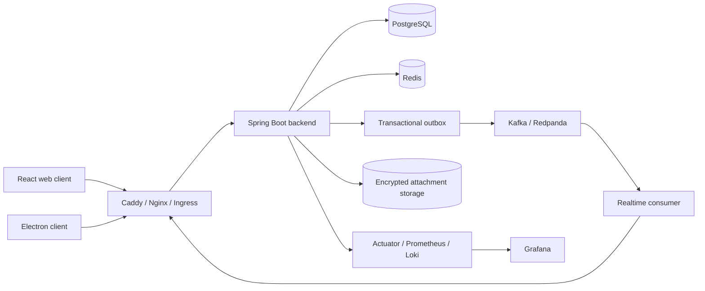

<div align="center">

# Chaos Messenger

Multi-device end-to-end encrypted messenger for web and desktop.

React · Electron · Spring Boot · PostgreSQL · Redis · Kafka/Redpanda · Docker · Kubernetes

[Русская версия](README.ru.md) · [Validation report](VALIDATION_REPORT.md) · [Security audit](SECURITY_AUDIT_EN.md)

</div>

## Features

- direct chats, group chats and saved messages;
- replies, editing, deletion, reactions and read/delivery states;
- encrypted attachments and expiring messages;
- typing, presence and WebSocket updates;
- audio/video call signalling through WebRTC;
- email/password and phone authentication;
- active-device management and per-device E2EE delivery;
- encrypted backup support;
- web client and Electron desktop client;
- Docker Compose, Kubernetes manifests and observability configuration.

## End-to-end encryption

Each client device owns a separate cryptographic identity. The client establishes sessions using an X3DH-style pre-key exchange and encrypts messages with a Double Ratchet implementation based on WebCrypto.

The backend receives and stores:

- public device keys and pre-keys;
- encrypted message envelopes;
- encrypted attachment payloads;
- account, device, chat and delivery metadata.

The backend does not receive message plaintext or client private keys.

### Device verification

A Safety Number can be compared out of band for every remote device. A verified device has one of these trust states:

```text
UNVERIFIED -> VERIFIED -> KEY_CHANGED
```

When the identity key of a previously verified device changes, encrypted operations are blocked until the device is explicitly verified again.

### Client key storage

Private identity keys, pre-keys and ratchet sessions are stored as encrypted IndexedDB records. The wrapping key is a non-extractable WebCrypto key. Ratchet mutations are serialised across concurrent operations to prevent message-index reuse.

The access token is kept in process memory. Refresh tokens are delivered through a `Secure`, `HttpOnly`, `SameSite=Strict` cookie and are rotated by the backend.

E2EE cannot protect an already compromised endpoint. JavaScript running in the trusted origin, a malicious application build, browser extensions or OS malware can access plaintext while the client is operating.

## Realtime delivery

The backend uses a transactional outbox when Kafka is enabled. Device events are persisted with a monotonically increasing sequence number.

After a reconnect, the client:

1. reads its last stored cursor;
2. requests missed events from `/api/realtime/sync`;
3. applies durable events in sequence order;
4. processes WebSocket events buffered during recovery;
5. stores the new cursor.

Realtime delivery is at least once. Events include an `eventId`, and the client deduplicates repeated delivery.

## Architecture



## Technology stack

| Layer | Technologies |
|---|---|
| Web | React 18, Vite 5, WebCrypto, IndexedDB, STOMP/SockJS |
| Desktop | Electron 33, electron-builder |
| Backend | Java 17, Spring Boot 3.5, Spring Security, JPA/Hibernate |
| Data | PostgreSQL 16, Redis 7, Flyway |
| Events | Kafka-compatible broker / Redpanda, transactional outbox |
| Observability | Actuator, Prometheus, Grafana, Loki, Promtail |
| Deployment | Docker Compose, Kubernetes/Kustomize, GitHub Actions |

## Quick start

### Requirements

- Docker Engine;
- Docker Compose v2;
- at least 4 GB of available memory for the complete local stack.

### Configure

```bash
cp .env.example .env
```

Generate strong secrets and replace all `CHANGE_ME` values:

```bash
openssl rand -base64 32   # POSTGRES_PASSWORD
openssl rand -base64 32   # REDIS_PASSWORD
openssl rand -base64 48   # JWT_SECRET
openssl rand -base64 32   # GRAFANA_ADMIN_PASSWORD
```

Set:

```dotenv
DOMAIN=localhost
CORS_ORIGINS=https://localhost
```

For a public deployment, use a real DNS name and the matching HTTPS origin.

### Run

```bash
docker compose up --build -d
docker compose ps
docker compose logs -f backend frontend caddy
```

Open:

```text
https://localhost
```

Caddy uses its local CA for local names and obtains a public TLS certificate for a valid public domain.

Stop the stack:

```bash
docker compose down
```

Remove local data as well:

```bash
docker compose down -v
```

## Local development

### Backend

```bash
cd backend
./mvnw spring-boot:run
```

Development dependencies can be started with:

```bash
cd backend
docker compose -f docker-compose.dev.yml up -d
```

### Frontend

```bash
cd frontend
npm ci
npm run dev
```

The Vite development server proxies `/api` and `/ws` to `http://localhost:8080`.

## Electron

Create the desktop environment file:

```bash
cd frontend
cp .env.electron.example .env.electron
```

Set absolute secure endpoints:

```dotenv
VITE_BACKEND_URL=https://messenger.example.com
VITE_API_BASE=https://messenger.example.com/api
VITE_WS_URL=wss://messenger.example.com/ws
```

Build:

```bash
npm run electron:build
```

The build fails when required endpoints are missing or use insecure protocols. Public installers should be code-signed; macOS builds should also be notarised.

## Configuration

Main environment variables:

| Variable | Purpose |
|---|---|
| `POSTGRES_PASSWORD` | PostgreSQL password |
| `REDIS_PASSWORD` | Redis password |
| `JWT_SECRET` | JWT signing secret, minimum 32 characters |
| `DOMAIN` | Public hostname used by Caddy |
| `CORS_ORIGINS` | Exact trusted frontend origin |
| `CHAOS_DEMO_ENABLED` | Enables the optional demo endpoint |
| `VAPID_PUBLIC_KEY` / `VAPID_PRIVATE_KEY` | Web Push credentials |
| `CHAOS_KAFKA_ENABLED` | Enables Kafka/outbox delivery |
| `KAFKA_BOOTSTRAP_SERVERS` | Kafka-compatible broker addresses |
| `CHAOS_ATTACHMENTS_STORAGE_PATH` | Encrypted attachment storage path |
| `CHAOS_ATTACHMENTS_MAX_BYTES` | Maximum encrypted attachment size |

See `.env.example`, `backend/.env.example` and `frontend/.env.example` for the complete local configuration.

## Tests

### Backend

```bash
cd backend
./mvnw verify
```

### Frontend

```bash
cd frontend
npm ci
npm run lint
npm test
npm run test:coverage
npm run build
```

The packaged source was checked with **154 passing frontend tests and 3 intentionally skipped tests**. Exact results and environment limitations are recorded in [VALIDATION_REPORT.md](VALIDATION_REPORT.md).

## Kubernetes

The `k8s/` directory contains:

- namespace and configuration;
- backend and frontend Deployments/Services;
- Ingress;
- resource requests and limits;
- liveness/readiness probes;
- Horizontal Pod Autoscalers;
- PodDisruptionBudgets;
- a secret template.

Apply after replacing image names, hostnames and secret values:

```bash
kubectl apply -k k8s/
```

For a public production deployment, use managed or operator-backed PostgreSQL, Redis and Kafka, tested backups/PITR, external secret management and independent security testing.

## Security notes

- Do not commit `.env` files or real credentials.
- Keep `/actuator` and Prometheus endpoints on an internal network.
- Serve the web application only over HTTPS.
- Use exact CORS origins; do not use a global wildcard.
- Rotate JWT, database, Redis and VAPID secrets through a secret manager.
- Run the backend test suite, integration tests and migrations before every release.
- Obtain an independent cryptographic review and penetration test before using the system for high-risk communications.

See [SECURITY_AUDIT_EN.md](SECURITY_AUDIT_EN.md) and [PRODUCTION_READINESS.md](PRODUCTION_READINESS.md) for the detailed security and release checklist.

## License

Licensed under the [Apache License 2.0](LICENSE).
