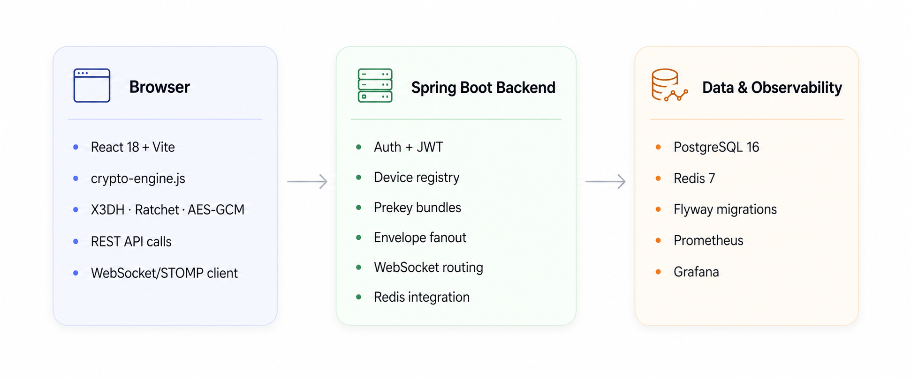
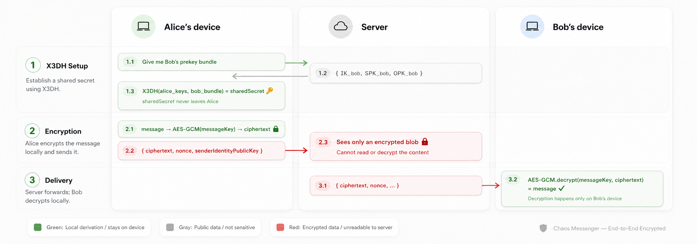
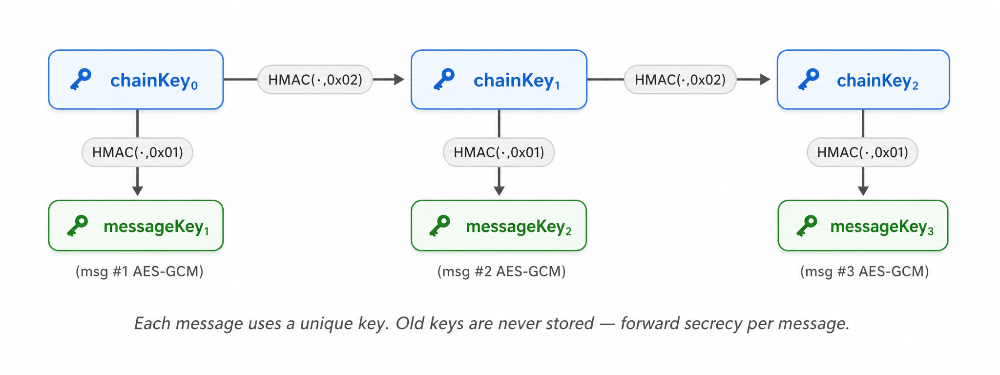

<div align="center">

[Русская версия](README.ru.md) · [Quick Setup](SETUP_COMPLETE.md) · [Security Audit](SECURITY_AUDIT_EN.md) · [Issues](https://github.com/vaazhen/chaos-e2ee-messenger/issues)

<br/>

[](https://github.com/vaazhen/chaos-e2ee-messenger/actions/workflows/ci.yml)
[](https://openjdk.org/)
[](https://spring.io/projects/spring-boot)
[](https://react.dev/)
[](https://www.postgresql.org/)
[](https://redis.io/)
[](LICENSE)

</div>

---

<div align="center">
  
</div>

<br/>

<p align="center">
  
</p>

<p align="center">
  <sub>Realtime chat · per-device encrypted envelopes · WebSocket/STOMP · Spring Boot + React</sub>
</p>

---

## What is Chaos Messenger

**Chaos Messenger** is a full-stack E2EE messenger MVP built with Spring Boot and React.

The main idea is simple: the browser encrypts messages, the backend routes encrypted envelopes, and the database stores ciphertext. The server is not supposed to know message plaintext.

Open DevTools, send a message, and the server receives an envelope like this:

```json
{
  "targetDeviceId": "device-2aa3ae0e-ee08-4261-aa09-7d8f800b61e9",
  "ciphertext": "qzgHSg7zbwU6h8j8RqCPUYBWHJLi78eR9C0tj9I=",
  "nonce": "6KPcVjbpM4FUB0Vz",
  "ratchetPublicKey": "n9b7..."
}
```

Ask the server what the last message says, and the chat preview returns:

```json
{ "lastMessage": "[encrypted]" }
```

Not because the server hides the text, but because it does not have plaintext to return.

**Current status:** strong solo MVP / portfolio project. Not a production-ready Signal replacement yet.

---

## Stack

| Area | Stack |
|---|---|
| Backend | Java 17 · Spring Boot 3 · Spring Security · WebSocket/STOMP |
| Frontend | React 18 · Vite · WebCrypto API |
| Database | PostgreSQL 16 · Flyway migrations V1–V34 |
| Cache / realtime state | Redis 7 |
| Observability | Spring Actuator · Prometheus · Grafana |
| Tests | JUnit · Mockito · Testcontainers · Vitest · Playwright |
| Tooling | Docker Compose · GitHub Actions · OpenAPI/Swagger |

---

## Architecture

> The client encrypts and decrypts. The backend authenticates, stores encrypted envelopes and routes them to devices.

<p align="center">
  
</p>

| Layer | Responsibility |
|---|---|
| Browser | Generate device keys · run E2EE session logic · encrypt/decrypt messages |
| Backend | Auth · chat/device management · encrypted envelope storage · WebSocket routing |
| PostgreSQL | Users · devices · chats · messages · envelopes · receipts · attachments |
| Redis | Refresh tokens · presence · unread counters · rate limits |
| WebSocket/STOMP | Device topics · chat updates · typing events · message status updates |

---

## E2EE model

### 1. X3DH-like session setup

<p align="center">
  
</p>

Each device publishes a public key bundle: identity key, signed prekey and one-time prekeys. A sender fetches the recipient device bundle and derives a shared secret locally. Private keys stay in the browser.

The backend stores public prekey material and reserves one-time prekeys. It does not derive the session secret.

### 2. Double Ratchet MVP

<p align="center">
  
</p>

The frontend crypto engine now contains the core Double Ratchet state:

```text
root key
sending / receiving chain keys
DH sending / receiving ratchet keys
message indexes
skipped message keys
previous chain length
ratchet public key per envelope
```

For every message, the client derives a fresh message key, encrypts with AES-GCM, and discards the key after use.

The backend only persists envelope metadata required for delivery and decryption by the target device:

```text
ciphertext
nonce
sender device id
target device id
message index
ratchet public key
previous chain length
```

### 3. Per-device encrypted envelopes

A message is not stored as one ciphertext for a whole user. It is fanned out into separate encrypted envelopes for concrete devices.

Example:

```text
Bob has phone + laptop.
Alice sends one message.
Backend stores one envelope for bob-phone and one envelope for bob-laptop.
Each device receives its own ciphertext through its own WebSocket topic.
```

This gives the project basic multi-device E2EE delivery.

### Security scope

This is still an MVP implementation. It is not an audited production cryptographic protocol.

Important remaining work:

- more Double Ratchet test vectors;
- out-of-order and skipped-key edge cases;
- device verification / safety numbers;
- identity key change warnings;
- stronger prekey exhaustion handling;
- WebSocket reconnect and missed-event recovery.

---

## Features

| Area | Features |
|---|---|
| E2EE | X3DH-like setup · Double Ratchet MVP · AES-GCM · WebCrypto |
| Multi-device | separate device identity · per-device envelopes · device management · revoke device |
| Auth | phone OTP · email/password · JWT access/refresh · Redis rate limits |
| Chats | direct chats · saved messages · group chats · chat requests |
| Messaging | send · edit · soft delete · reply · reactions · read/delivered receipts · typing |
| Attachments | encrypted image/file/voice payloads · local encrypted blob storage |
| Self-destruct | expiring messages with scheduled backend cleanup |
| Realtime | SockJS/WebSocket/STOMP · device topics · chat updates · status updates |
| Push | push subscription storage and VAPID config placeholder; real Web Push delivery is still planned |
| Observability | Actuator · Prometheus · Grafana dashboard |

Group moderation and role logic exist, but they are intentionally not the main focus of this README. The core project direction is E2EE messaging, device delivery, realtime transport and backend hardening.

---

## Backend hardening after review

The project went through a backend cleanup pass after external review. Several demo-friendly but non-scalable paths were changed.

Main changes:

- profile/chat update notifications moved away from N+1 repository loops;
- read/delivered status handling moved to bulk SQL operations;
- timeline reactions are loaded in batches;
- chat list supports pagination and database-side ordering;
- key REST responses use typed DTOs instead of `Map<String, Object>`;
- hot-path indexes were added in `V23__performance_indexes.sql`;
- device/prekey lookups were batched where possible;
- frontend supports bulk status updates.

This does not make the project production-ready, but the backend is now much closer to a real MVP than to a simple demo.

---

## Local load-testing snapshot

These are local benchmark results from a Windows development machine. They are useful for regression tracking, not production capacity claims.

### Direct-chat HTTP/API battery

| Scenario | Requests | Iterations | Failed requests | send p95 | timeline p95 | read p95 | delivered p95 |
|---|---:|---:|---:|---:|---:|---:|---:|
| baseline, 5 VU / 2m / sleep=1 | 2,995 | 495 | 0 | 93 ms | 43 ms | 50 ms | 49 ms |
| normal, 25 VU / 5m / sleep=1 | 35,549 | 5,904 | 0 | 151 ms | 89 ms | 106 ms | 99 ms |
| heavy, 2 VU / 10m / sleep=0 | 49,546 | 8,256 | 0 | 54 ms | 28 ms | 45 ms | 35 ms |
| stress, 10 VU / 10m / sleep=0 | 161,018 | 26,828 | 0 | 81 ms | 42 ms | 55 ms | 48 ms |
| spike, 50 VU / 5m / sleep=0 | 76,816 | 12,761 | 0 | 428 ms | 375 ms | 394 ms | 379 ms |
| soak, 5 VU / 30m / sleep=0 | 250,795 | 41,795 | 0 | 81 ms | 44 ms | 60 ms | 52 ms |

Total direct-chat battery:

```text
576,719 HTTP requests
96,039 iterations
0 failed requests
100% checks
```

### WebSocket/SockJS/STOMP hold tests

Prepared WebSocket hold tests separate registration from connection load.

Observed locally:

```text
100 prepared WS connections: clean
500 prepared ramp connections: clean
1000 prepared ramp connections: clean
0 ws_errors in validated hold scenarios
```

A ramp toward 10k WebSocket connections on a local 8 GB RAM machine hit JVM heap / Spring SimpleBroker memory limits. That is a useful finding, not a production capacity result. Large-scale realtime delivery needs a separate production-oriented broker/gateway strategy.

---

## Quick Start

```bash
git clone https://github.com/vaazhen/chaos-e2ee-messenger.git
cd chaos-e2ee-messenger
```

One command:

```bash
./START.sh        # macOS / Linux
START.bat         # Windows
```

Manual start:

```bash
# 1. Infrastructure
cd backend
docker compose -f docker-compose.dev.yml up -d

# 2. Backend
./mvnw spring-boot:run

# 3. Frontend, in a new terminal
cd frontend
npm install
npm run dev
```

Open: [http://localhost:5173](http://localhost:5173)

In dev mode, SMS codes are printed in backend logs. No real SMS provider is required.

Requirements:

```text
Java 17+
Node.js 18+
Docker + Docker Compose
```

---

## Local URLs

| Service | URL |
|---|---|
| App | http://localhost:5173 |
| API | http://localhost:8080 |
| Swagger UI | http://localhost:8080/swagger-ui/index.html |
| OpenAPI JSON | http://localhost:8080/api-docs |
| Health | http://localhost:8080/actuator/health |
| Prometheus | http://localhost:9090 |
| Grafana | http://localhost:3000 · `admin / admin` |

---

## API overview

Every protected request requires:

```text
Authorization: Bearer <jwt>
X-Device-Id: <deviceId>
```

| Group | Purpose |
|---|---|
| Auth | phone OTP, email auth, token refresh, logout |
| Devices | device registration, current device, list devices, deactivate |
| Crypto | prekey bundle, chat device resolution, prekey reservation |
| Chats | direct chat, saved messages, group chat, chat list, chat requests |
| Messages | encrypted send/edit/delete, timeline, read/delivered, reactions |
| Attachments | encrypted upload/download |
| Push | subscription management, VAPID public key |
| Users/Profile | current user, profile update, search, username availability |
| i18n | locale and translation endpoints |

### WebSocket topics

| Topic | Purpose |
|---|---|
| `/topic/devices/{deviceId}/chats/{chatId}` | device-specific message events |
| `/topic/devices/{deviceId}/status` | bulk and single message status updates |
| `/topic/users/{username}/chats` | chat list/profile updates |
| `/topic/chats/{chatId}/typing` | typing events |

---

## Tests

Backend:

```bash
cd backend
./mvnw test
```

Frontend:

```bash
cd frontend
npm install
npm test -- --run
npm run build
```

E2E:

```bash
cd frontend
npm run test:e2e
```

---

## Project status and roadmap

Chaos Messenger is an MVP. The main completed direction is direct-chat E2EE delivery and backend hardening.

Next engineering areas:

1. **WebSocket delivery benchmark** — measure actual `MESSAGE` frame delivery latency, not just connection hold.
2. **Preloaded 10k-message chat benchmark** — validate timeline/read/delivered on large existing history.
3. **Group fanout benchmark** — measure envelope creation and WebSocket fanout for 10/50/100 participants.
4. **Double Ratchet hardening** — add test vectors, out-of-order tests and key-change warnings.
5. **Production realtime strategy** — evaluate broker relay / gateway / backpressure beyond Spring SimpleBroker.
6. **Observability** — expose more domain metrics for message operations and WebSocket sessions.

See [Issues](https://github.com/vaazhen/chaos-e2ee-messenger/issues) for the structured roadmap.

---

## Known limitations

- The project is not a production-ready secure messenger.
- Double Ratchet is implemented as an MVP and needs more edge-case testing.
- WebSocket delivery latency is not fully benchmarked yet.
- Group chat fanout needs dedicated load testing.
- Spring SimpleBroker is suitable for MVP, but not the final answer for large production realtime traffic.
- Attachments are encrypted, but storage/access-control hardening is still required.
- Push subscriptions exist; full Web Push delivery is still planned.
- Local load-test results are not production capacity guarantees.

---

## Articles

Technical write-ups:

- [Building an End-to-End Encrypted Messenger with Spring Boot and WebCrypto](https://dev.to/vaazhen/i-built-an-end-to-end-encrypted-messenger-with-spring-boot-and-webcrypto-1if5)
- [Habr article / discussion](https://habr.com/ru/articles/1030854/)

---

## Contributing

Contributions are welcome: backend, frontend, crypto, docs, tests and performance work.

Good starting points:

- documentation and setup improvements;
- frontend empty/loading/error states;
- WebSocket connection state UI;
- additional backend tests;
- k6 load-test documentation.

Harder areas:

- WebSocket delivery latency benchmark;
- group chat fanout;
- Double Ratchet edge cases;
- device verification;
- production observability.

Start with [Issues](https://github.com/vaazhen/chaos-e2ee-messenger/issues).

---

## License

Apache License 2.0. See [LICENSE](LICENSE).
