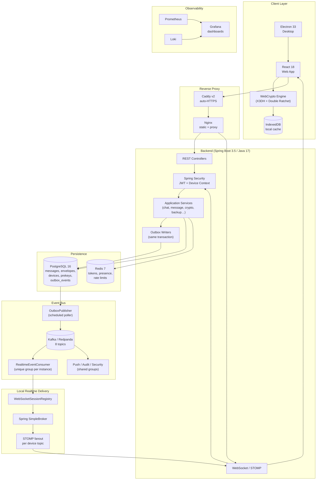
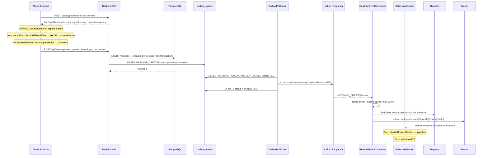
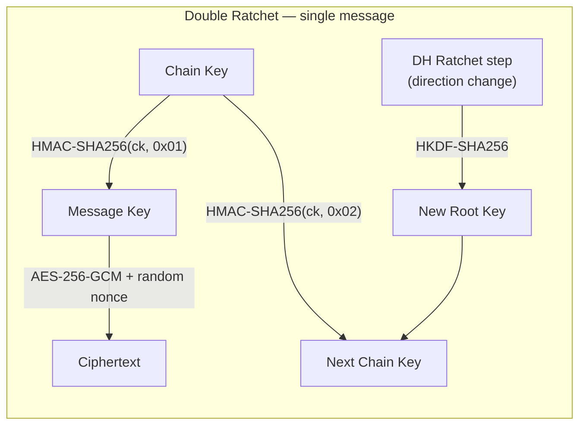
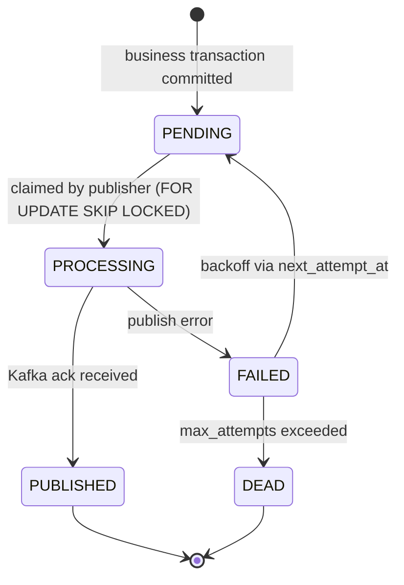
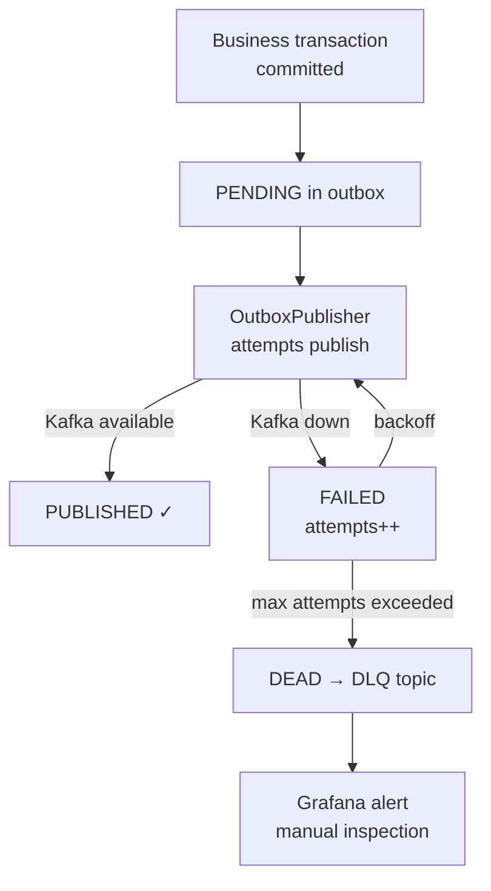
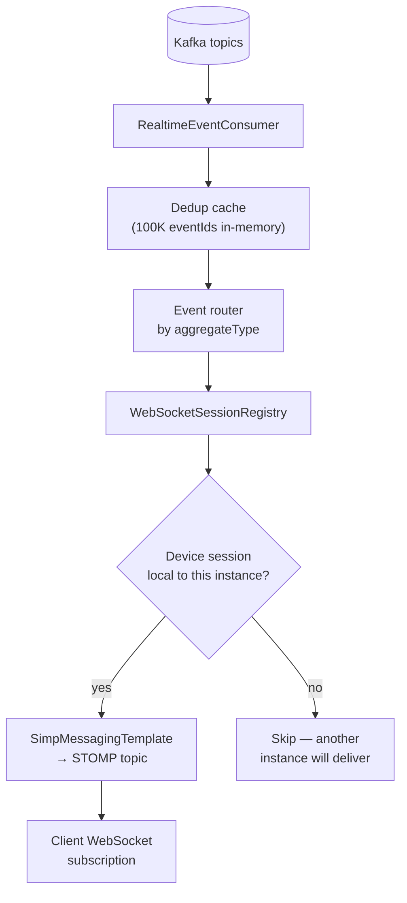
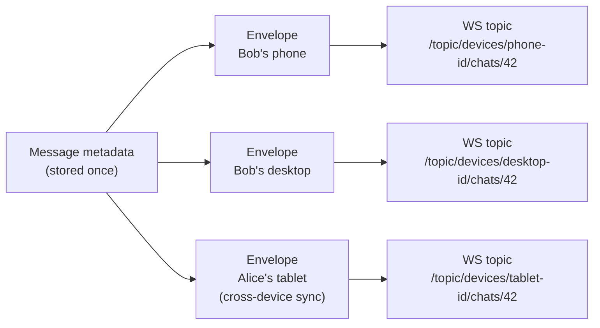

<div align="center">

[Русская версия](README.ru.md) · [Quick Setup](SETUP_COMPLETE.md) · [Security Audit](SECURITY_AUDIT_EN.md) · [Issues](https://github.com/vaazhen/chaos-e2ee-messenger/issues)

<br/>

[](https://github.com/vaazhen/chaos-e2ee-messenger/actions/workflows/ci.yml)
[](https://spring.io/projects/spring-boot)
[](https://react.dev/)
[](https://www.electronjs.org/)
[](https://openjdk.org/)
[](https://www.postgresql.org/)
[](https://redis.io/)
[](https://redpanda.com/)
[](https://www.docker.com/)
[](k8s/)
[](LICENSE)

</div>

---

# Chaos Messenger

**Chaos Messenger** is an open-source full-stack E2EE messenger and engineering project. The browser encrypts every message using the Signal protocol (X3DH + Double Ratchet), the backend routes encrypted envelopes per device, and PostgreSQL stores only ciphertext. **The server never sees plaintext.**

```json
// What the server stores per message
{ "ciphertext": "qzgHSg7z...", "nonce": "6KPcVjbp...", "messageIndex": 42 }
// What appears in chat previews
{ "lastMessage": "[encrypted]" }
```

> ⚠️ This is not a Signal replacement and has not been independently audited. It is an engineering project implementing a production-like E2EE architecture: cryptography, realtime delivery, multi-device support, desktop client, Kafka backbone, observability and infrastructure.

**Available as:** Web app · Desktop (Electron) for Windows / macOS / Linux · Docker Compose · Kubernetes

---

## Table of Contents

- [Stack](#stack)
- [High-Level Architecture](#high-level-architecture)
- [Message Path: End to End](#message-path-end-to-end)
- [E2EE Protocol](#e2ee-protocol)
- [Transactional Outbox + Kafka](#transactional-outbox--kafka)
- [Realtime Delivery Model](#realtime-delivery-model)
- [Multi-Device Delivery](#multi-device-delivery)
- [Desktop Client (Electron)](#desktop-client-electron)
- [Features](#features)
- [Quick Start](#quick-start)
- [Local Services](#local-services)
- [Load Testing Results](#load-testing-results)
- [Backend Module Map](#backend-module-map)
- [API Reference](#api-reference)
- [Key Design Decisions](#key-design-decisions)
- [Known Limitations](#known-limitations)
- [Roadmap](#roadmap)
- [Articles](#articles)

---

## Stack

| Layer | Technology |
|---|---|
| Frontend | React 18, JavaScript, WebCrypto API, IndexedDB, STOMP/WebSocket |
| Desktop | Electron 33 (Windows / macOS / Linux) |
| Backend | Java 17, Spring Boot 3.5, Spring Security, Spring Data JPA, Hibernate |
| Realtime backbone | Apache Kafka / Redpanda, Transactional Outbox |
| Local delivery | WebSocket/STOMP, Spring SimpleBroker |
| Storage | PostgreSQL 16, 38 Flyway migrations |
| Cache / runtime state | Redis 7 (tokens, presence, rate limits, unread counters) |
| Reverse proxy | Caddy v2 (auto-HTTPS), Nginx |
| Observability | Prometheus, Grafana, Loki, Promtail, Spring Boot Actuator |
| Infrastructure | Docker Compose (13 services), Kubernetes (Kustomize), GitHub Actions CI/CD |
| Cryptography | WebCrypto API, X25519 ECDH, ECDSA P-256, HKDF-SHA256, AES-256-GCM |

---

## High-Level Architecture



---

## Message Path: End to End

This is the complete journey of a message from Alice's browser to Bob's device.



**Core principle:** PostgreSQL commits the business fact and the event atomically. Kafka distributes to all backend instances. Each instance delivers only to locally connected devices.

---

## E2EE Protocol

### Device Registration

On first launch, the browser generates via WebCrypto API:

| Key material | Algorithm | Stored |
|---|---|---|
| Identity keypair | X25519 ECDH | Private → localStorage only |
| Signing keypair | ECDSA P-256 | Private → localStorage only |
| Signed prekey | X25519, signed by signing key | Public → server |
| 50 one-time prekeys | X25519 | Public → server |

The backend stores **only public key material and encrypted envelopes** — never private keys.

### Session Establishment (X3DH)

When Alice sends the first message to Bob:

```
1. Fetch Bob's devices: POST /api/crypto/resolve-chat-devices
2. Atomically reserve a one-time prekey (FOR UPDATE)
3. Verify signed prekey ECDSA P-256 signature
4. Compute 3–4 X25519 DH operations
5. Derive shared secret: HKDF-SHA256(DH1 ‖ DH2 ‖ DH3 ‖ DH4)
6. Initialize Double Ratchet
```

### Double Ratchet

Per the Signal specification:

```
Symmetric ratchet:
  messageKey   = HMAC-SHA256(chainKey, 0x01)
  nextChainKey = HMAC-SHA256(chainKey, 0x02)

DH ratchet (on direction change):
  new X25519 keypair → DH exchange → HKDF-SHA256(rootKey, dhOutput) → newRootKey + newChainKey

Encryption:
  ciphertext = AES-256-GCM(plaintext, messageKey, randomNonce)

Out-of-order delivery:
  skipped message keys cached: up to 2000 per step, 4000 total
```



---

## Transactional Outbox + Kafka

### Why Outbox

Spring SimpleBroker works for single-instance deployments but is in-memory and doesn't solve cross-instance delivery. The transactional outbox pattern guarantees that every committed business event eventually reaches Kafka — even if the broker is temporarily unavailable.



### Outbox Event Fields

| Field | Purpose |
|---|---|
| `event_id` | Idempotency key for dedup |
| `aggregate_type` | `message`, `chat`, `user`, `request` |
| `aggregate_id` | Entity ID (used as Kafka partition key) |
| `event_type` | `MESSAGE_CREATED`, `CHAT_UPDATED`, etc. |
| `payload jsonb` | Full event data |
| `status` | `PENDING → PROCESSING → PUBLISHED / FAILED / DEAD` |
| `attempts / max_attempts` | Retry tracking |
| `next_attempt_at` | Exponential backoff schedule |
| `locked_by` | Instance lock owner (hostname:pid) |
| `last_error` | Last failure reason |

### Kafka Topics

| Topic | Partitions | Purpose |
|---|---|---|
| `chaos.message.events` | 6 | Messages: send, edit, delete, reaction, status |
| `chaos.chat.events` | 6 | Chat created/updated, members, moderation |
| `chaos.receipt.events` | 6 | Delivered / read receipts |
| `chaos.user.events` | 3 | Profile and avatar updates |
| `chaos.push.events` | 6 | Push notification requests |
| `chaos.security.events` | 3 | Device/prekey/security events |
| `chaos.audit.events` | 3 | Audit trail |
| `chaos.dead-letter.events` | 3 | Failed events |

Kafka partition key = `chatId` for message/chat events → ordering preserved per chat.

### Kafka Failure Handling



---

## Realtime Delivery Model



### Consumer Group Strategy

Realtime consumers use a **unique group per backend instance** so every instance receives every event:

```
backend-1  →  group: chaos-realtime-a1b2c3
backend-2  →  group: chaos-realtime-d4e5f6
backend-3  →  group: chaos-realtime-g7h8i9
```

Background consumers use **shared groups** (push, audit, security) — processed exactly once across the fleet.

---

## Multi-Device Delivery

One logical message → N encrypted envelopes, one per recipient device plus sender's own devices for cross-device sync.



The backend is **transport-aware but content-blind** — it routes envelopes without being able to decrypt them.

---

## Local Message Cache (IndexedDB)

After decryption, every message is stored in **IndexedDB** (`chaos-messenger` DB, `messages` table):

```
WebSocket event → decrypt → IndexedDB + React state
Page reload     → IndexedDB → React state   (zero API calls, zero crypto)
Cold sync       → API → decrypt → IndexedDB + React state
```

| Field | Stored | Notes |
|---|---|---|
| `id`, `chatId`, `senderId` | ✅ | Index key = `id` |
| `content` (decrypted JSON) | ✅ | Full payload |
| `reactions`, `myReactions` | ✅ | Updated via `updateMessageReactions()` |
| `_img`, `_voice` | ❌ | Object URLs — session-only |
| `_attachment.objectUrl` | ❌ | Stripped before saving |

---

## Desktop Client (Electron)

Electron wraps the React frontend in a native Chromium window:

- **System tray** — minimize to tray, background notifications
- **Native notifications** — OS-level message alerts
- **File dialogs** — save/open encrypted attachments natively
- **Single instance** — prevents duplicate windows
- **Window state** — remembers position, size, maximized
- **Cross-platform** — Windows (NSIS), macOS (DMG), Linux (AppImage)

```bash
cd frontend
npm install

# Development (hot reload in Electron window)
npm run electron:dev

# Production build for Windows
npm run electron:build:win

# Production build for current platform
npm run electron:build
```

Installer output: `frontend/release/`

---

## Features

| Category | Features |
|---|---|
| **E2EE** | X3DH session establishment · Double Ratchet per message · AES-256-GCM · HKDF-SHA256 |
| **Multi-device** | Per-device keys · per-device envelopes · device management UI |
| **Auth** | Phone OTP · email/password · JWT · refresh token rotation · rate limits |
| **Chats** | Direct · Saved Messages · Groups with RBAC · chat requests |
| **Messages** | Send · edit · delete · reply · reactions · read/delivered status · typing indicator |
| **Attachments** | AES-256-GCM encrypted · image compression · voice messages |
| **Self-destruct** | TTL per message · scheduled cleanup · countdown UI |
| **Realtime** | SockJS / WebSocket / STOMP · per-device topics · presence heartbeats |
| **Calls** | WebRTC audio/video · screen share · STUN-based ICE |
| **Desktop** | Electron · system tray · native notifications · single instance |
| **Observability** | Spring Actuator · Prometheus · Loki · Grafana (pre-built dashboards) |
| **Infrastructure** | Docker Compose (13 services) · Kubernetes (Kustomize) · GitHub Actions CI/CD |

---

## Quick Start

### 1. Docker Compose (recommended)

```bash
git clone https://github.com/vaazhen/chaos-e2ee-messenger.git
cd chaos-e2ee-messenger

cat > .env << EOF
POSTGRES_PASSWORD=change_this_password_123
JWT_SECRET=change_this_jwt_secret_32_chars_minimum
CORS_ORIGINS=http://localhost
DOMAIN=localhost
GRAFANA_ADMIN_PASSWORD=change_admin_password
EOF

docker compose up -d
```

Open: [http://localhost](http://localhost)

### 2. Demo mode (test accounts)

Add to `.env`:
```
CHAOS_DEMO_ENABLED=true
```

Restart and seed:
```bash
docker compose up -d
curl -s http://localhost/api/demo/seed
```

| User | Phone | Code |
|---|---|---|
| Alice | +19999999998 | 111111 |
| Bob | +19999999999 | 000000 |

### 3. Manual dev setup

```bash
# 1. Infrastructure (PostgreSQL + Redis + Redpanda)
cd backend
docker compose -f docker-compose.dev.yml up -d

# 2. Backend
./mvnw spring-boot:run

# 3. Frontend (separate terminal)
cd frontend
npm install
npm run dev
```

Open: [http://localhost:5173](http://localhost:5173)

SMS codes are printed to backend logs. Test account: `+79999999999` / code `123456`.

### 4. Kubernetes

```bash
kubectl apply -k k8s/
```

### Requirements

- Java 17+, Node.js 18+, Docker, Docker Compose v2+

---

## Local Services

| Service | URL |
|---|---|
| Web App | http://localhost |
| Backend API | http://localhost:8080 |
| Swagger UI | http://localhost:8080/swagger-ui/index.html |
| Health check | http://localhost:8080/actuator/health |
| Prometheus | http://localhost:9090 |
| Grafana | http://localhost:3000 (admin / $GRAFANA_ADMIN_PASSWORD) |

---

## Load Testing Results

Local k6 tests (8 GB RAM, Windows):

| Scenario | Requests | Errors | p95 send | p95 timeline |
|---|---:|---:|---:|---:|
| Baseline 5 VU | 2,995 | 0 | 93 ms | 43 ms |
| Normal 25 VU | 35,549 | 0 | 151 ms | 89 ms |
| Spike 50 VU | 76,816 | 0 | 428 ms | 375 ms |
| Soak 5 VU / 30 min | 250,795 | 0 | 81 ms | 44 ms |
| **Total** | **576,719** | **0** | — | — |

WebSocket: 1,000 concurrent connections, 0 errors.

---

## Backend Module Map

```
backend/src/main/java/ru/messenger/chaosmessenger/
├── auth/           # phone OTP, email auth, JWT, refresh tokens, rate limiting
├── user/           # profile, user identity, search
├── crypto/         # device registration, signed prekeys, one-time prekeys, bundles
├── chat/           # direct chats, groups, participants, RBAC moderation
├── message/        # send, edit, delete, receipts, reactions, timeline, self-destruct
├── attachment/     # encrypted attachment storage and access control
├── outbox/         # transactional outbox, Kafka config, OutboxPublisher
├── realtime/       # Kafka consumers, WebSocket session registry, STOMP fanout
├── push/           # web push subscriptions
├── backup/         # encrypted backup export/import
├── call/           # WebRTC signaling
└── infra/          # security config, JWT filter, device context, observability
```

---

## API Reference

### Auth (`/api/auth/`)

| Method | Path | Description |
|---|---|---|
| GET | `/exists?phone=` | Check if account exists |
| GET | `/username-available?username=` | Check username availability |
| POST | `/send-code` | Send SMS verification code |
| POST | `/verify-code` | Verify SMS code |
| POST | `/complete-setup` | Complete registration |
| POST | `/register` | Register via email |
| POST | `/login` | Login via email |
| POST | `/refresh` | Refresh JWT |
| POST | `/logout` | Logout, revoke token |

### Messages (`/api/messages/`)

| Method | Path | Description |
|---|---|---|
| POST | `/encrypted/v2` | Send E2EE message |
| GET | `/chat/{chatId}/timeline` | Fetch message history |
| POST | `/chat/{chatId}/read` | Mark chat as read |
| PUT | `/{messageId}/encrypted/v2` | Edit encrypted message |
| PUT | `/{messageId}/reactions` | Add/remove reaction |
| DELETE | `/{messageId}` | Delete message |

### Crypto / Devices (`/api/crypto/`)

| Method | Path | Description |
|---|---|---|
| POST | `/devices/register` | Register a device |
| GET | `/devices/my` | List my devices |
| POST | `/devices/{id}/deactivate` | Deactivate a device |
| GET | `/bundle/{username}` | Fetch user's public key bundle |
| POST | `/resolve-chat-devices/{chatId}` | Resolve all devices in a chat |
| POST | `/*/reserve-prekey` | Reserve one-time prekey |

Full OpenAPI docs: `http://localhost:8080/swagger-ui/index.html`

---

## Key Design Decisions

| Decision | Rationale |
|---|---|
| **WebCrypto instead of libsodium/WASM** | No native dependencies, browser-audited implementation |
| **Per-device envelopes** | Message loss is isolated per device; no shared decryption key |
| **Transactional Outbox + Kafka** | Guarantees event delivery even when Kafka is temporarily down; enables horizontal WebSocket scaling |
| **Unique Kafka group per realtime consumer** | Every backend instance receives every event → no missed delivery for locally connected clients |
| **STOMP over raw WebSocket** | Pub/sub topics, frame routing, SockJS fallback |
| **PostgreSQL over NoSQL** | Foreign keys, Flyway migrations, JSON reactions, strong transaction model |
| **Electron over Tauri** | WebCrypto guaranteed in Chromium, zero Rust, proven cross-platform |
| **IndexedDB local cache** | Decrypted messages survive page reload with zero API calls |
| **Spring SimpleBroker** | Works for single instance; replaced by Kafka fanout for multi-instance |

---

## Project Structure

```
chaos-e2ee-messenger/
├── backend/                    # Spring Boot (Maven)
│   ├── src/main/java/          # 12 domain packages
│   ├── src/main/resources/     # 38 Flyway migrations, Grafana dashboards, Logback
│   ├── src/test/               # 34 test files (unit + controller + architecture)
│   ├── Dockerfile              # Multi-stage JRE build
│   └── pom.xml                 # Dependencies, Checkstyle, JaCoCo
├── frontend/                   # React 18 + Vite + Electron
│   ├── src/                    # crypto-engine.js, hooks, components
│   ├── src/test/               # 16 test files (Vitest + Playwright)
│   ├── electron/               # Electron main process + preload
│   ├── Dockerfile              # Multi-stage Nginx build
│   └── nginx.conf              # Frontend + API proxy config
├── infra/                      # Caddyfile, Loki, Promtail configs
├── k8s/                        # Kubernetes manifests (Kustomize)
├── scripts/                    # smoke-test, healthcheck, backup
├── docker-compose.yml          # Production stack (13 services)
├── docker-compose.override.yml # Local dev overrides
├── .env.example                # Environment variable template
└── .github/workflows/          # CI/CD: build → test → Docker → K8s deploy
```

---

## Known Limitations

- Push notifications: endpoint exists, Web Push delivery not yet implemented
- Attachments stored on local filesystem (not S3/GCS)
- Spring SimpleBroker does not scale horizontally without Kafka enabled
- No Safety Numbers / device verification UI yet
- XSS in localStorage would compromise keys (mitigated by CSP + short-lived JWTs)

---

## Roadmap

- Safety numbers and explicit device verification UI
- Stronger key storage strategy (e.g. non-extractable CryptoKey)
- More adversarial E2EE and multi-device tests
- Kafka DLQ dashboard and operational tooling
- Multi-instance realtime integration tests
- Push notification worker hardening
- External security review
- Android client
- S3/GCS attachment storage

---

## Articles

- [Building an E2EE Messenger with Spring Boot and WebCrypto (Habr EN)](https://habr.com/ru/articles/1051406/)
- [Habr discussion (RU)](https://habr.com/ru/articles/1030854/)

---

## License

Apache License 2.0. See [LICENSE](LICENSE).
