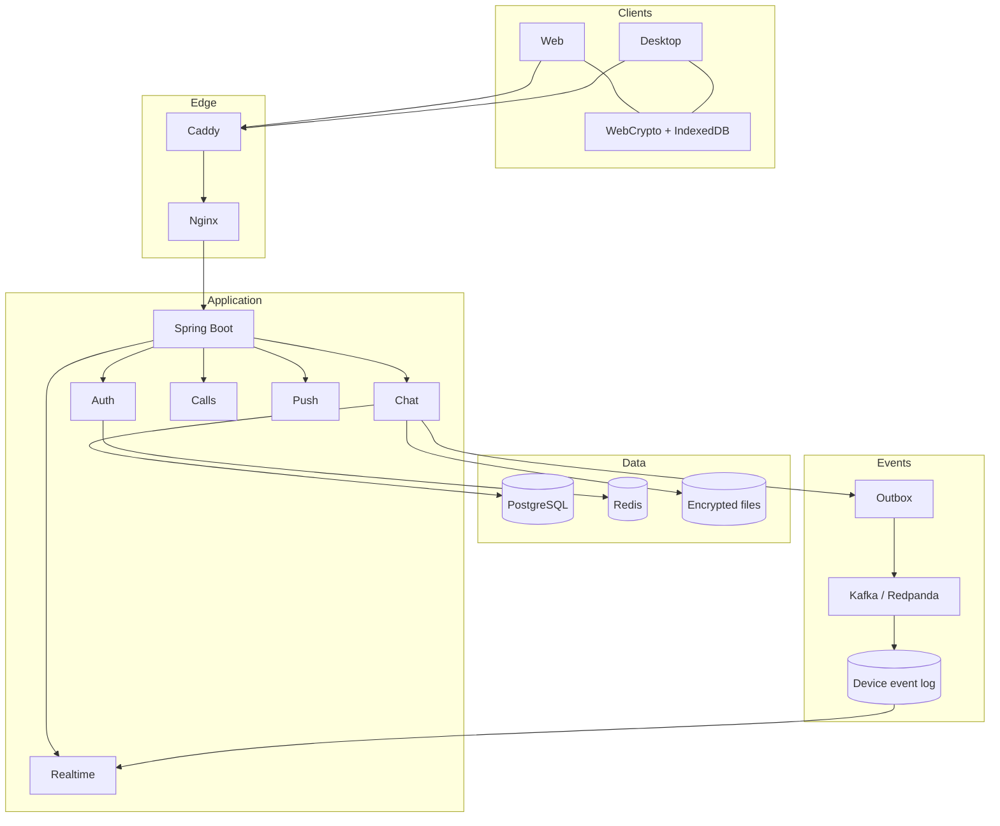

<div align="center">

# Chaos

**A self-hosted encrypted messenger for web and desktop.**

Private chats · Groups · Voice & video notes · 1:1 calls · Multi-device E2EE

[](https://github.com/vaazhen/chaos-e2ee-messenger/actions/workflows/ci.yml)
[](backend/)
[](backend/)
[](frontend/)
[](LICENSE)

[Русская версия](README.ru.md) · [Run it](#run-it) · [Security](#security) · [Architecture](#architecture) · [Self-host](#self-host)

</div>

Chaos is a messenger you run yourself. Messages, photos, files, voice and video notes are encrypted on the device before they reach the server. You get a Slack-like workspace for teams and a Signal-like guarantee that the host does not read the content.

It is not affiliated with Signal and is not a copy of the Signal Protocol. There is no independent cryptographic audit yet. Do not treat it as a finished high-risk product.

---

## Product

| | |
|---|---|
| **Chat** | Direct messages, groups and saved messages. Replies, edits, deletion, reactions, typing, delivery and read receipts, disappearing messages. |
| **Media** | Encrypted photos, files, voice messages and circular video notes. Hold-to-record, lock or cancel, send preview, in-chat paging. |
| **Calls** | 1:1 audio and video, with camera picture-in-picture. |
| **Identity** | Safety Number / QR verification. A changed device key is a security event, not a silent update. |
| **Devices** | Every device has its own keys. Messages fan out encrypted to each of them, including your other devices. |
| **Clients** | Web app and Electron desktop. Push notifications on the web. |
| **Backup** | Encrypted key backup. The passphrase never leaves the device. It restores identity, not chat history. |

The server stores accounts, chat membership, ciphertext, delivery metadata and call signaling. It does not receive message plaintext, file plaintext, private keys or backup passphrases. Relationships, timing and ciphertext size are still visible. That is the same class of metadata tradeoff Signal and Mattermost document: content is protected, traffic analysis is not.

Calls use DTLS-SRTP. Signaling (who called whom, SDP, ICE) still goes through the server. Production calls stay off until you put TURN in front of WebRTC.

---

## Run it

You need Docker Engine, Docker Compose v2 and about 4 GB of free memory.

```bash
git clone https://github.com/vaazhen/chaos-e2ee-messenger.git
cd chaos-e2ee-messenger
cp .env.example .env
```

Replace every `CHANGE_ME` value:

```bash
openssl rand -base64 32   # POSTGRES_PASSWORD
openssl rand -base64 32   # REDIS_PASSWORD
openssl rand -base64 48   # JWT_SECRET
openssl rand -base64 32   # GRAFANA_ADMIN_PASSWORD
```

For a machine on localhost:

```dotenv
DOMAIN=localhost
CORS_ORIGINS=https://localhost
CHAOS_DEMO_ENABLED=false
KAFKA_BOOTSTRAP_SERVERS=localhost:19092
```

```bash
docker compose up --build -d
```

Open [https://localhost](https://localhost). Register two accounts and start a chat. Caddy uses a local CA on localhost and a public certificate when you set a real domain.

Stop with `docker compose down`. Wipe local data with `docker compose down -v`.

### Develop against a live API

```bash
cd backend && docker compose -f docker-compose.dev.yml up -d && ./mvnw spring-boot:run
cd frontend && cp .env.example .env && npm ci && npm run dev
```

API: `http://localhost:8080`. App: `http://localhost:5173`. The dev compose file includes PostgreSQL, Redis, Redpanda and coturn so two browsers on the same machine can call each other.

Desktop:

```bash
cd frontend
cp .env.electron.example .env.electron
npm run electron:dev
```

Packaged Electron builds require absolute `https` / `wss` endpoints.

---

## Security

Chaos encrypts with WebCrypto on the client: X25519 identities, an X3DH-inspired handshake, Double Ratchet-style chains and AES-256-GCM for messages and attachments. Each destination device gets its own envelope.

| Server may see | Server must not receive |
|---|---|
| Accounts, profiles, chat membership | Message plaintext |
| Device ids and public pre-key bundles | Private identity or pre-keys |
| Encrypted envelopes and attachment blobs | Attachment plaintext, ratchet keys |
| Delivery timing and ciphertext size | Backup passphrase |
| Call signaling (peers, SDP, ICE) | Call media plaintext |

E2EE does not protect a compromised OS, a malicious browser extension, injected JavaScript on a trusted origin, or an unlocked desktop session.

A backup restores cryptographic identity. It does not restore local message history or every previous ratchet session.

---

## Architecture


```mermaid
flowchart TB
    subgraph Clients
        WEB[Web]
        DESKTOP[Desktop]
        CRYPTO[WebCrypto + IndexedDB]
        WEB --- CRYPTO
        DESKTOP --- CRYPTO
    end

    subgraph Edge
        CADDY[Caddy]
        NGINX[Nginx]
    end

    subgraph Application
        API[Spring Boot]
        AUTH[Auth]
        CHAT[Chat]
        RT[Realtime]
        CALLS[Calls]
        PUSH[Push]
    end

    subgraph Data
        PG[(PostgreSQL)]
        REDIS[(Redis)]
        BLOB[(Encrypted files)]
    end

    subgraph Events
        OUTBOX[Outbox]
        KAFKA[Kafka / Redpanda]
        DURABLE[(Device event log)]
    end

    WEB --> CADDY
    DESKTOP --> CADDY
    CADDY --> NGINX
    NGINX --> API
    API --> AUTH
    API --> CHAT
    API --> RT
    API --> CALLS
    API --> PUSH
    AUTH --> REDIS
    CHAT --> PG
    CHAT --> BLOB
    CHAT --> OUTBOX
    OUTBOX --> KAFKA
    KAFKA --> DURABLE
    DURABLE --> RT
```

A send is one database transaction: message, envelopes, outbox row. After commit the outbox publisher writes to Kafka. The realtime consumer appends a device-scoped log first, then notifies over WebSocket and push. If the broker is down, outbox rows stay pending and retry. Clients catch up through `/api/realtime/sync`. Typing and presence stay ephemeral.

Stack: React 18, Vite, Electron, Java 17, Spring Boot 3.5, PostgreSQL 16, Redis 7, Kafka-compatible broker, Caddy, Nginx, Prometheus, Grafana, Loki.

```text
backend/     API, Flyway, tests
frontend/    Web client, Electron, crypto engine
infra/       Caddy, Prometheus, Loki
k8s/         Stateless production manifests
docs/        Runbooks and production checklist
```

---

## Self-host

Kubernetes manifests in `k8s/` deploy the stateless app. Bring your own PostgreSQL, Redis, Kafka, object storage and secret manager.

```bash
kubectl kustomize k8s/
kubectl apply -k k8s/
```

See [k8s/README.md](k8s/README.md) and [docs/PRODUCTION_READINESS.md](docs/PRODUCTION_READINESS.md).

<details>
<summary>Environment variables</summary>

| Variable | Purpose |
|---|---|
| `POSTGRES_PASSWORD` | Database password |
| `REDIS_PASSWORD` | Redis password |
| `JWT_SECRET` | JWT signing secret |
| `DOMAIN` | Public hostname for Caddy |
| `CORS_ORIGINS` | Trusted web origin |
| `KAFKA_BOOTSTRAP_SERVERS` | Kafka-compatible brokers |
| `CHAOS_ATTACHMENTS_MAX_BYTES` | Max encrypted upload size |
| `CHAOS_CALLS_ENABLED` | 1:1 call signaling; off outside `dev` |
| `VAPID_PUBLIC_KEY` / `VAPID_PRIVATE_KEY` | Web Push |

Full examples live in `.env.example`, `backend/.env.example` and `frontend/.env.example`.

</details>

CI builds, tests, scans and publishes images. Staging and production deploys are gated. Runbooks for outage, outbox backlog, token reuse and rollback are in [`docs/runbooks/`](docs/runbooks/).

### Verify

```bash
cd backend && ./mvnw --batch-mode --no-transfer-progress verify
cd ../frontend && npm ci && npm run lint && npm run typecheck && npm run test:coverage -- --run && npm run build
```

---

## Roadmap

- Finish the strict TypeScript crypto migration
- Production object storage for encrypted attachments
- Production TURN, hardened call state and group calls
- Independent pentest and cryptographic review
- Formal protocol spec and test vectors

---

## Contributing

Small, focused pull requests. Before a PR:

```bash
cd backend && ./mvnw verify
cd ../frontend && npm run lint && npm run typecheck && npm run test:coverage -- --run && npm run build
```

Report security issues privately until a fix is ready.

## License

[Apache License 2.0](LICENSE).
