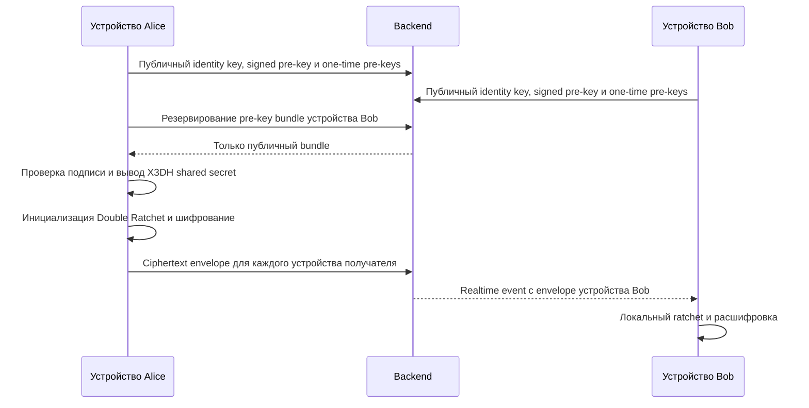
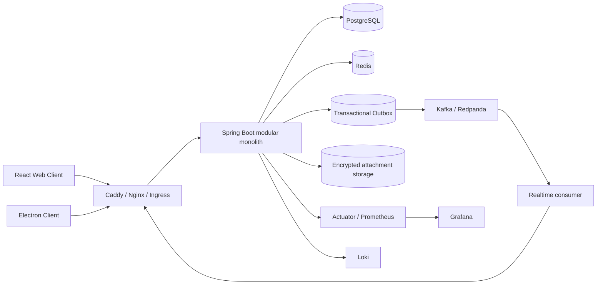

<div align="center">

# Chaos Messenger

### Полноценная основа мультидевайсного мессенджера со сквозным шифрованием

Web + Electron · X3DH-подобное установление сессии · Double Ratchet · Spring Boot · PostgreSQL · Redis · Kafka/Redpanda · Docker · Kubernetes

[English](README.md) · [Готовность к production](PRODUCTION_READINESS.md) · [Отчёт о проверке](VALIDATION_REPORT.md) · [Список hardening-изменений](HARDENING_CHANGELOG.md)

</div>

> **Статус:** security-hardened исходный проект, пригодный для оценки, white-label разработки, staging и дальнейшей коммерциализации. Перед публичным запуском с чувствительными данными обязательны независимый аудит криптографии, pentest, production-инфраструктура для stateful-компонентов, object storage, нагрузочные испытания и эксплуатационные проверки из [PRODUCTION_READINESS.md](PRODUCTION_READINESS.md).

## Почему проект имеет коммерческую ценность

Chaos Messenger — не UI-макет и не обычный CRUD-чат. В одном репозитории уже собраны клиентская криптография, мультидевайсная доставка ключей и сообщений, realtime, transactional outbox, desktop-клиент, observability, тесты и deployment-манифесты.

Проект подходит как основа для:

- приватного корпоративного или командного мессенджера;
- white-label продукта защищённой связи;
- внутренней collaboration-платформы;
- дальнейшей разработки аудируемого E2EE-решения;
- сильного portfolio/source-code asset с понятными границами модулей.

Backend сознательно оставлен **модульным монолитом**. Сейчас его можно надёжно разворачивать одним приложением, а позднее разделить на API, realtime, worker, attachment, push и call-контуры только после появления измеримой нагрузки.

## Возможности

| Область | Реализовано |
|---|---|
| E2EE | Отдельные encrypted envelopes для каждого устройства, X3DH-подобная pre-key схема, Double Ratchet, AES-256-GCM, HKDF-SHA-256 |
| Доверие устройствам | Safety Number для каждого устройства, сохранение verification-state, `KEY_CHANGED` и блокировка шифрования/расшифровки до повторной проверки |
| Multi-device | Identity key, signed pre-key, one-time pre-keys и доставка на все активные устройства участников |
| Сообщения | Личные чаты, сохранённые сообщения, группы, ответы, редактирование, удаление, реакции, delivered/read, typing |
| Вложения | Поддержка клиентского шифрования, лимиты backend-хранилища, защита от path traversal и удаление файла при rollback |
| Исчезающие сообщения | TTL и плановая очистка |
| Realtime | STOMP/WebSocket, topics по устройствам, presence, дедупликация at-least-once событий по `eventId` |
| Звонки | Основа WebRTC signalling, audio/video и screen sharing |
| Auth | Email/password и phone-flow, короткий access JWT, HttpOnly refresh-cookie, rotation и reuse detection |
| Desktop | Electron для Windows/macOS/Linux, sandbox, ограниченный IPC, native notifications и tray |
| Эксплуатация | Flyway, Actuator, Prometheus, Grafana, Loki, Docker Compose, Kubernetes, GitHub Actions |

## Модель безопасности

### Что не получает сервер

Plaintext сообщений и приватный ключевой материал клиента не отправляются на backend. Сервер хранит публичный device key material, ciphertext envelopes, метаданные сообщений, membership, delivery-state и зашифрованные вложения.

### Хранение ключей на клиенте

Приватное E2EE-состояние хранится в IndexedDB как записи, зашифрованные AES-GCM. Wrapping key создаётся WebCrypto как non-extractable и сохраняется через IndexedDB. Старые секреты мигрируются из `localStorage`; access JWT существует только в памяти процесса; refresh token передаётся через host-only cookie с `Secure`, `HttpOnly` и `SameSite=Strict`.

Это усиливает защиту данных в покое и от простого чтения browser storage. Это **не** защищает уже скомпрометированный endpoint: JavaScript, исполняющийся в доверенном origin, вредоносное расширение, malware ОС или подменённая сборка всё ещё могут получить plaintext во время работы клиента. E2EE защищает канал и недоверенное серверное хранилище, но не заражённое конечное устройство.

### Проверка identity key

Для каждого удалённого устройства хранится отдельный статус:

```text
UNVERIFIED -> VERIFIED -> KEY_CHANGED
```

Пользователь сверяет Safety Number по независимому каналу. Если ранее подтверждённый identity key изменился, клиент фиксирует `KEY_CHANGED` и блокирует encrypted operations до явной повторной проверки.

### Видимые серверу метаданные

Сервису необходимы аккаунты, устройства, membership чатов, timestamps, размеры сообщений, delivery-state, сетевые данные и метаданные объектов вложений. Key transparency и протоколы сокрытия метаданных пока не реализованы.

## Криптографический поток



Реализация поддерживает skipped message keys для доставки не по порядку и сериализует изменения ratchet-state между конкурентными операциями, чтобы не переиспользовать message index.

## Архитектура



### Модули backend

`auth`, `crypto`, `message`, `chat`, `user`, `attachment`, `backup`, `call`, `push`, `realtime`, `outbox`, `infra`, `common`, `demo` разделены на уровне пакетов. Домены с сильными транзакционными инвариантами пока не разнесены по сети без необходимости.

### Семантика доставки

При включённом Kafka изменение домена и outbox-event фиксируются одной транзакцией PostgreSQL. Publisher повторяет неудачные публикации и отправляет события в partitioned topics. Realtime имеет семантику **at least once**: событие содержит `eventId`, backend дедуплицирует успешно обработанные fanout-события, frontend отбрасывает повторную WebSocket-доставку.

При отключённом Kafka в local development используется прямой локальный realtime-path.

## Стек

| Слой | Технологии |
|---|---|
| Web | React 18, Vite 5, WebCrypto, IndexedDB, STOMP/SockJS |
| Desktop | Electron 33, electron-builder |
| Backend | Java 17, Spring Boot 3.5, Spring Security, JPA/Hibernate |
| Data | PostgreSQL 16, Redis 7, 37 Flyway migrations |
| Events | Kafka-compatible broker / Redpanda, transactional outbox |
| Observability | Actuator, Prometheus, Grafana, Loki, Promtail |
| Delivery | Docker Compose, Kubernetes/Kustomize, GitHub Actions |

## Быстрый запуск через Docker Compose

### Требования

- Docker Engine и Docker Compose v2;
- домен, направленный на сервер, либо `localhost` для локальной проверки;
- минимум 4 ГБ свободной памяти для полного demo-стека.

### Запуск

```bash
cp .env.example .env
```

Сгенерируйте секреты и заполните `.env`:

```bash
openssl rand -base64 32   # POSTGRES_PASSWORD
openssl rand -base64 32   # REDIS_PASSWORD
openssl rand -base64 48   # JWT_SECRET
openssl rand -base64 32   # GRAFANA_ADMIN_PASSWORD
```

```bash
docker compose up --build -d
docker compose ps
docker compose logs -f backend frontend caddy
```

Откройте `https://$DOMAIN`. Для публичного домена Caddy получает публичный TLS-сертификат, для локальных имён использует локальный CA.

Compose предназначен для evaluation/staging. В production одиночные PostgreSQL, Redis и Redpanda следует заменить managed-сервисами или operator-backed кластерами с проверенными backup/PITR.

## Локальная разработка

### Backend

```bash
cd backend
./mvnw spring-boot:run
```

Backend требует PostgreSQL и Redis. Зависимости для разработки можно поднять через `backend/docker-compose.dev.yml`.

### Frontend

```bash
cd frontend
npm ci
npm run dev
```

### Сборка Electron

Packaged-страница `file://` не может использовать относительные `/api` и `/ws`:

```bash
cd frontend
cp .env.electron.example .env.electron
# Укажите VITE_API_BASE=https://.../api и VITE_WS_URL=wss://.../ws
npm run electron:build
```

Сборка завершается ошибкой, если secure endpoints не заданы. Для реального распространения также требуются code signing/notarisation и защищённый update-channel.

## Проверки

```bash
# Backend
cd backend
./mvnw verify

# Frontend
cd frontend
npm ci
npm run lint
npm test
npm run test:coverage
npm run build
```

В подготовленном архиве frontend прошёл **151 тест, 3 теста осознанно skipped**. Точные команды, coverage, статические проверки и ограничение проверки Maven в текущем packaging-окружении описаны в [VALIDATION_REPORT.md](VALIDATION_REPORT.md).

CI содержит dependency review, CodeQL, image scanning, SBOM/provenance, immutable image tags, gated production deployment и обязательную проверку rollout.

## Kubernetes

Основной каталог `k8s/` содержит stateless production-base:

- non-root, read-only root filesystem, dropped capabilities и seccomp;
- requests/limits, HPA, PodDisruptionBudget и topology spread;
- публичный Ingress только для application traffic;
- management/Actuator port остаётся внутри кластера;
- вместо настоящих секретов хранится только шаблон.

Одиночные PostgreSQL/Redis перенесены в `k8s/dev/` и не входят в production-base. Перед развёртыванием прочитайте [k8s/README.md](k8s/README.md).

## Нужны ли микросервисы и API Gateway

Сейчас не нужно дробить транзакционное ядро ради формальности. Первый практичный шаг масштабирования — разные deployments одной кодовой базы:

```text
chaos-api       REST commands и queries
chaos-realtime  WebSocket connections и event fanout
chaos-worker    outbox, push и cleanup jobs
```

Push, attachment storage, realtime gateway и call signalling стоит выносить только при доказанной необходимости независимого scaling/failure isolation. Пока достаточно существующего edge-слоя Ingress/Nginx; отдельный API Gateway оправдан после появления нескольких независимо развёртываемых API.

## Что ещё обязательно перед настоящим production

Проект не заявляет сертифицированную или независимо проверенную безопасность. Минимальные внешние gates:

1. независимый аудит криптографического дизайна и реализации;
2. pentest web, API и Electron;
3. key transparency либо другой проверяемый device-key directory;
4. S3-compatible object storage с квотами и lifecycle cleanup;
5. managed PostgreSQL/Redis/Kafka, encrypted backups и restore drills;
6. load, soak, reconnect, broker-failure и chaos testing под целевые SLO;
7. KMS/Vault/External Secrets и rotation signing keys;
8. подписанные Electron-релизы, безопасные обновления и incident runbooks.

Полный список — в [PRODUCTION_READINESS.md](PRODUCTION_READINESS.md).

## Структура репозитория

```text
.
├── backend/                 Spring Boot и backend-тесты
├── frontend/                React, WebCrypto и Electron
├── infra/                   Caddy, Loki и Promtail
├── k8s/                     Hardened stateless Kubernetes base
│   └── dev/                 Непроизводственные PostgreSQL/Redis примеры
├── .github/workflows/       CI, security scanning и release pipeline
├── docker-compose.yml       Полный evaluation/staging stack
├── PRODUCTION_READINESS.md  Оставшиеся production-gates
├── HARDENING_CHANGELOG.md   Security/reliability изменения
└── VALIDATION_REPORT.md     Воспроизводимый отчёт о проверке
```

## Продажа и лицензия

Проект распространяется по Apache License 2.0 и может быть форкнут, брендирован и расширен с соблюдением условий лицензии. Корректное коммерческое позиционирование: **основа защищённого мессенджера**, а не сертифицированная готовая замена высокозащищённым аудированным продуктам.

Перед размещением проекта на marketplace стоит добавить настоящие screenshots, изолированный hosted demo, условия поддержки покупателя, inventory лицензий зависимостей и независимый security report.

## Responsible disclosure

Не публикуйте эксплуатационные security findings в открытом issue. Передайте владельцу репозитория affected version, шаги воспроизведения, impact и предлагаемое исправление приватным каналом.

## Лицензия

[Apache License 2.0](LICENSE)
