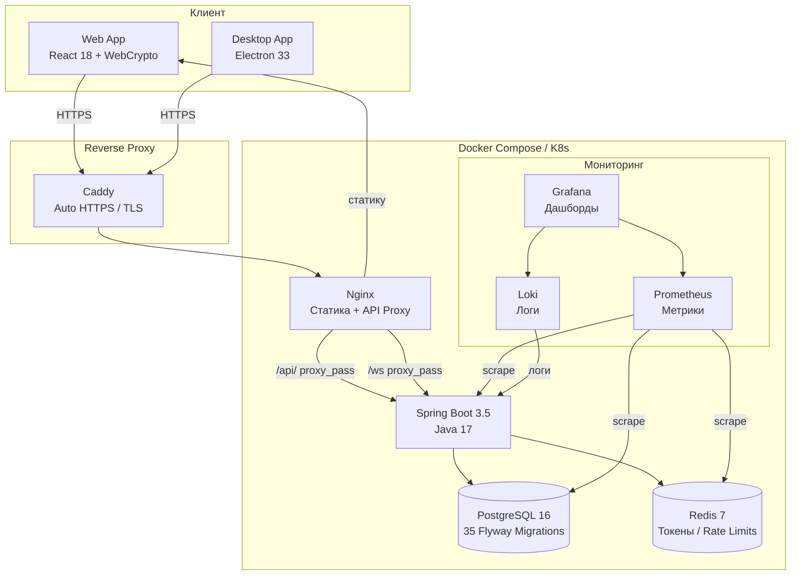
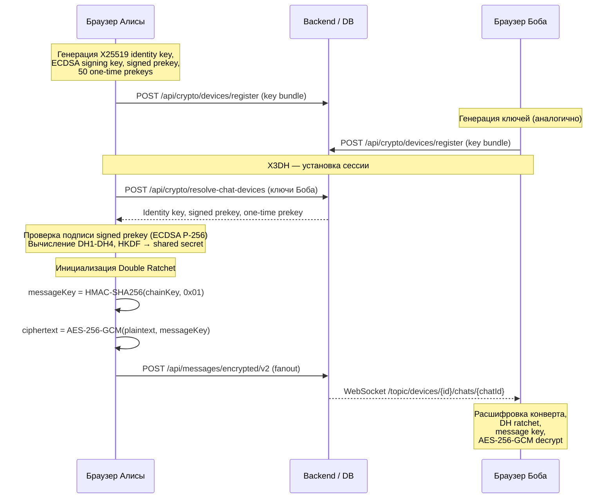
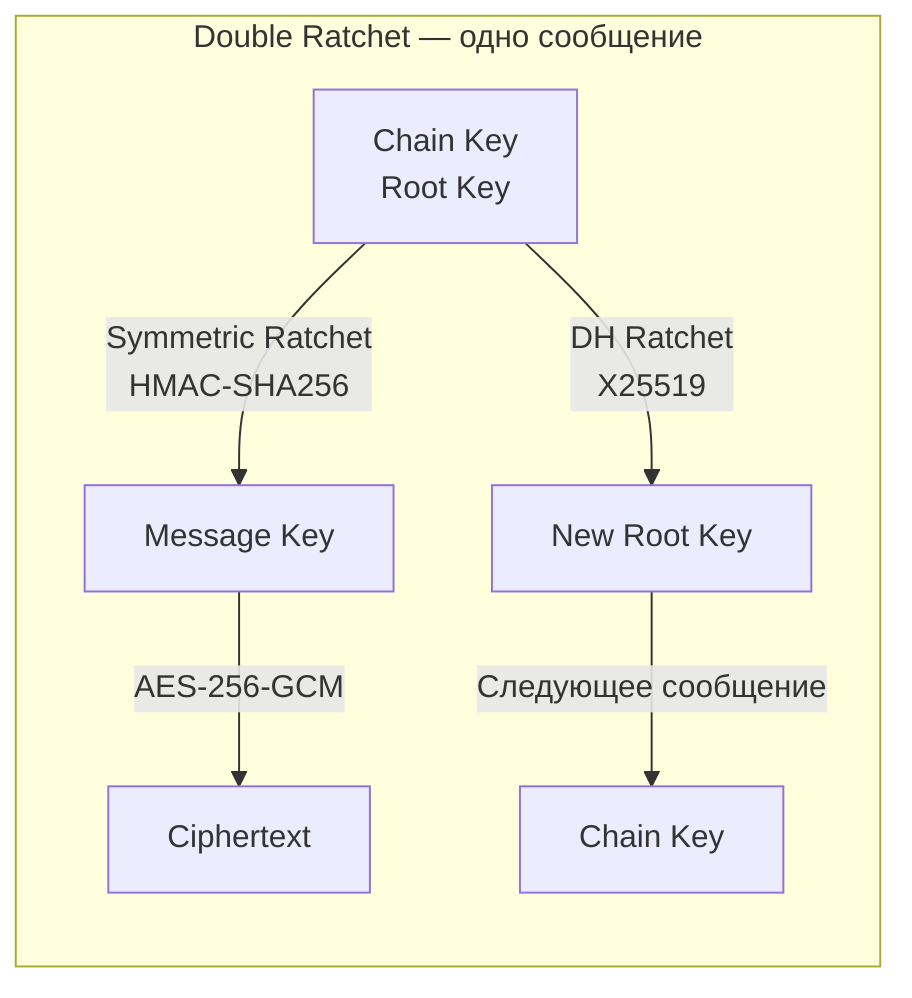
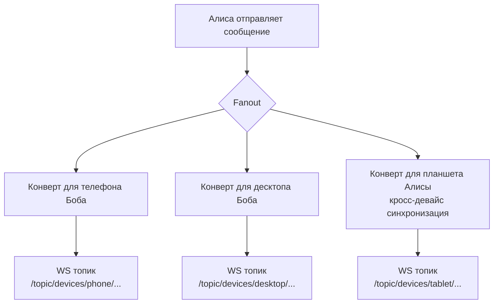

<div align="center">

[English README](README.md) · [Быстрый запуск](SETUP_COMPLETE.ru.md) · [Аудит безопасности](SECURITY_AUDIT_RU.md) · [Issues](https://github.com/vaazhen/chaos-e2ee-messenger/issues)

<br/>

[](https://github.com/vaazhen/chaos-e2ee-messenger/actions/workflows/ci.yml)
[](https://spring.io/projects/spring-boot)
[](https://react.dev/)
[](https://www.electronjs.org/)
[](https://openjdk.org/)
[](https://www.postgresql.org/)
[](https://redis.io/)
[](https://www.docker.com/)
[](k8s/)
[](LICENSE)

</div>

---

<div align="center">
  
</div>

<br/>

<p align="center">
  
</p>

<p align="center">
  <b>Full-stack E2EE мессенджер · X3DH + Double Ratchet · Multi-device · Spring Boot + React</b>
</p>

---

## О проекте

**Chaos Messenger** — production-ready end-to-end encrypted мессенджер. Браузер шифрует каждое сообщение по протоколу Signal (X3DH + Double Ratchet), backend маршрутизирует зашифрованные конверты по устройствам, а база данных хранит только ciphertext. **Сервер никогда не видит открытый текст.**

```json
// Что сервер хранит для каждого сообщения
{ "ciphertext": "qzgHSg7z...", "nonce": "6KPcVjbp...", "messageIndex": 42 }
// Что показывается в preview чата
{ "lastMessage": "[encrypted]" }
```

**Доступен как:** Web-приложение · Десктоп (Electron) для Windows/macOS/Linux · Docker Compose · Kubernetes

---

## Архитектура



| Слой | Технология | Ответственность |
|------|-----------|----------------|
| Клиент | React 18 + WebCrypto API | Генерация ключей, X3DH-сессии, Double Ratchet шифрование/дешифрование |
| Backend | Java 17 + Spring Boot 3.5 | Auth, управление устройствами, хранение конвертов, WebSocket-роутинг |
| База данных | PostgreSQL 16 + Flyway | Пользователи, устройства, чаты, сообщения, конверты (E2EE-blind) |
| Кэш | Redis 7 | Refresh-токены, присутствие, непрочитанные, rate limits |
| Reverse Proxy | Caddy v2 | Автоматический HTTPS (Let's Encrypt), TLS терминация |
| Статика | Nginx | Фронтенд, прокси API, WebSocket upgrade |
| Мониторинг | Prometheus + Loki + Grafana | Метрики, логи, готовые дашборды |
| Десктоп | Electron 33 | Нативное окно, трей, уведомления, файловые диалоги |

---

## Десктоп-приложение (Electron)

Electron-сборка оборачивает React-фронтенд в нативное окно Chromium:

- **Системный трей** — сворачивание в трей, фоновые уведомления
- **Нативные уведомления** — OS-native алерты о сообщениях
- **Файловые диалоги** — сохранение/открытие зашифрованных вложений
- **Single instance** — предотвращает повторный запуск
- **Состояние окна** — запоминает позицию, размер, maximized
- **Кроссплатформенность** — Windows (NSIS), macOS (DMG), Linux (AppImage)

### Сборка десктоп-приложения

```bash
cd frontend
npm install

# Разработка (hot reload в Electron окне)
npm run electron:dev

# Production сборка для Windows
npm run electron:build:win

# Production сборка для текущей платформы
npm run electron:build
```

Установщик будет в `frontend/release/`.

---

## Возможности

| Категория | Возможности |
|-----------|-------------|
| **E2EE** | X3DH · Double Ratchet · AES-256-GCM · HKDF-SHA256 |
| **Multi-device** | Ключи на устройство · отдельные конверты · управление устройствами |
| **Auth** | Phone OTP · email/password · JWT · refresh token rotation · rate limits |
| **Чаты** | Личные · «Сохранённые» · группы (RBAC) · chat requests |
| **Сообщения** | Отправка · редактирование · удаление · reply · реакции · статусы · печать |
| **Вложения** | AES-256-GCM шифрование · сжатие изображений · voice messages |
| **Self-destruct** | TTL · scheduled cleanup · таймер в UI |
| **Realtime** | SockJS / WebSocket / STOMP · device topics · presence heartbeats |
| **Звонки** | WebRTC аудио/видео · демонстрация экрана · STUN-based ICE |
| **Десктоп** | Electron · системный трей · нативные уведомления · single instance |
| **Мониторинг** | Spring Actuator · Prometheus · Loki · Grafana (готовый dashboard) |
| **Деплой** | Docker Compose (13 сервисов) · Kubernetes (Kustomize) · GitHub Actions CI/CD |

---

## Быстрый старт

### 1. Docker Compose (рекомендуется)

```bash
git clone https://github.com/vaazhen/chaos-e2ee-messenger.git
cd chaos-e2ee-messenger

# Создать .env с секретами
cat > .env << EOF
POSTGRES_PASSWORD=change_this_password_123
JWT_SECRET=change_this_jwt_secret_32_chars_min
CORS_ORIGINS=http://localhost
DOMAIN=localhost
GRAFANA_ADMIN_PASSWORD=change_admin_password
EOF

docker compose up -d
```

Открыть: [http://localhost](http://localhost)

### 2. Демо-режим (тестовые аккаунты)

Добавить в `.env`:
```
CHAOS_DEMO_ENABLED=true
```

Перезапустить и сделать seed:
```bash
docker compose up -d
curl -s http://localhost/api/demo/seed
```

Тестовые аккаунты:
| Пользователь | Телефон | Код |
|-------------|---------|-----|
| Alice | +19999999998 | 111111 |
| Bob | +19999999999 | 000000 |

### 3. Ручной запуск (dev)

```bash
# 1. Инфраструктура (PostgreSQL + Redis)
cd backend
docker compose -f docker-compose.dev.yml up -d

# 2. Backend
./mvnw spring-boot:run

# 3. Frontend (в другом терминале)
cd frontend
npm install
npm run dev
```

Открыть: [http://localhost:5173](http://localhost:5173)

SMS-коды печатаются в логах backend. Тестовый аккаунт: `+79999999999` / код `123456`.

### 4. Kubernetes

```bash
kubectl apply -k k8s/
```

### Требования

- Java 17+, Node.js 18+, Docker, Docker Compose v2+

---

## Локальные сервисы

| Сервис | URL |
|---------|-----|
| Web App | http://localhost |
| API | http://localhost:8080 |
| Swagger UI | http://localhost:8080/swagger-ui/index.html |
| Health | http://localhost:8080/actuator/health |
| Prometheus | http://localhost:9090 |
| Grafana | http://localhost:3000 (admin / $GRAFANA_ADMIN_PASSWORD) |

---

## E2EE Протокол



### 1. Регистрация устройства

При первом запуске браузер генерирует:
- **X25519 identity keypair** — долгоживущий идентификатор устройства
- **ECDSA P-256 signing keypair** — подписывает signed prekey
- **X25519 signed prekey** — подписан и опубликован на сервере
- **50 X25519 one-time prekeys** — для будущих сессий

Приватные ключи хранятся в `localStorage`. Сервер хранит только публичные ключи.

### 2. Установка сессии (X3DH)

Когда Алиса отправляет первое сообщение Бобу:

1. Получить устройства Боба: `POST /api/crypto/resolve-chat-devices`
2. Зарезервировать one-time prekey (атомарно, `FOR UPDATE`)
3. Проверить подпись signed prekey (ECDSA P-256)
4. Вычислить 3-4 X25519 DH-операции
5. Вывести shared secret: `HKDF-SHA256(DH1 || DH2 || DH3 || DH4)`
6. Инициализировать Double Ratchet

### 3. Double Ratchet

По спецификации Signal:

- **Симметричный ratchet:** `messageKey = HMAC-SHA256(chainKey, 0x01)`
- **DH ratchet:** при смене направления — новый X25519 keypair
- **AES-256-GCM** со случайным nonce на каждое сообщение
- **Skipped message keys:** до 2000 на шаг, 4000 всего (out-of-order delivery)

Все операции через Web Crypto API — чистый браузерный крипто.



### 4. Конверты на устройство

Одно сообщение → N зашифрованных конвертов (на каждое устройство получателей + на свои устройства для синхронизации). Каждый конверт доставляется через пер-устройствo WebSocket-топик.



---

## Деплой

### Docker Compose (13 сервисов)

```yaml
services:
  postgres          # База данных (PostgreSQL 16)
  postgres-exporter # PG метрики для Prometheus
  redis             # Кэш (Redis 7)
  redis-exporter    # Redis метрики для Prometheus
  backend           # Spring Boot (Java 17)
  frontend          # Nginx + React static
  caddy             # Reverse proxy (auto HTTPS)
  prometheus        # Сбор метрик (14 дней хранения)
  loki              # Агрегация логов
  promtail          # Сбор логов Docker
  grafana           # Дашборды и визуализация
```

```bash
docker compose up -d
```

### Kubernetes

Манифесты в `k8s/`:

```bash
kubectl apply -k k8s/
```

Включает: StatefulSet (Postgres), Deployments (Redis, Backend ×2, Frontend ×2), Services, Ingress с cert-manager, ConfigMap, Prometheus annotations.

### CI/CD

[GitHub Actions](.github/workflows/ci.yml):

1. **Backend:** Maven build + test (Checkstyle + JaCoCo 60%/40%)
2. **Frontend:** ESLint + Prettier + Vitest
3. **Docker:** Buildx multi-arch, push в `ghcr.io`
4. **Deploy:** `kustomize build | kubectl apply`

---

## Нагрузочное тестирование

Локальные k6-тесты (8 GB RAM, Windows):

| Сценарий | Запросов | Ошибок | p95 send | p95 timeline |
|----------|---------:|------:|---------:|-------------:|
| Baseline 5 VU | 2,995 | 0 | 93ms | 43ms |
| Normal 25 VU | 35,549 | 0 | 151ms | 89ms |
| Spike 50 VU | 76,816 | 0 | 428ms | 375ms |
| Soak 5 VU / 30m | 250,795 | 0 | 81ms | 44ms |
| **Всего** | **576,719** | **0** | — | — |

WebSocket: 1,000 одновременных соединений, 0 ошибок.

---

## Структура проекта

```
chaos-e2ee-messenger/
├── backend/                  # Spring Boot (Maven)
│   ├── src/main/java/        # 12 пакетов: auth, chat, crypto, message, ...
│   ├── src/main/resources/   # 35 Flyway миграций, logback, grafana dashboards
│   ├── src/test/             # Controller + unit тесты
│   ├── Dockerfile            # Multi-stage JRE build
│   └── pom.xml               # Dependencies, checkstyle, jacoco
├── frontend/                 # React 18 + Vite + Electron
│   ├── src/                  # crypto-engine.js (Double Ratchet), hooks, components
│   ├── electron/             # Electron main process, preload
│   ├── Dockerfile            # Multi-stage nginx build
│   └── nginx.conf            # Reverse proxy config
├── infra/                    # Caddyfile, Loki, Promtail конфиги
├── k8s/                      # Kubernetes манифесты (kustomize)
├── scripts/                  # smoke-test, healthcheck, backup
├── docker-compose.yml        # Production стек (13 сервисов)
├── docker-compose.override.yml  # Локальные переопределения
├── .env.example              # Шаблон переменных окружения
├── .github/workflows/        # CI/CD pipeline
└── docs/                     # Скриншоты, диаграммы
```

---

## API Methods

### Аутентификация (`/api/auth/`)

| Method | Path | Назначение |
|--------|------|-----------|
| GET | `/exists?phone=` | Проверка существования аккаунта |
| GET | `/username-available?username=` | Проверка доступности username |
| POST | `/send-code` | Отправка SMS кода |
| POST | `/verify-code` | Проверка SMS кода |
| POST | `/complete-setup` | Завершение регистрации |
| POST | `/register` | Регистрация по email |
| POST | `/login` | Вход по email |
| POST | `/refresh` | Обновление JWT |
| POST | `/logout` | Выход, отзыв токена |

### Сообщения (`/api/messages/`)

| Method | Path | Назначение |
|--------|------|-----------|
| POST | `/encrypted/v2` | Отправка E2EE сообщения |
| GET | `/chat/{chatId}/timeline` | История сообщений |
| POST | `/chat/{chatId}/read` | Отметить как прочитано |
| PUT | `/{messageId}/encrypted/v2` | Редактировать |
| PUT | `/{messageId}/reactions` | Реакция |
| DELETE | `/{messageId}` | Удалить |

### Crypto / Devices (`/api/crypto/`)

| Method | Path | Назначение |
|--------|------|-----------|
| POST | `/devices/register` | Регистрация устройства |
| GET | `/devices/my` | Мои устройства |
| POST | `/devices/{id}/deactivate` | Деактивировать устройство |
| GET | `/bundle/{username}` | Получить ключи пользователя |
| POST | `/resolve-chat-devices/{chatId}` | Устройства в чате |
| POST | `/*/reserve-prekey` | Зарезервировать one-time prekey |

Полная Swagger/OpenAPI документация: `http://localhost:8080/swagger-ui/index.html`

---

## Ключевые решения

| Решение | Почему |
|---------|--------|
| **WebCrypto вместо libsodium/WASM** | Нет нативных зависимостей, аудированная реализация браузера |
| **Per-device конверты** | Изоляция потерь сообщений на уровне устройств |
| **STOMP вместо raw WebSocket** | Pub/sub топики, фрейм-роутинг, SockJS fallback |
| **PostgreSQL вместо NoSQL** | Foreign keys, миграции, JSON реакции, транзакции |
| **Electron вместо Tauri** | WebCrypto гарантирован, zero Rust, проверенная кроссплатформенность |
| **In-memory broker** | Подходит для MVP; масштабирование через external broker |
| **IndexedDB локальное хранилище** | Расшифрованные сообщения в IndexedDB — ноль API-запросов при перезагрузке |

---

## Хранение сообщений (IndexedDB)

После расшифровки каждое сообщение сохраняется в **IndexedDB** (БД `chaos-messenger`, таблица `messages`):

```
WebSocket → decrypt → IndexedDB + React state
Page reload → IndexedDB → React state (ноль API, ноль крипто)
Cold sync  → API → decrypt → IndexedDB + React state
```

### Что сохраняется

| Поле | Сохраняется | Примечание |
|------|------------|-----------|
| `id`, `chatId`, `senderId` | ✅ | Ключ — `id` |
| `content` (расшифрованный JSON) | ✅ | Полный payload |
| `reactions`, `myReactions` | ✅ | Обновляется через `updateMessageReactions()` |
| `_img`, `_voice` | ❌ | Object URL-ы живут только в сессии |
| `_attachment.objectUrl` | ❌ | Удаляется перед сохранением |

---

## Известные ограничения

- Push-уведомления: endpoint есть, Web Push delivery не реализован
- Вложения на локальной ФС (не S3/GCS)
- Spring SimpleBroker не масштабируется горизонтально
- Нет Safety Numbers / device verification UI
- XSS в localStorage скомпрометирует все ключи (митигируется CSP + короткими JWT)

---

## Скриншоты

| | |
|---|---|
|  |  |
|  |  |
|  |  |

---

## Статьи

- [Building an E2EE Messenger with Spring Boot and WebCrypto (EN)](https://dev.to/vaazhen/i-built-an-end-to-end-encrypted-messenger-with-spring-boot-and-webcrypto-1if5)
- [Обсуждение на Habr](https://habr.com/ru/articles/1030854/)

---

## Лицензия

Apache License 2.0. См. [LICENSE](LICENSE).
