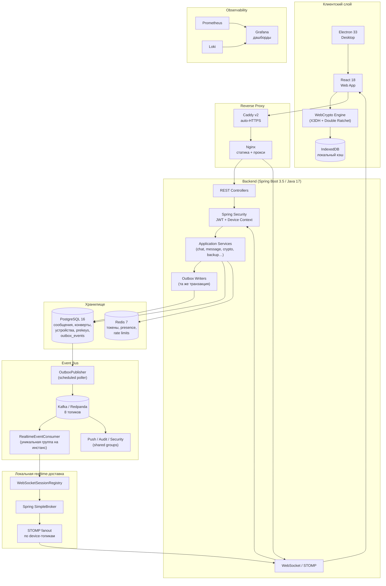
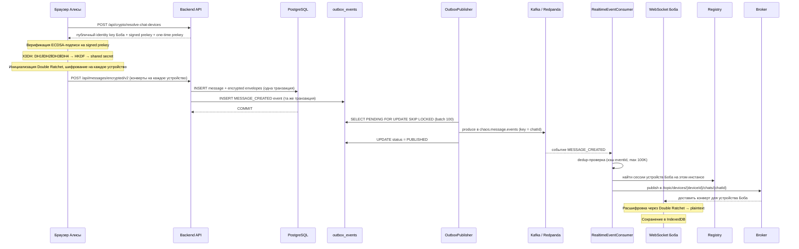
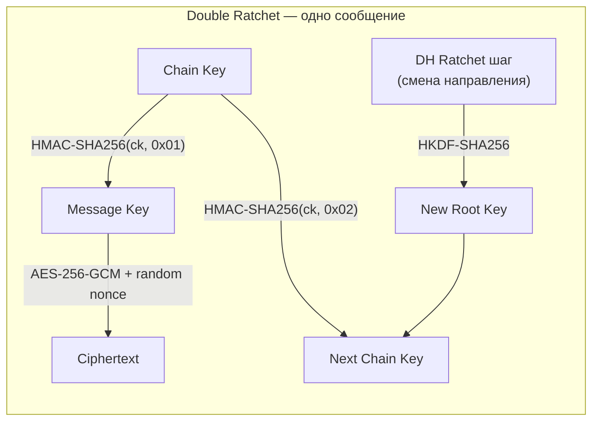
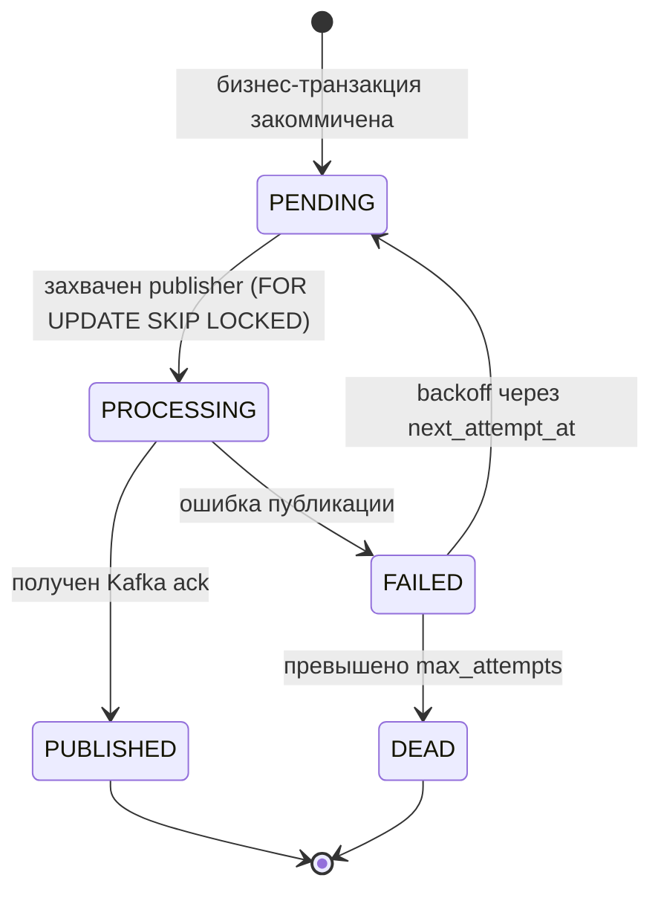
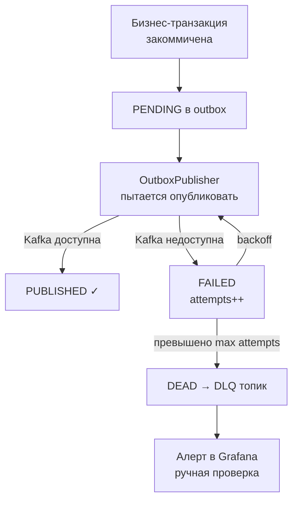
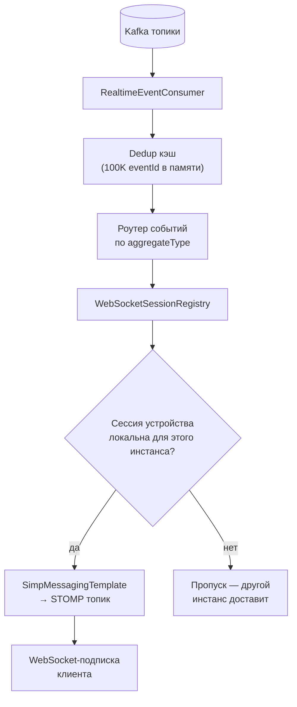
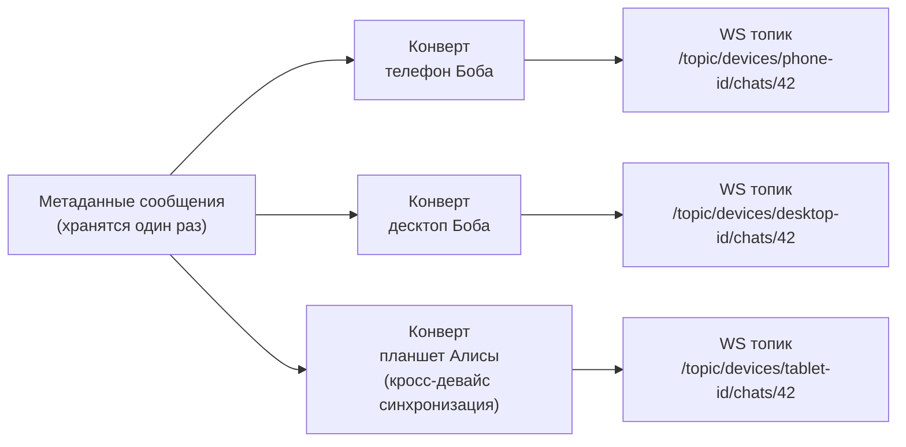

<div align="center">

[English README](README.md) · [Быстрый запуск](SETUP_COMPLETE.ru.md) · [Аудит безопасности](SECURITY_AUDIT_RU.md) · [Issues](https://github.com/vaazhen/chaos-e2ee-messenger/issues)

<br/>

[](https://github.com/vaazhen/chaos-e2ee-messenger/actions/workflows/ci.yml)
[](https://spring.io/projects/spring-boot)
[](https://react.dev/)
[](https://www.electronjs.org/)
[](https://openjdk.org/)
[](https://www.postgresql.org/)
[](https://redis.io/)
[](https://redpanda.com/)
[](https://www.docker.com/)
[](k8s/)
[](LICENSE)

</div>

---

# Chaos Messenger

**Chaos Messenger** — open-source full-stack E2EE мессенджер и инженерный проект. Браузер шифрует каждое сообщение по протоколу Signal (X3DH + Double Ratchet), backend маршрутизирует зашифрованные конверты по устройствам, а PostgreSQL хранит только ciphertext. **Сервер никогда не видит открытый текст.**

```json
// Что сервер хранит для каждого сообщения
{ "ciphertext": "qzgHSg7z...", "nonce": "6KPcVjbp...", "messageIndex": 42 }
// Что показывается в preview чата
{ "lastMessage": "[encrypted]" }
```

> ⚠️ Это не замена Signal и проект не прошёл независимый аудит. Это инженерный проект, реализующий production-like архитектуру E2EE мессенджера: криптография, realtime-доставка, мультиустройственность, десктоп-клиент, Kafka-бэкбон, observability и инфраструктура.

**Доступен как:** Web-приложение · Десктоп (Electron) для Windows / macOS / Linux · Docker Compose · Kubernetes

---

## Содержание

- [Стек](#стек)
- [Высокоуровневая архитектура](#высокоуровневая-архитектура)
- [Путь сообщения: от отправки до получения](#путь-сообщения-от-отправки-до-получения)
- [E2EE протокол](#e2ee-протокол)
- [Transactional Outbox + Kafka](#transactional-outbox--kafka)
- [Модель realtime-доставки](#модель-realtime-доставки)
- [Мультиустройственная доставка](#мультиустройственная-доставка)
- [Десктоп-клиент (Electron)](#десктоп-клиент-electron)
- [Возможности](#возможности)
- [Быстрый старт](#быстрый-старт)
- [Локальные сервисы](#локальные-сервисы)
- [Результаты нагрузочного тестирования](#результаты-нагрузочного-тестирования)
- [Карта модулей backend](#карта-модулей-backend)
- [API Reference](#api-reference)
- [Ключевые архитектурные решения](#ключевые-архитектурные-решения)
- [Известные ограничения](#известные-ограничения)
- [Roadmap](#roadmap)
- [Статьи](#статьи)

---

## Стек

| Слой | Технология |
|---|---|
| Frontend | React 18, JavaScript, WebCrypto API, IndexedDB, STOMP/WebSocket |
| Десктоп | Electron 33 (Windows / macOS / Linux) |
| Backend | Java 17, Spring Boot 3.5, Spring Security, Spring Data JPA, Hibernate |
| Event backbone | Apache Kafka / Redpanda, Transactional Outbox |
| Локальная доставка | WebSocket/STOMP, Spring SimpleBroker |
| Хранилище | PostgreSQL 16, 38 Flyway-миграций |
| Кэш / runtime state | Redis 7 (токены, presence, rate limits, счётчики непрочитанных) |
| Reverse proxy | Caddy v2 (auto-HTTPS), Nginx |
| Observability | Prometheus, Grafana, Loki, Promtail, Spring Boot Actuator |
| Инфраструктура | Docker Compose (13 сервисов), Kubernetes (Kustomize), GitHub Actions CI/CD |
| Криптография | WebCrypto API, X25519 ECDH, ECDSA P-256, HKDF-SHA256, AES-256-GCM |

---

## Высокоуровневая архитектура



---

## Путь сообщения: от отправки до получения

Полный путь сообщения от браузера Алисы до устройства Боба.



**Ключевой принцип:** PostgreSQL атомарно коммитит бизнес-факт и событие. Kafka распределяет по всем инстансам backend. Каждый инстанс доставляет только локально подключённым устройствам.

---

## E2EE протокол

### Регистрация устройства

При первом запуске браузер генерирует через WebCrypto API:

| Ключевой материал | Алгоритм | Хранится |
|---|---|---|
| Identity keypair | X25519 ECDH | Приватный → только localStorage |
| Signing keypair | ECDSA P-256 | Приватный → только localStorage |
| Signed prekey | X25519, подписан signing key | Публичный → сервер |
| 50 one-time prekeys | X25519 | Публичные → сервер |

Backend хранит **только публичный ключевой материал и зашифрованные конверты** — никогда приватные ключи.

### Установка сессии (X3DH)

Когда Алиса отправляет первое сообщение Бобу:

```
1. Получить устройства Боба: POST /api/crypto/resolve-chat-devices
2. Атомарно зарезервировать one-time prekey (FOR UPDATE)
3. Верифицировать ECDSA P-256 подпись на signed prekey
4. Вычислить 3–4 X25519 DH-операции
5. Вывести shared secret: HKDF-SHA256(DH1 ‖ DH2 ‖ DH3 ‖ DH4)
6. Инициализировать Double Ratchet
```

### Double Ratchet

По спецификации Signal:

```
Симметричный ratchet:
  messageKey   = HMAC-SHA256(chainKey, 0x01)
  nextChainKey = HMAC-SHA256(chainKey, 0x02)

DH ratchet (при смене направления):
  новый X25519 keypair → DH → HKDF-SHA256(rootKey, dhOutput) → newRootKey + newChainKey

Шифрование:
  ciphertext = AES-256-GCM(plaintext, messageKey, randomNonce)

Out-of-order доставка:
  skipped message keys кэшируются: до 2000 на шаг, 4000 всего
```



---

## Transactional Outbox + Kafka

### Зачем Outbox

Spring SimpleBroker работает для single-instance, но in-memory и не решает кросс-инстансную доставку. Паттерн transactional outbox гарантирует, что каждый закоммиченный бизнес-ивент в итоге попадёт в Kafka — даже если брокер временно недоступен.



### Поля outbox-события

| Поле | Назначение |
|---|---|
| `event_id` | Ключ идемпотентности для dedup |
| `aggregate_type` | `message`, `chat`, `user`, `request` |
| `aggregate_id` | ID сущности (используется как Kafka partition key) |
| `event_type` | `MESSAGE_CREATED`, `CHAT_UPDATED` и т.д. |
| `payload jsonb` | Полные данные события |
| `status` | `PENDING → PROCESSING → PUBLISHED / FAILED / DEAD` |
| `attempts / max_attempts` | Трекинг ретраев |
| `next_attempt_at` | Расписание exponential backoff |
| `locked_by` | Владелец лока (hostname:pid) |
| `last_error` | Причина последней ошибки |

### Kafka-топики

| Топик | Партиции | Назначение |
|---|---|---|
| `chaos.message.events` | 6 | Сообщения: отправка, редактирование, удаление, реакции, статусы |
| `chaos.chat.events` | 6 | Создание/обновление чатов, участники, модерация |
| `chaos.receipt.events` | 6 | Статусы доставки и прочтения |
| `chaos.user.events` | 3 | Обновления профиля и аватара |
| `chaos.push.events` | 6 | Запросы push-уведомлений |
| `chaos.security.events` | 3 | Устройства/prekeys/security-события |
| `chaos.audit.events` | 3 | Аудит-трейл |
| `chaos.dead-letter.events` | 3 | Мёртвые события |

Kafka partition key = `chatId` для событий message/chat → порядок сохраняется в рамках чата.

### Обработка сбоев Kafka



---

## Модель realtime-доставки



### Стратегия consumer groups

Realtime-консьюмеры используют **уникальную группу на каждый инстанс backend** — чтобы каждый инстанс получал каждое событие:

```
backend-1  →  group: chaos-realtime-a1b2c3
backend-2  →  group: chaos-realtime-d4e5f6
backend-3  →  group: chaos-realtime-g7h8i9
```

Фоновые консьюмеры (push, audit, security) используют **shared groups** — обрабатываются ровно один раз по всему кластеру.

---

## Мультиустройственная доставка

Одно логическое сообщение → N зашифрованных конвертов: по одному на каждое устройство получателей и собственные устройства отправителя для кросс-девайс синхронизации.



Backend **знает маршрутизацию, но не содержимое** — роутит конверты не имея возможности их расшифровать.

---

## Локальный кэш сообщений (IndexedDB)

После расшифровки каждое сообщение сохраняется в **IndexedDB** (БД `chaos-messenger`, таблица `messages`):

```
WebSocket-событие → расшифровка → IndexedDB + React state
Перезагрузка      → IndexedDB → React state (ноль API-запросов, ноль крипто)
Холодная синхр.   → API → расшифровка → IndexedDB + React state
```

| Поле | Сохраняется | Примечание |
|---|---|---|
| `id`, `chatId`, `senderId` | ✅ | Ключ индекса = `id` |
| `content` (расшифрованный JSON) | ✅ | Полный payload |
| `reactions`, `myReactions` | ✅ | Обновляется через `updateMessageReactions()` |
| `_img`, `_voice` | ❌ | Object URL — живут только в сессии |
| `_attachment.objectUrl` | ❌ | Удаляется перед сохранением |

---

## Десктоп-клиент (Electron)

Electron оборачивает React-фронтенд в нативное Chromium-окно:

- **Системный трей** — сворачивание в трей, фоновые уведомления
- **Нативные уведомления** — OS-level алерты о новых сообщениях
- **Файловые диалоги** — нативное сохранение/открытие зашифрованных вложений
- **Single instance** — предотвращает повторный запуск
- **Состояние окна** — запоминает позицию, размер, maximized
- **Кроссплатформенность** — Windows (NSIS), macOS (DMG), Linux (AppImage)

```bash
cd frontend
npm install

# Разработка (hot reload в Electron-окне)
npm run electron:dev

# Production-сборка для Windows
npm run electron:build:win

# Production-сборка для текущей платформы
npm run electron:build
```

Установщик в `frontend/release/`

---

## Возможности

| Категория | Возможности |
|---|---|
| **E2EE** | X3DH установка сессии · Double Ratchet на каждое сообщение · AES-256-GCM · HKDF-SHA256 |
| **Multi-device** | Ключи на устройство · отдельные конверты · UI управления устройствами |
| **Авторизация** | Phone OTP · email/password · JWT · ротация refresh-токенов · rate limits |
| **Чаты** | Личные · «Сохранённые» · группы с RBAC · chat requests |
| **Сообщения** | Отправка · редактирование · удаление · reply · реакции · статусы доставки · индикатор печати |
| **Вложения** | AES-256-GCM шифрование · сжатие изображений · голосовые сообщения |
| **Self-destruct** | TTL на сообщение · scheduled cleanup · таймер в UI |
| **Realtime** | SockJS / WebSocket / STOMP · device-топики · presence heartbeats |
| **Звонки** | WebRTC аудио/видео · демонстрация экрана · STUN-based ICE |
| **Десктоп** | Electron · системный трей · нативные уведомления · single instance |
| **Observability** | Spring Actuator · Prometheus · Loki · Grafana (готовые дашборды) |
| **Инфраструктура** | Docker Compose (13 сервисов) · Kubernetes (Kustomize) · GitHub Actions CI/CD |

---

## Быстрый старт

### 1. Docker Compose (рекомендуется)

```bash
git clone https://github.com/vaazhen/chaos-e2ee-messenger.git
cd chaos-e2ee-messenger

cat > .env << EOF
POSTGRES_PASSWORD=change_this_password_123
JWT_SECRET=change_this_jwt_secret_32_chars_minimum
CORS_ORIGINS=http://localhost
DOMAIN=localhost
GRAFANA_ADMIN_PASSWORD=change_admin_password
EOF

docker compose up -d
```

Открыть: [http://localhost](http://localhost)

### 2. Демо-режим (тестовые аккаунты)

Добавить в `.env`:
```
CHAOS_DEMO_ENABLED=true
```

Перезапустить и сделать seed:
```bash
docker compose up -d
curl -s http://localhost/api/demo/seed
```

| Пользователь | Телефон | Код |
|---|---|---|
| Alice | +19999999998 | 111111 |
| Bob | +19999999999 | 000000 |

### 3. Ручной запуск (dev)

```bash
# 1. Инфраструктура (PostgreSQL + Redis + Redpanda)
cd backend
docker compose -f docker-compose.dev.yml up -d

# 2. Backend
./mvnw spring-boot:run

# 3. Frontend (другой терминал)
cd frontend
npm install
npm run dev
```

Открыть: [http://localhost:5173](http://localhost:5173)

SMS-коды печатаются в логах backend. Тестовый аккаунт: `+79999999999` / код `123456`.

### 4. Kubernetes

```bash
kubectl apply -k k8s/
```

### Требования

- Java 17+, Node.js 18+, Docker, Docker Compose v2+

---

## Локальные сервисы

| Сервис | URL |
|---|---|
| Web App | http://localhost |
| Backend API | http://localhost:8080 |
| Swagger UI | http://localhost:8080/swagger-ui/index.html |
| Health check | http://localhost:8080/actuator/health |
| Prometheus | http://localhost:9090 |
| Grafana | http://localhost:3000 (admin / $GRAFANA_ADMIN_PASSWORD) |

---

## Результаты нагрузочного тестирования

Локальные k6-тесты (8 GB RAM, Windows):

| Сценарий | Запросов | Ошибок | p95 send | p95 timeline |
|---|---:|---:|---:|---:|
| Baseline 5 VU | 2 995 | 0 | 93 мс | 43 мс |
| Normal 25 VU | 35 549 | 0 | 151 мс | 89 мс |
| Spike 50 VU | 76 816 | 0 | 428 мс | 375 мс |
| Soak 5 VU / 30 мин | 250 795 | 0 | 81 мс | 44 мс |
| **Итого** | **576 719** | **0** | — | — |

WebSocket: 1 000 одновременных соединений, 0 ошибок.

---

## Карта модулей backend

```
backend/src/main/java/ru/messenger/chaosmessenger/
├── auth/           # phone OTP, email auth, JWT, refresh tokens, rate limiting
├── user/           # профиль, user identity, поиск
├── crypto/         # регистрация устройств, signed prekeys, one-time prekeys, bundles
├── chat/           # личные чаты, группы, участники, RBAC-модерация
├── message/        # отправка, редактирование, удаление, статусы, реакции, timeline, self-destruct
├── attachment/     # хранение зашифрованных вложений и контроль доступа
├── outbox/         # transactional outbox, Kafka config, OutboxPublisher
├── realtime/       # Kafka-консьюмеры, WebSocket session registry, STOMP fanout
├── push/           # web push subscriptions
├── backup/         # экспорт/импорт зашифрованных бэкапов
├── call/           # WebRTC signaling
└── infra/          # security config, JWT filter, device context, observability
```

---

## API Reference

### Аутентификация (`/api/auth/`)

| Метод | Путь | Описание |
|---|---|---|
| GET | `/exists?phone=` | Проверить существование аккаунта |
| GET | `/username-available?username=` | Проверить доступность username |
| POST | `/send-code` | Отправить SMS-код |
| POST | `/verify-code` | Верифицировать SMS-код |
| POST | `/complete-setup` | Завершить регистрацию |
| POST | `/register` | Регистрация по email |
| POST | `/login` | Вход по email |
| POST | `/refresh` | Обновить JWT |
| POST | `/logout` | Выход, отзыв токена |

### Сообщения (`/api/messages/`)

| Метод | Путь | Описание |
|---|---|---|
| POST | `/encrypted/v2` | Отправить E2EE сообщение |
| GET | `/chat/{chatId}/timeline` | История сообщений |
| POST | `/chat/{chatId}/read` | Отметить как прочитано |
| PUT | `/{messageId}/encrypted/v2` | Редактировать сообщение |
| PUT | `/{messageId}/reactions` | Добавить/убрать реакцию |
| DELETE | `/{messageId}` | Удалить сообщение |

### Crypto / Устройства (`/api/crypto/`)

| Метод | Путь | Описание |
|---|---|---|
| POST | `/devices/register` | Зарегистрировать устройство |
| GET | `/devices/my` | Мои устройства |
| POST | `/devices/{id}/deactivate` | Деактивировать устройство |
| GET | `/bundle/{username}` | Получить публичный key bundle пользователя |
| POST | `/resolve-chat-devices/{chatId}` | Устройства участников чата |
| POST | `/*/reserve-prekey` | Зарезервировать one-time prekey |

Полная OpenAPI-документация: `http://localhost:8080/swagger-ui/index.html`

---

## Ключевые архитектурные решения

| Решение | Обоснование |
|---|---|
| **WebCrypto вместо libsodium/WASM** | Нет нативных зависимостей, аудированная реализация браузера |
| **Конверты на устройство** | Потеря сообщения изолирована на уровне устройства; нет общего ключа дешифрования |
| **Transactional Outbox + Kafka** | Гарантия доставки event'а даже при временной недоступности Kafka; горизонтальное масштабирование WebSocket |
| **Уникальная Kafka-группа на realtime-консьюмер** | Каждый инстанс backend получает каждое событие → нет пропущенной доставки для локально подключённых клиентов |
| **STOMP вместо raw WebSocket** | Pub/sub топики, фрейм-роутинг, SockJS fallback |
| **PostgreSQL вместо NoSQL** | Foreign keys, Flyway-миграции, JSON-реакции, строгая модель транзакций |
| **Electron вместо Tauri** | WebCrypto гарантирован в Chromium, zero Rust, проверенная кроссплатформенность |
| **IndexedDB локальный кэш** | Расшифрованные сообщения переживают перезагрузку страницы без API-запросов |
| **Spring SimpleBroker** | Работает для single-instance; заменяется Kafka fanout при горизонтальном масштабировании |

---

## Структура проекта

```
chaos-e2ee-messenger/
├── backend/                    # Spring Boot (Maven)
│   ├── src/main/java/          # 12 domain-пакетов
│   ├── src/main/resources/     # 38 Flyway-миграций, Grafana dashboards, Logback
│   ├── src/test/               # 34 тест-файла (unit + controller + архитектурные)
│   ├── Dockerfile              # Multi-stage JRE build
│   └── pom.xml                 # Зависимости, Checkstyle, JaCoCo
├── frontend/                   # React 18 + Vite + Electron
│   ├── src/                    # crypto-engine.js, hooks, components
│   ├── src/test/               # 16 тест-файлов (Vitest + Playwright)
│   ├── electron/               # Electron main process + preload
│   ├── Dockerfile              # Multi-stage Nginx build
│   └── nginx.conf              # Frontend + API proxy config
├── infra/                      # Caddyfile, Loki, Promtail конфиги
├── k8s/                        # Kubernetes манифесты (Kustomize)
├── scripts/                    # smoke-test, healthcheck, backup
├── docker-compose.yml          # Production стек (13 сервисов)
├── docker-compose.override.yml # Локальные dev-переопределения
├── .env.example                # Шаблон переменных окружения
└── .github/workflows/          # CI/CD: build → test → Docker → K8s deploy
```

---

## Известные ограничения

- Push-уведомления: endpoint есть, Web Push delivery не реализован
- Вложения хранятся на локальной ФС (не S3/GCS)
- Spring SimpleBroker не масштабируется горизонтально без включённого Kafka
- Нет Safety Numbers / UI верификации устройств
- XSS в localStorage скомпрометирует ключи (митигируется CSP + короткими JWT)

---

## Roadmap

- Safety numbers и UI явной верификации устройств
- Более надёжная стратегия хранения ключей (non-extractable CryptoKey)
- Больше adversarial E2EE и мультиустройственных тестов
- Grafana-дашборд для Kafka DLQ и операционного инструментария
- Интеграционные тесты realtime в мультиинстансном режиме
- Hardening push notification worker
- Внешний аудит безопасности
- Android-клиент
- S3/GCS для хранения вложений

---

## Статьи

- [Habr: статья с разбором архитектуры (EN)](https://habr.com/ru/articles/1051406/)
- [Habr: обсуждение и реакция сообщества (RU)](https://habr.com/ru/articles/1030854/)

---

## Лицензия

Apache License 2.0. См. [LICENSE](LICENSE).
