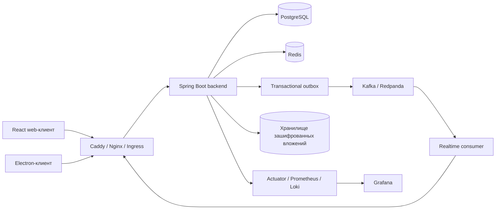

<div align="center">

# Chaos Messenger

Мультидевайсный мессенджер со сквозным шифрованием для web и desktop.

React · Electron · Spring Boot · PostgreSQL · Redis · Kafka/Redpanda · Docker · Kubernetes

[English](README.md) · [Отчёт о проверке](VALIDATION_REPORT.md) · [Аудит безопасности](SECURITY_AUDIT_RU.md)

</div>

## Возможности

- личные чаты, группы и сохранённые сообщения;
- ответы, редактирование, удаление, реакции и статусы доставки/прочтения;
- зашифрованные вложения и исчезающие сообщения;
- typing, presence и обновления через WebSocket;
- сигналинг аудио- и видеозвонков через WebRTC;
- аутентификация по email/паролю и телефону;
- управление устройствами и отдельная E2EE-доставка на каждое устройство;
- зашифрованные резервные копии;
- web-клиент и Electron-приложение;
- Docker Compose, Kubernetes-манифесты и observability-конфигурация.

## Сквозное шифрование

У каждого клиентского устройства отдельная криптографическая идентичность. Клиент устанавливает сессию через X3DH-подобный обмен pre-key и шифрует сообщения реализацией Double Ratchet на WebCrypto.

Backend получает и хранит:

- публичные ключи устройств и pre-key;
- зашифрованные message envelope;
- зашифрованные вложения;
- метаданные аккаунтов, устройств, чатов и доставки.

Backend не получает открытый текст сообщений и приватные ключи клиентов.

### Проверка устройств

Для каждого удалённого устройства можно сравнить Safety Number вне мессенджера. Состояние доверия:

```text
UNVERIFIED -> VERIFIED -> KEY_CHANGED
```

При изменении identity key ранее подтверждённого устройства клиент блокирует криптографические операции до повторной явной проверки.

### Хранение ключей на клиенте

Приватные identity keys, pre-key и ratchet-сессии хранятся в IndexedDB в виде AES-GCM-зашифрованных записей. Wrapping key — non-extractable WebCrypto key. Изменения ratchet-state сериализуются между конкурентными операциями, чтобы не переиспользовать message index.

Access token хранится только в памяти процесса. Refresh token передаётся через cookie с флагами `Secure`, `HttpOnly`, `SameSite=Strict` и ротируется backend.

E2EE не защищает уже скомпрометированное конечное устройство. JavaScript в доверенном origin, вредоносная сборка приложения, расширение браузера или malware ОС могут получить plaintext во время работы клиента.

## Realtime-доставка

При включённом Kafka backend использует transactional outbox. Персональные события устройства сохраняются с монотонно возрастающим sequence.

После переподключения клиент:

1. читает последний сохранённый cursor;
2. запрашивает пропущенные события через `/api/realtime/sync`;
3. применяет durable events по порядку;
4. обрабатывает WebSocket-события, накопленные во время recovery;
5. сохраняет новый cursor.

Realtime имеет семантику at least once. Каждое событие содержит `eventId`, а клиент отбрасывает повторную доставку.

## Архитектура



## Стек

| Слой | Технологии |
|---|---|
| Web | React 18, Vite 5, WebCrypto, IndexedDB, STOMP/SockJS |
| Desktop | Electron 33, electron-builder |
| Backend | Java 17, Spring Boot 3.5, Spring Security, JPA/Hibernate |
| Data | PostgreSQL 16, Redis 7, Flyway |
| Events | Kafka-compatible broker / Redpanda, transactional outbox |
| Observability | Actuator, Prometheus, Grafana, Loki, Promtail |
| Deployment | Docker Compose, Kubernetes/Kustomize, GitHub Actions |

## Быстрый запуск

### Требования

- Docker Engine;
- Docker Compose v2;
- минимум 4 ГБ свободной памяти для полного локального стека.

### Настройка

```bash
cp .env.example .env
```

Сгенерируйте сильные секреты и замените все значения `CHANGE_ME`:

```bash
openssl rand -base64 32   # POSTGRES_PASSWORD
openssl rand -base64 32   # REDIS_PASSWORD
openssl rand -base64 48   # JWT_SECRET
openssl rand -base64 32   # GRAFANA_ADMIN_PASSWORD
```

Для локального запуска:

```dotenv
DOMAIN=localhost
CORS_ORIGINS=https://localhost
```

Для публичного размещения используйте реальный DNS-домен и соответствующий HTTPS origin.

### Запуск

```bash
docker compose up --build -d
docker compose ps
docker compose logs -f backend frontend caddy
```

Откройте:

```text
https://localhost
```

Для локального имени Caddy использует локальный CA, для публичного домена получает публичный TLS-сертификат.

Остановить стек:

```bash
docker compose down
```

Удалить также локальные данные:

```bash
docker compose down -v
```

## Локальная разработка

### Backend

```bash
cd backend
./mvnw spring-boot:run
```

Зависимости для разработки:

```bash
cd backend
docker compose -f docker-compose.dev.yml up -d
```

### Frontend

```bash
cd frontend
npm ci
npm run dev
```

Vite проксирует `/api` и `/ws` на `http://localhost:8080`.

## Electron

Создайте конфигурацию desktop-сборки:

```bash
cd frontend
cp .env.electron.example .env.electron
```

Укажите абсолютные secure endpoints:

```dotenv
VITE_BACKEND_URL=https://messenger.example.com
VITE_API_BASE=https://messenger.example.com/api
VITE_WS_URL=wss://messenger.example.com/ws
```

Сборка:

```bash
npm run electron:build
```

Сборка завершается ошибкой, если обязательные endpoints отсутствуют или используют небезопасные протоколы. Публичные установщики должны быть подписаны; macOS-сборки также требуют notarisation.

## Конфигурация

Основные переменные окружения:

| Переменная | Назначение |
|---|---|
| `POSTGRES_PASSWORD` | Пароль PostgreSQL |
| `REDIS_PASSWORD` | Пароль Redis |
| `JWT_SECRET` | JWT signing secret, минимум 32 символа |
| `DOMAIN` | Публичный hostname для Caddy |
| `CORS_ORIGINS` | Точный доверенный frontend origin |
| `CHAOS_DEMO_ENABLED` | Включает необязательный demo endpoint |
| `VAPID_PUBLIC_KEY` / `VAPID_PRIVATE_KEY` | Данные Web Push |
| `CHAOS_KAFKA_ENABLED` | Включает Kafka/outbox delivery |
| `KAFKA_BOOTSTRAP_SERVERS` | Адреса Kafka-compatible broker |
| `CHAOS_ATTACHMENTS_STORAGE_PATH` | Путь для зашифрованных вложений |
| `CHAOS_ATTACHMENTS_MAX_BYTES` | Максимальный размер зашифрованного вложения |

Полный список локальных параметров находится в `.env.example`, `backend/.env.example` и `frontend/.env.example`.

## Проверки

### Backend

```bash
cd backend
./mvnw verify
```

### Frontend

```bash
cd frontend
npm ci
npm run lint
npm test
npm run test:coverage
npm run build
```

Подготовленный архив проверен с результатом **154 пройденных frontend-теста и 3 осознанно пропущенных теста**. Точные результаты и ограничения окружения зафиксированы в [VALIDATION_REPORT.md](VALIDATION_REPORT.md).

## Kubernetes

Каталог `k8s/` содержит:

- namespace и конфигурацию;
- Deployments/Services backend и frontend;
- Ingress;
- requests/limits;
- liveness/readiness probes;
- Horizontal Pod Autoscalers;
- PodDisruptionBudgets;
- шаблон Secret.

После замены image names, hostname и секретов:

```bash
kubectl apply -k k8s/
```

Для публичного production-развёртывания используйте managed или operator-backed PostgreSQL, Redis и Kafka, проверенные backup/PITR, внешний secret manager и независимое тестирование безопасности.

## Безопасность

- Не коммитьте `.env` и реальные секреты.
- Не публикуйте `/actuator` и Prometheus endpoints в интернет.
- Отдавайте web-клиент только по HTTPS.
- Используйте точные CORS origins, без глобального wildcard.
- Ротируйте JWT, database, Redis и VAPID secrets через secret manager.
- Перед каждым релизом запускайте backend tests, integration tests и миграции.
- Перед использованием для высокорисковых коммуникаций проведите независимый crypto-аудит и pentest.

Подробности: [SECURITY_AUDIT_RU.md](SECURITY_AUDIT_RU.md) и [PRODUCTION_READINESS.md](PRODUCTION_READINESS.md).

## Лицензия

Проект распространяется по [Apache License 2.0](LICENSE).
