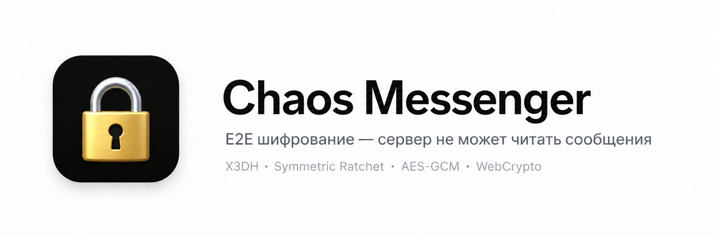
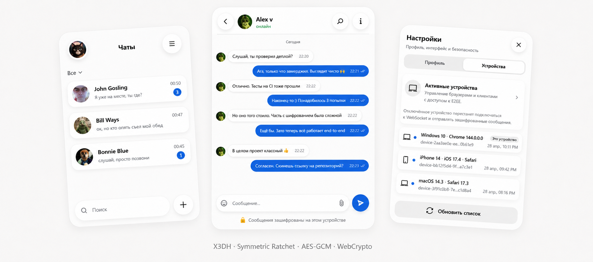

<div align="center">

[English README](README.md) · [Быстрый запуск](SETUP_COMPLETE.ru.md) · [Аудит безопасности](SECURITY_AUDIT_RU.md) · [Issues](https://github.com/vaazhen/chaos-e2ee-messenger/issues)

<br/>

[](https://github.com/vaazhen/chaos-e2ee-messenger/actions/workflows/ci.yml)
[](https://www.docker.com/)
[](k8s/)
[](https://openjdk.org/)
[](https://spring.io/projects/spring-boot)
[](https://react.dev/)
[](https://www.postgresql.org/)
[](https://redis.io/)
[](LICENSE)

</div>

---

<div align="center">
  
</div>

<br/>

<p align="center">
  
</p>

<p align="center">
  <sub>E2EE мессенджер · X3DH + Double Ratchet · multi-device · Spring Boot + React</sub>
</p>

---

## О проекте

**Chaos Messenger** — full-stack end-to-end encrypted мессенджер. Браузер шифрует каждое сообщение по протоколу Signal (X3DH + Double Ratchet), backend маршрутизирует зашифрованные конверты по устройствам, а база данных хранит только ciphertext. Сервер никогда не видит открытый текст.

```json
// Что сервер хранит для каждого сообщения
{ "ciphertext": "qzgHSg7z...", "nonce": "6KPcVjbp...", "messageIndex": 42 }
// Что показывается в preview чата
{ "lastMessage": "[encrypted]" }
```

**Статус:** production-ready MVP. Основной E2EE-протокол, realtime доставка, групповые чаты, вложения и самоуничтожающиеся сообщения полностью реализованы. CI/CD, Docker Compose и Kubernetes манифесты в комплекте.

---

## Архитектура

```
Браузер (WebCrypto)
    │
    ├── HTTPS/REST (JSON) ──► Spring Boot ──► PostgreSQL
    │   Auth: Bearer <JWT>                      ▲
    │   Device: X-Device-Id                     │
    │                                            │
    └── WebSocket/STOMP ◄────────────────────────┘
         (SockJS fallback)
```

| Слой | Технология | Ответственность |
|------|-----------|----------------|
| Клиент | React 18 + WebCrypto API | Генерация ключей, X3DH-сессии, Double Ratchet шифрование/дешифрование |
| Backend | Java 17 + Spring Boot 3.5 | Auth, управление устройствами, хранение конвертов, WebSocket-роутинг, push |
| База | PostgreSQL 16 + Flyway | Пользователи, устройства, чаты, сообщения, конверты (E2EE-blind) |
| Кэш | Redis 7 | Refresh-токены, присутствие, непрочитанные, rate limits |
| Realtime | STOMP over WebSocket | Пер-устройствo топики, статусы, печать, синхронизация чатов |
| Прокси | Nginx | TLS терминация, статика, WebSocket upgrade, API-роутинг |

---

## Возможности

| Категория | Возможности |
|-----------|-------------|
| **E2EE** | X3DH · Double Ratchet · AES-256-GCM · HKDF-SHA256 |
| **Multi-device** | Ключи на устройство · отдельные конверты · управление устройствами |
| **Auth** | Phone OTP · email/password · JWT · refresh token rotation · rate limits |
| **Чаты** | Личные · "Сохранённые" · группы · chat requests |
| **Сообщения** | Отправка · редактирование · удаление · reply · реакции · статусы · печать |
| **Вложения** | AES-256-GCM шифрование · сжатие изображений · voice messages |
| **Self-destruct** | TTL · scheduled cleanup · таймер в UI |
| **Realtime** | SockJS / WebSocket / STOMP · device topics · presence heartbeats |
| **Мониторинг** | Spring Actuator · Prometheus · Grafana (готовый dashboard) |
| **Деплой** | Docker Compose · Kubernetes manifests · GitHub Actions CI/CD |

---

## Быстрый старт

### Docker Compose (рекомендуется)

```bash
git clone https://github.com/vaazhen/chaos-e2ee-messenger.git
cd chaos-e2ee-messenger
echo JWT_SECRET=your-256-bit-secret-key-change-me > .env
echo POSTGRES_PASSWORD=change-me >> .env
docker compose up -d
```

Открыть: [http://localhost](http://localhost)

### Ручной запуск (dev)

```bash
cd backend
docker compose -f docker-compose.dev.yml up -d    # PostgreSQL + Redis
./mvnw spring-boot:run

# В другом терминале:
cd frontend
npm install
npm run dev
```

Открыть: [http://localhost:5173](http://localhost:5173)

SMS-коды печатаются в логах backend. Тестовый аккаунт: `+79999999999` / код `123456`.

### Kubernetes

```bash
kubectl apply -k k8s/
```

### Требования

- Java 17+, Node.js 18+, Docker
- Для K8s: kubectl, kustomize, кластер

---

## E2EE Протокол

### 1. Регистрация устройства

При первом запуске браузер генерирует:
- **X25519 identity keypair** — долгоживущий идентификатор устройства
- **ECDSA P-256 signing keypair** — подписывает signed prekey
- **X25519 signed prekey** — подписан и опубликован на сервере
- **50 X25519 one-time prekeys** — для будущих сессий

Приватные ключи хранятся в `localStorage`. Сервер хранит только публичные ключи.

### 2. Установка сессии (X3DH)

Когда Алиса отправляет первое сообщение Бобу:

1. Получить устройства Боба: `POST /api/crypto/resolve-chat-devices`
2. Зарезервировать one-time prekey (атомарно, `FOR UPDATE`)
3. Проверить подпись signed prekey (ECDSA P-256)
4. Вычислить 3–4 X25519 DH-операции
5. Вывести shared secret: `HKDF-SHA256(DH1 || DH2 || DH3 || DH4)`
6. Инициализировать Double Ratchet

### 3. Double Ratchet

По спецификации Signal:

- **Symmetric ratchet:** `messageKey = HMAC-SHA256(chainKey, 0x01)`
- **DH ratchet:** при смене направления — новый X25519 keypair
- **AES-256-GCM** со случайным nonce на каждое сообщение
- **Skipped message keys:** до 2000 на шаг, 4000 всего (out-of-order delivery)

Все операции через Web Crypto API — чистый браузерный крипто, без WASM и библиотек.

### 4. Конверты на устройство

Одно сообщение от Алисы → N зашифрованных конвертов (по одному на каждое устройство получателей + на свои устройства для синхронизации). Каждый конверт доставляется через пер-устройствo WebSocket-топик:

```
/topic/devices/{deviceId}/chats/{chatId}
```

---

## Деплой

### Docker Compose

```bash
docker compose up -d
```

Сервисы: PostgreSQL 16 (healthcheck), Redis 7 (healthcheck), Backend (Spring Boot prod), Frontend (Nginx). [Файл](docker-compose.yml).

### Kubernetes

Манифесты в [k8s/](k8s/):

```bash
kubectl apply -k k8s/
```

Включает: StatefulSet (Postgres), Deployments (Redis, Backend ×2, Frontend ×2), Services, Ingress с cert-manager, ConfigMap, Prometheus annotations.

### CI/CD

[GitHub Actions](.github/workflows/ci.yml):
1. Maven build + test
2. Vitest build + test
3. Docker build + push в ghcr.io
4. Kubernetes deploy с rollout status

---

## Нагрузочное тестирование

Локальные k6-тесты (8 GB RAM, Windows):

| Сценарий | Запросов | Ошибок | p95 send | p95 timeline |
|----------|---------:|------:|---------:|-------------:|
| Baseline 5 VU | 2,995 | 0 | 93ms | 43ms |
| Normal 25 VU | 35,549 | 0 | 151ms | 89ms |
| Spike 50 VU | 76,816 | 0 | 428ms | 375ms |
| Soak 5 VU / 30m | 250,795 | 0 | 81ms | 44ms |
| **Всего** | **576,719** | **0** | — | — |

WebSocket: 1,000 одновременных соединений, 0 ошибок.

---

## Структура проекта

```
chaos-messenger_e2ee/
├── backend/            # Spring Boot (Maven)
│   ├── src/            # 33 Flyway миграции, crypto, message, chat, auth
│   ├── Dockerfile      # Multi-stage JRE build
│   └── docker-compose*.yml
├── frontend/           # React 18 + Vite
│   ├── src/            # crypto-engine.js (Double Ratchet), hooks, components
│   ├── Dockerfile      # Multi-stage nginx build
│   └── nginx.conf      # Reverse proxy
├── k8s/                # Kubernetes манифесты (kustomize)
├── docker-compose.yml  # Root full-stack оркестрация
├── .github/workflows/  # CI/CD pipeline
└── docs/               # Диаграммы, скриншоты
```

---

## Ключевые решения

| Решение | Почему |
|---------|--------|
| **WebCrypto вместо libsodium/WASM** | Нет нативных зависимостей, аудированная реализация браузера |
| **Per-device конверты** | Изоляция потерь сообщений на уровне устройств |
| **STOMP вместо raw WebSocket** | Pub/sub топики, фрейм-роутинг, SockJS fallback |
| **PostgreSQL вместо NoSQL** | Foreign keys, миграции, JSON реакции, транзакции |
| **In-memory broker** | Подходит для MVP; масштабирование через external broker |

---

## Известные ограничения

- Double Ratchet требует больше edge-case тестов
- Push-уведомления: endpoint есть, Web Push delivery не реализован
- Вложения на локальной ФС (не S3/GCS)
- Spring SimpleBroker не масштабируется горизонтально
- Нет Safety Numbers / device verification UI
- XSS в localStorage скомпрометирует все ключи (митигируется CSP + короткими JWT)

---

## Статьи

- [Building an E2EE Messenger with Spring Boot and WebCrypto (EN)](https://dev.to/vaazhen/i-built-an-end-to-end-encrypted-messenger-with-spring-boot-and-webcrypto-1if5)
- [Обсуждение на Habr](https://habr.com/ru/articles/1030854/)

---

## Лицензия

Apache License 2.0. См. [LICENSE](LICENSE).
