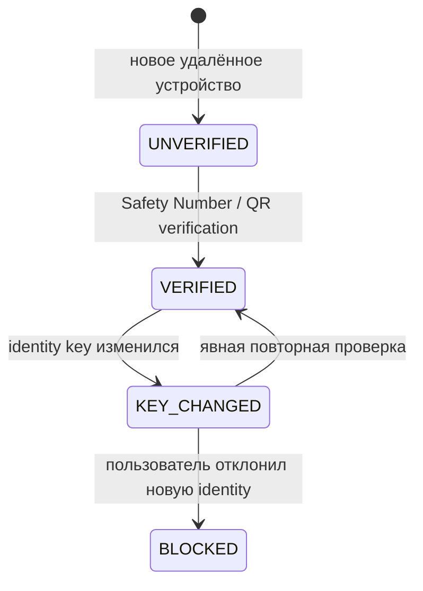
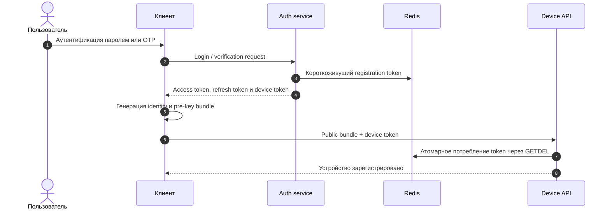
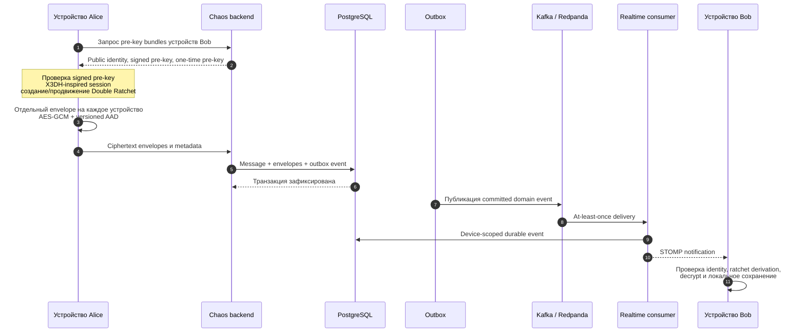
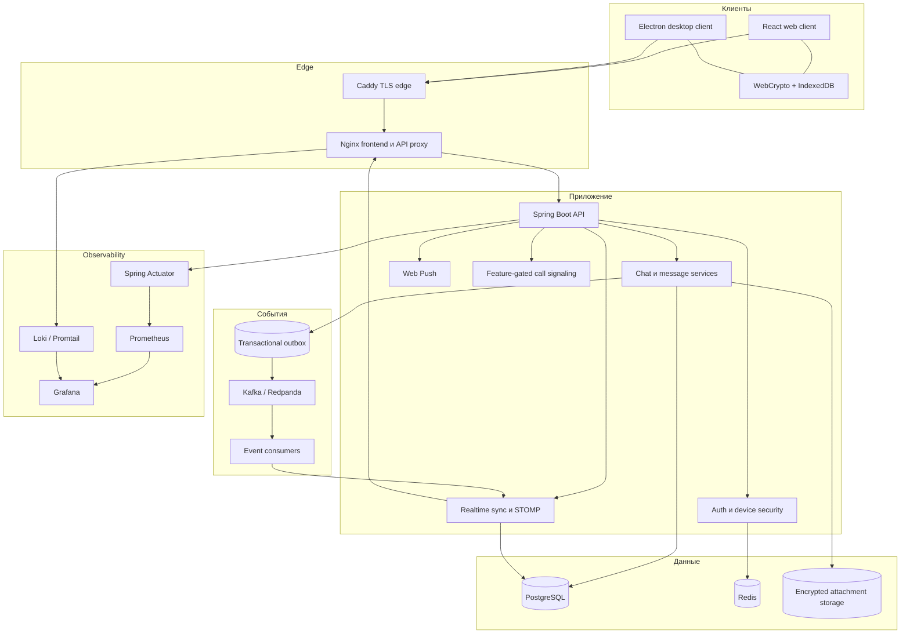
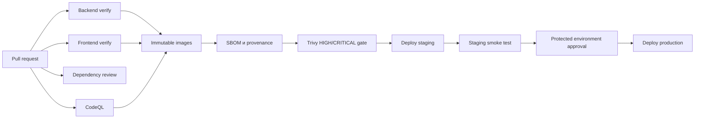

<div align="center">

# Chaos E2EE Messenger

**Production-oriented мультидевайсный E2EE-мессенджер для web и desktop.**

Клиентская криптография · Надёжная realtime-доставка · Защищённая аутентификация · Наблюдаемая инфраструктура

[](https://github.com/vaazhen/chaos-e2ee-messenger/actions/workflows/ci.yml)
[](backend/)
[](backend/)
[](frontend/)
[](frontend/src/crypto-engine.ts)
[](LICENSE)

[English](README.md) · [Архитектура](#архитектура) · [Модель безопасности](#модель-безопасности) · [Быстрый запуск](#быстрый-запуск) · [Эксплуатация](#эксплуатация)

</div>

> [!IMPORTANT]
> Chaos использует собственный X3DH-inspired обмен pre-key и Double Ratchet-style протокол на WebCrypto. Проект **не связан с Signal**, не является совместимой реализацией Signal Protocol и пока не проходил независимый криптографический аудит.

---

## О проекте

Chaos — полнофункциональная система защищённого обмена сообщениями, построенная вокруг четырёх инженерных целей:

1. **Открытый текст остаётся на конечных устройствах.** Приватные ключи, расшифрованные сообщения и attachment plaintext обрабатываются клиентом.
2. **Доставка переживает сбои.** Используются транзакции БД, transactional outbox, Kafka-compatible transport и восстановление по cursor.
3. **Аутентификация учитывает возможность кражи токена.** Refresh tokens одноразовые, повторное использование token family обнаруживается, а регистрация устройства использует отдельный короткоживущий token.
4. **Систему можно эксплуатировать.** В репозитории есть Docker Compose, Kubernetes, метрики, логи, dashboards, alerts, runbooks и поэтапный CI/CD.

Chaos создаётся как серьёзный инженерный проект по secure messaging, распределённым системам и production hardening, а не как заявление о равенстве зрелым аудированным продуктам вроде Signal, WhatsApp, Slack или Mattermost.

## Состояние функций

| Возможность | Состояние | Комментарий |
|---|---|---|
| Личные и групповые чаты | Активно | Ответы, редактирование, удаление, реакции, receipts и исчезающие сообщения |
| Мультидевайсное E2EE | Активно | Отдельная identity каждого устройства, pre-key bundles и encrypted fan-out |
| Durable realtime recovery | Активно | Device-scoped sequence, cursor sync и at-least-once delivery |
| Зашифрованные вложения | Активно | Клиентское шифрование; эталонный локальный backend хранения ciphertext |
| Голосовые сообщения | Активно | Зашифрованные media payloads |
| Зашифрованный backup ключей | Активно | Восстанавливает identity material, но не обещает историю и ratchet sessions |
| Web-клиент | Активно | React/Vite |
| Desktop-клиент | Активно | Electron и проверка secure endpoints |
| WebRTC-звонки | Экспериментально | Signaling закрыт feature flag; TURN и hardened call state — отдельный этап |
| Независимый crypto-аудит | Не выполнен | Необходим перед высокорисковым применением |

---

## Основные возможности

### Защищённые сообщения

- X25519 identity и pre-key material каждого устройства;
- проверка ECDSA-подписи signed pre-key;
- X3DH-inspired bootstrap сессии;
- Double Ratchet-style root, sending и receiving chains;
- HMAC-SHA-256 для chain derivation и HKDF-SHA-256 для root derivation;
- AES-256-GCM для сообщений и вложений;
- versioned AAD binding для routing и ratchet headers;
- skipped-message keys для сообщений, пришедших не по порядку;
- отдельный encrypted envelope на каждое устройство получателя и другие устройства отправителя;
- Safety Number и явное состояние `KEY_CHANGED`;
- client-side encrypted backup, passphrase которого не передаётся backend.

### Пользовательские функции

- личные чаты, группы и сохранённые сообщения;
- ответы, редактирование, удаление и реакции;
- delivery/read receipts и typing indicators;
- исчезающие сообщения;
- зашифрованные файлы, изображения и голосовые сообщения;
- профили, aliases, управление устройствами и администрирование групп;
- Web Push;
- web и Electron-клиенты.

### Backend и распределённая доставка

- Java 17 и Spring Boot;
- PostgreSQL с Flyway migrations;
- Redis для rate limits, session/token state;
- transactional outbox;
- Kafka/Redpanda-compatible transport;
- retry и dead-letter paths;
- durable device-scoped realtime store;
- durable device events и STOMP notification delivery;
- монотонный sequence и recovery cursor;
- идемпотентная обработка событий.

### Production engineering

- эталонный Docker Compose stack;
- Kubernetes/Kustomize manifests;
- readiness/liveness probes, HPA и PodDisruptionBudgets;
- контейнеры с non-root runtime;
- immutable image tags, provenance и SBOM;
- CodeQL, dependency review и Trivy gates;
- staging deployment, smoke test и ручное production promotion;
- Prometheus, Grafana, Loki и Promtail;
- operational alerts и incident runbooks.

---

## Модель безопасности

### Что видит сервер

| Сервер может хранить или наблюдать | Сервер не должен получать |
|---|---|
| Метаданные аккаунта и профиля | Открытый текст сообщений |
| Идентификаторы устройств | Приватные identity keys |
| Публичные identity keys и pre-key bundles | Приватные signed/one-time pre-keys |
| Состав чатов и authorization data | Ratchet message keys |
| Зашифрованные message envelopes | Расшифрованные attachments |
| Зашифрованные attachment blobs | Passphrase резервной копии |
| Delivery, sequence и timing metadata | Расшифрованное содержимое backup |
| Push subscription metadata | Локальные решения о доверии Safety Number |

Chaos **не скрывает все метаданные**. Сервис может видеть состав аккаунтов и чатов, число устройств, время сообщений и размер ciphertext.

### Границы доверия endpoint

E2EE защищает контент при передаче и на серверном хранении. Оно не защищает plaintext от:

- malware или скомпрометированной ОС;
- вредоносного browser extension;
- подменённого JavaScript с доверенного origin;
- скомпрометированного Electron-процесса;
- screen/clipboard capture и локального доступа во время работы клиента.

### Жизненный цикл доверия устройству



Смена ранее подтверждённого identity key обрабатывается как security event, а не принимается автоматически.

### Одноразовая регистрация устройства



Registration token короткоживущий и одноразовый. Он отделён от криптографической identity устройства и потребляется при регистрации публичного key bundle.

---

## Криптографический поток сообщения

Каждое устройство имеет отдельную криптографическую identity. Сообщение шифруется независимо для каждого устройства получателя и, при необходимости, для других устройств отправителя.



### Аутентификация envelope

AAD связывает ciphertext с protocol context:

- protocol/message type;
- chat identifier;
- message index;
- previous chain length;
- ratchet public key.

Изменение аутентифицированного заголовка приводит к ошибке AES-GCM authentication.

### Семантика backup

Backup шифруется на клиенте AES-GCM-ключом, полученным из passphrase. Passphrase остаётся на устройстве.

Backup восстанавливает identity material, но не обещает восстановление:

- локального plaintext-кеша сообщений;
- уже использованных one-time pre-keys;
- всех Double Ratchet sessions;
- полной расшифровки старой истории на новом устройстве.

---

## Надёжная realtime-доставка

Chaos разделяет durable state и low-latency notification.

```mermaid
flowchart LR
    CMD[Команда отправки] --> TX[Транзакция БД]
    TX --> MSG[(Messages и envelopes)]
    TX --> OUT[(Outbox event)]
    OUT --> PUB[Outbox publisher]
    PUB --> BUS[Kafka / Redpanda]
    BUS --> CONSUMER[Realtime consumer]
    CONSUMER --> STORE[(Device event store)]
    CONSUMER --> WS[STOMP / WebSocket]
    STORE --> SYNC[/api/realtime/sync]
    WS --> QUEUE[Client event queue]
    SYNC --> QUEUE
    QUEUE --> APPLY[Decrypt и durable local apply]
    APPLY --> CURSOR[Продвижение cursor]
```

### Гарантии доставки

- Kafka transport рассматривается как **at least once**;
- каждое событие имеет стабильный `eventId`;
- device events имеют монотонный sequence;
- device-scoped events сохраняются как источник recovery;
- после reconnect клиент запрашивает события после последнего cursor;
- duplicate delivery должна быть безопасной;
- клиент хранит recovery cursor и игнорирует уже встречавшиеся event IDs.

WebSocket — быстрый канал уведомления. Durable recovery остаётся контуром корректности.

---

## Архитектура



### Технологический стек

| Слой | Технологии |
|---|---|
| Web client | React 18, Vite, WebCrypto, IndexedDB, STOMP/SockJS |
| Desktop | Electron, electron-builder |
| Protocol types | Постепенная TypeScript-миграция и строгий DTO gate |
| Backend | Java 17, Spring Boot 3.5, Spring Security, JPA/Hibernate |
| Основные данные | PostgreSQL 16, Flyway |
| Coordination/auth state | Redis 7 |
| Event transport | Kafka-compatible broker / Redpanda |
| Edge | Caddy, Nginx |
| Observability | Actuator, Prometheus, Grafana, Loki, Promtail |
| Delivery | Docker, Kubernetes/Kustomize, GitHub Actions, GHCR |

### Структура репозитория

```text
.
├── backend/                 Spring Boot и миграции БД
│   ├── src/main/java/       Auth, users, chats, messages, crypto metadata,
│   │                        attachments, backup, outbox, realtime и push
│   └── src/test/            Unit и integration tests
├── frontend/                React web client и Electron package
│   ├── src/crypto-engine.ts Клиентский E2EE-движок
│   ├── src/hooks/           Auth, chats, messages, WebSocket и WebRTC
│   ├── src/test/            Frontend unit/integration tests
│   ├── e2e/                 Mocked browser flows
│   └── e2e-real/            Real-stack E2EE browser scenarios
├── infra/                   Caddy, Prometheus, Loki и Promtail
├── k8s/                     Stateless production manifests и dev dependencies
├── docs/runbooks/           Incident procedures
├── docker-compose.yml       Полный reference stack
└── .github/workflows/       Verification, scans и deployment pipeline
```

---

## Быстрый запуск

### Требования

- Docker Engine;
- Docker Compose v2;
- OpenSSL для генерации secrets;
- минимум 4 ГБ свободной памяти для полного reference stack.

### 1. Настройка secrets

```bash
cp .env.example .env
```

Замените все `CHANGE_ME`:

```bash
openssl rand -base64 32   # POSTGRES_PASSWORD
openssl rand -base64 32   # REDIS_PASSWORD
openssl rand -base64 48   # JWT_SECRET
openssl rand -base64 32   # GRAFANA_ADMIN_PASSWORD
```

Для локального запуска:

```dotenv
DOMAIN=localhost
CORS_ORIGINS=https://localhost
CHAOS_DEMO_ENABLED=false
CHAOS_KAFKA_ENABLED=true
```

### 2. Запуск stack

```bash
docker compose up --build -d
docker compose ps
```

Откройте:

```text
https://localhost
```

Для `localhost` Caddy использует локальный CA. Для реального домена он получает публичный сертификат.

### 3. Логи

```bash
docker compose logs -f backend frontend caddy redpanda
```

### Остановка

```bash
docker compose down
```

Удаление локальных volumes:

```bash
docker compose down -v
```

---

## Локальная разработка

### Backend

```bash
cd backend
docker compose -f docker-compose.dev.yml up -d
./mvnw spring-boot:run
```

API слушает `http://localhost:8080`. В production profile management probes вынесены на отдельный порт `9091`.

### Frontend

```bash
cd frontend
cp .env.example .env
npm ci
npm run dev
```

Стандартная dev-конфигурация:

```dotenv
VITE_BACKEND_URL=http://localhost:8080
VITE_API_BASE=http://localhost:8080/api
VITE_WS_URL=http://localhost:8080/ws
```

### Electron

```bash
cd frontend
cp .env.electron.example .env.electron
```

Укажите secure endpoints:

```dotenv
VITE_BACKEND_URL=https://messenger.example.com
VITE_API_BASE=https://messenger.example.com/api
VITE_WS_URL=wss://messenger.example.com/ws
```

Запуск и сборка:

```bash
npm run electron:dev
npm run electron:build
```

Production desktop build проверяет обязательные endpoints и secure schemes. Публичные installers должны быть подписаны, а macOS-сборки требуют notarization.

---

## Проверки

### Backend

```bash
cd backend
./mvnw --batch-mode --no-transfer-progress verify
```

Maven lifecycle включает compilation, Checkstyle, unit/integration tests и JaCoCo verification.

### Frontend

```bash
cd frontend
npm ci --ignore-scripts --no-audit --no-fund
npm run lint
npm run typecheck
npm run typecheck:crypto
npm run typecheck:protocol
npm run test:coverage -- --run
npm run build
```

### Browser E2E

```bash
cd frontend
npx playwright install --with-deps chromium
npm run test:e2e
npm run test:e2e:real
```

Real-stack suite требует запущенный backend и инфраструктурные зависимости.

---

## CI/CD



Pipeline включает:

- backend `mvn verify`;
- frontend lint, три TypeScript gate, coverage и production build;
- dependency review для pull requests;
- CodeQL для Java и JavaScript/TypeScript;
- immutable images в GHCR;
- SBOM и build provenance;
- блокирующий HIGH/CRITICAL container scan;
- staging rollout и health smoke test;
- защищённое ручное promotion в production.

---

## Kubernetes

Корневая конфигурация `k8s/` разворачивает stateless workloads приложения. Production stateful dependencies намеренно остаются внешними.

Для production требуются:

- PostgreSQL 16 с backup и point-in-time recovery;
- Redis 7 с authentication, persistence и failover;
- multi-replica Kafka/Redpanda;
- durable storage для зашифрованных attachments;
- внешний secret manager;
- metrics-server, cert-manager и Ingress controller.

Проверка manifests:

```bash
kubectl kustomize k8s/
```

Развёртывание после замены image placeholders, hosts, connection addresses и secrets:

```bash
kubectl apply -k k8s/
```

Disposable dependencies для разработки находятся в `k8s/dev/`. Они не являются HA production database/cache.

Подробнее: [k8s/README.md](k8s/README.md).

---

## Эксплуатация

### Observability

Reference stack включает:

- Spring Boot Actuator health и application metrics;
- Prometheus;
- PostgreSQL и Redis exporters;
- structured container logs;
- Loki и Promtail;
- provisioned Grafana dashboard;
- alerts для delivery, database, authentication и recovery failures.

### Runbooks

Процедуры находятся в [`docs/runbooks/`](docs/runbooks/):

- database outage;
- outbox backlog;
- realtime recovery failure;
- refresh-token reuse spike;
- rollback.

### Production checklist

Перед публичным deployment:

- подключить внешний secret manager и заменить initial secrets;
- использовать managed/operator-backed PostgreSQL, Redis и Kafka;
- настроить и проверить backup, PITR и restore exercises;
- запускать browser E2E против staging;
- подключить маршрутизацию alerts и incident owner;
- подписывать desktop releases;
- проверить resource limits под нагрузкой;
- провести независимый application-security review и crypto-аудит.

Текущее состояние hardening: [docs/PRODUCTION_READINESS.md](docs/PRODUCTION_READINESS.md).

---

## Конфигурация

<details>
<summary><strong>Основные переменные окружения</strong></summary>

| Переменная | Назначение |
|---|---|
| `POSTGRES_PASSWORD` | Пароль PostgreSQL в reference compose stack |
| `REDIS_PASSWORD` | Пароль Redis |
| `JWT_SECRET` | Высокоэнтропийный JWT signing secret |
| `DOMAIN` | Public hostname для Caddy |
| `CORS_ORIGINS` | Точный доверенный web origin |
| `CHAOS_DEMO_ENABLED` | Включение optional demo endpoints |
| `CHAOS_KAFKA_ENABLED` | Kafka/outbox event delivery |
| `KAFKA_BOOTSTRAP_SERVERS` | Адреса Kafka-compatible brokers |
| `CHAOS_ATTACHMENTS_STORAGE_PATH` | Reference ciphertext storage directory |
| `CHAOS_ATTACHMENTS_MAX_BYTES` | Максимальный размер encrypted upload |
| `VAPID_PUBLIC_KEY` | Web Push public key |
| `VAPID_PRIVATE_KEY` | Web Push private key |

Полные примеры: `.env.example`, `backend/.env.example`, `frontend/.env.example`.

</details>

---

## Инженерные принципы

1. **Ciphertext не отменяет authorization.** Доступ проверяется независимо от шифрования.
2. **Realtime не является durable storage.** WebSocket поддержан восстанавливаемым журналом событий.
3. **Retries — нормальный режим работы.** Consumers и clients обязаны безопасно принимать duplicates.
4. **Token не является device identity.** Device enrollment использует отдельный одноразовый credential и клиентский key bundle.
5. **Green checks — часть продукта.** Build, tests, types, scans и deployment gates являются условиями релиза.
6. **Security claims должны быть ограниченными.** Экспериментальные и неаудированные компоненты явно обозначаются.

---

## Roadmap

- завершить strict TypeScript migration всего crypto-engine;
- сделать real-browser reconnect/full-resync E2E обязательным в CI;
- production object-storage adapter для ciphertext attachments;
- hardened WebRTC state machine, TURN и authenticated signaling;
- исследование key transparency и более сильной cross-device verification;
- внешний pentest и независимый crypto review;
- formal protocol specification и interoperable test vectors.

---

## Вклад в проект

Предпочтительны небольшие сфокусированные pull requests вместо массовых refactor.

Перед PR:

```bash
cd backend && ./mvnw verify
cd ../frontend && npm run lint && npm run typecheck && npm run test:coverage -- --run && npm run build
```

Security-sensitive изменение должно содержать:

- защищаемый invariant;
- конкретный failure scenario;
- tests для success, replay, tampering и failure paths;
- migration/compatibility notes;
- operational impact.

Уязвимости не следует публично раскрывать до подготовки согласованного исправления.

---

## Лицензия

Проект распространяется по [Apache License 2.0](LICENSE).

---

<div align="center">

**Chaos — инженерное исследование защищённого мессенджера в условиях реальных сбоев распределённой системы.**

</div>
