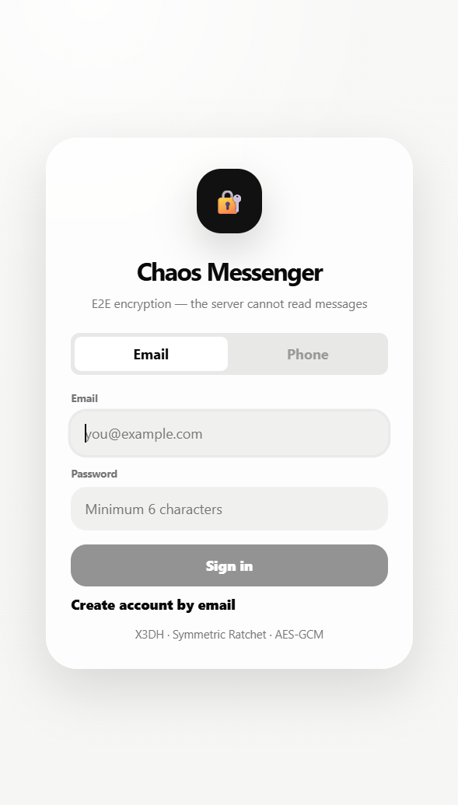

<div align="center">

```
░█████╗░██╗░░██╗░█████╗░░█████╗░░██████╗
██╔══██╗██║░░██║██╔══██╗██╔══██╗██╔════╝
██║░░╚═╝███████║███████║██║░░██║╚█████╗░
██║░░██╗██╔══██║██╔══██║██║░░██║░╚═══██╗
╚█████╔╝██║░░██║██║░░██║╚█████╔╝██████╔╝
░╚════╝░╚═╝░░╚═╝╚═╝░░╚═╝░╚════╝░╚═════╝░
```

### Realtime E2EE-мессенджер — сервер не может прочитать ваши сообщения

*Spring Boot 3 · React 18 · WebSocket/STOMP · X3DH · Symmetric Ratchet · AES-GCM · WebCrypto*

[🇬🇧 English README](README.md) · [🚀 Быстрый запуск](SETUP_COMPLETE.ru.md) · [🔐 Аудит безопасности](SECURITY_AUDIT_RU.md)

<br/>

[](https://github.com/vaazhen/chaos-messenger/actions/workflows/ci.yml)
[](https://openjdk.org/)
[](https://spring.io/projects/spring-boot)
[](https://react.dev/)
[](https://www.postgresql.org/)
[](https://redis.io/)
[](https://stomp.github.io/)
[](http://localhost:8080/swagger-ui/index.html)

<br/>

[О проекте](#о-проекте) · [Как работает E2EE](#как-работает-e2ee) · [Функции](#функции) · [Архитектура](#архитектура) · [Скриншоты](#скриншоты) · [Быстрый запуск](#быстрый-запуск) · [API](#api) · [Мониторинг](#мониторинг) · [Роадмап](#роадмап)

</div>

## Статья

Технический разбор проекта опубликован на DEV:

[Building an End-to-End Encrypted Messenger with Spring Boot and WebCrypto](https://dev.to/vaazhen/i-built-an-end-to-end-encrypted-messenger-with-spring-boot-and-webcrypto-1if5)

В статье разобраны основные архитектурные решения Chaos Messenger: установка E2EE-сессии через X3DH, symmetric ratchet, зашифрованные конверты для каждого устройства, WebSocket-доставка, multi-device маршрутизация и ограничения браузерного E2EE.

---

## О проекте

**Chaos Messenger** — full-stack realtime-мессенджер, построенный вокруг одной идеи: **сервер никогда не видит ваши сообщения**.

Каждое сообщение шифруется на устройстве отправителя до того как покидает браузер. Backend хранит и маршрутизирует непрозрачные зашифрованные блобы — у него нет ключей, нет plaintext, нет возможности прочитать то, что вы написали. Это проверяемо: откройте DevTools, отправьте сообщение, посмотрите на Network tab.

<p align="center">
  
</p>

<p align="center">
  <sub>🔒 Messages are encrypted on this device</sub>
</p>

Проект покрывает полный стек end-to-end: авторизация, управление устройствами, обмен ключами, realtime-доставка, наблюдаемость и чистый React UI — всё связано вместе и протестировано.

---

## Как работает E2EE

Большинство приложений, заявляющих об E2EE, всё равно позволяют серверам читать метаданные или временно держать plaintext. Вот что Chaos Messenger делает на самом деле — и каждый шаг можно проверить в браузере.

### Обмен ключами — X3DH

Когда вы впервые пишете кому-то, ваши устройства выполняют рукопожатие по протоколу [X3DH (Extended Triple Diffie-Hellman)](https://signal.org/docs/specifications/x3dh/) с использованием prekeys, опубликованных на сервере. Это позволяет вывести общий секрет без его передачи по сети. Сервер видит только публичные ключи — никогда не выведенный секрет.

### Шифрование каждого сообщения — Symmetric Ratchet + AES-GCM

После установки сессии каждое сообщение получает уникальный ключ через **симметричный ratchet**:

```
nextChainKey = HMAC-SHA256(chainKey, 0x02)
messageKey   = HMAC-SHA256(chainKey, 0x01)
```

Каждое сообщение шифруется с `messageKey` через AES-GCM. Старые ключи никогда не хранятся — forward secrecy на уровне каждого сообщения.

### Что реально получает сервер

```json
{
  "envelope": {
    "ciphertext": "qzgHSg7zbwU6h8j8RqCPUYBWHJLi78eR9C0tj9I=",
    "nonce": "6KPcVjbpM4FUB0Vz",
    "senderIdentityPublicKey": "B4pERe0xKmSdiQPR+kLWWmI0nloC8Za3RBTg+occHF0=",
    "targetDeviceId": "device-2aa3ae0e-ee08-4261-aa09-7d8f800b61e9",
    "messageType": "SELF_WHISPER"
  }
}
```

А что сервер возвращает при запросе списка чатов:

```json
{
  "lastMessage": "[encrypted]"
}
```

Не `***`. Не `[скрыто]`. Буквально `[encrypted]` — потому что у сервера нет другого значения для возврата.

> **Важная оговорка.** В этой реализации используется *симметричный* ratchet, а не полный Double Ratchet (Signal Protocol). DH ratchet step отсутствует, break-in recovery не реализован. Forward secrecy — на уровне сообщений внутри сессии. Это явно указано в коде и аудите безопасности.

---

## Функции

<table>
<tr>
<td width="50%">

### Безопасность и шифрование

- Клиентское E2EE — backend никогда не держит plaintext
- X3DH session bootstrap через prekeys
- Проверка signed prekey
- Symmetric ratchet — уникальный ключ на каждое сообщение
- AES-GCM шифрование через WebCrypto API
- Device identity хранится только в браузере
- Multi-device envelope fanout
- JWT-аутентификация (access + refresh)
- Redis rate limiting для SMS-кодов
- Усиленная WebSocket-авторизация
- Явные CORS origins + security headers

</td>
<td width="50%">

### Сообщения

- Личные чаты (1:1)
- Групповые чаты
- Realtime-доставка через WebSocket/STOMP
- Индикатор печати
- Статусы доставки и прочтения (✓✓)
- Ответы на сообщения
- Редактирование сообщений
- Soft delete
- Фото-вложения
- Онлайн-статус
- Поиск по сообщениям

</td>
</tr>
<tr>
<td width="50%">

### Backend

- Spring Boot 3 + Spring Security
- PostgreSQL 16 + Flyway (22 миграции)
- Redis 7 — токены, presence, rate limits
- OpenAPI 3.1 / Swagger UI
- Spring Boot Actuator
- Prometheus metrics endpoint
- Grafana dashboard provisioning
- Docker Compose (dev + prod профили)
- GitHub Actions CI

</td>
<td width="50%">

### Frontend

- React 18 + Vite
- Без внешних crypto-зависимостей — чистый WebCrypto API
- Crypto engine как самостоятельный ES-модуль
- Device identity управляется на стороне клиента
- STOMP/WebSocket клиент
- Phone + email аутентификация
- i18n поддержка (EN / RU)
- Unit-тесты (Vitest) + E2E (Playwright)

</td>
</tr>
</table>

---

## Архитектура

```
Браузер (React + WebCrypto)
  ├── REST — auth, profile, chats, messages, devices, prekeys
  ├── WebSocket/STOMP — realtime-события по устройствам
  └── crypto-engine.js — X3DH · Ratchet · AES-GCM · хранение ключей

Spring Boot Backend
  ├── Auth — phone OTP / email, JWT, refresh tokens
  ├── Device registry — prekey bundles, signed prekeys
  ├── Message fanout — один зашифрованный конверт на каждое устройство получателя
  ├── WebSocket — per-device STOMP topics, JWT auth
  ├── Redis — refresh tokens, online presence, SMS rate limits
  └── PostgreSQL — users, devices, chats, encrypted envelopes

Наблюдаемость
  ├── Actuator — health, info, metrics
  ├── Prometheus — scrapes /actuator/prometheus
  └── Grafana — провизионированный дашборд
```

<p align="center">
  
</p>

**Ключевой принцип:** клиент и сервер имеют строго разделённые обязанности.

| Слой | Ответственность |
|---|---|
| Браузер | Создание ключей · Шифрование · Расшифровка · Хранение идентификатора |
| Backend | Аутентификация · Маршрутизация · Хранение конвертов · Доставка |
| База данных | Состояние приложения и зашифрованные данные |
| Redis | Быстрое эфемерное состояние — токены, presence, rate limits |

---

## Скриншоты

<table>
<tr>
<td align="center" width="33%">
  <br/>
  <sub>Вход по номеру телефона</sub>
</td>
<td align="center" width="33%">
  <br/>
  <sub>Вход по email</sub>
</td>
<td align="center" width="33%">
  <br/>
  <sub>Ввод SMS-кода</sub>
</td>
</tr>
<tr>
<td align="center">
  <br/>
  <sub>Настройка профиля</sub>
</td>
<td align="center">
  <br/>
  <sub>Список чатов с непрочитанными</sub>
</td>
<td align="center">
  <br/>
  <sub>Создание личного или группового чата</sub>
</td>
</tr>
<tr>
<td align="center">
  <br/>
  <sub>Живая переписка со статусами прочтения</sub>
</td>
<td align="center">
  <br/>
  <sub>Активные устройства — multi-device E2EE</sub>
</td>
<td align="center">
  <br/>
  <sub>OpenAPI — полная документация API</sub>
</td>
</tr>
</table>

<details>
<summary>🔐 Под капотом — доказательства из DevTools</summary>

<br/>

**API списка чатов — сервер возвращает `[encrypted]`, а не текст сообщения:**


<br/>

**WebSocket-событие — сервер доставляет зашифрованный конверт, не plaintext:**


</details>

---

## Быстрый запуск

Полные руководства: [SETUP_COMPLETE.ru.md](SETUP_COMPLETE.ru.md) · [SETUP_COMPLETE.md](SETUP_COMPLETE.md)

**Или просто запустите скрипт:**

```bash
# macOS / Linux
./START.sh

# Windows
START.bat
```

### Ручная установка

**Требования**

```bash
java -version       # 17+
mvn -version        # 3.8+
node --version      # 18+
docker --version
docker compose version
```

**1. Запустить инфраструктуру**

```bash
cd backend
docker compose -f docker-compose.dev.yml up -d
```

**2. Запустить backend**

```bash
cd backend
mvn spring-boot:run
```

**3. Запустить frontend**

```bash
cd frontend
npm install
npm run dev
```

**4. Открыть приложение**

```
http://localhost:5173
```

> В dev-режиме SMS-коды верификации выводятся в логах backend — SMS-провайдер не нужен.

---

## Локальные адреса

| Сервис | URL |
|---|---|
| Web Client | http://localhost:5173 |
| Backend API | http://localhost:8080 |
| Swagger UI | http://localhost:8080/swagger-ui/index.html |
| OpenAPI JSON | http://localhost:8080/api-docs |
| Actuator Health | http://localhost:8080/actuator/health |
| Prometheus Metrics | http://localhost:8080/actuator/prometheus |
| Prometheus UI | http://localhost:9090 |
| Grafana | http://localhost:3000 (admin / admin) |

---

## API

API задокументирован через OpenAPI 3.1. Запустите backend и откройте Swagger UI по адресу `http://localhost:8080/swagger-ui/index.html`.

Каждый защищённый эндпоинт требует:
- `Authorization: Bearer <jwt>` — access token
- `X-Device-Id: <uuid>` — UUID зарегистрированного устройства

### Группы эндпоинтов

| Группа | Описание |
|---|---|
| **Auth** | Phone OTP flow, email login, JWT refresh, logout |
| **Profile** | Username, имя, аватар, bio |
| **Devices** | Регистрация устройства, загрузка prekeys, ротация signed prekey |
| **Crypto** | Получение prekey bundle для установки сессии |
| **Chats** | Создание личного / группового чата, список чатов |
| **Messages** | Отправка · редактирование · удаление · статусы |
| **Users** | Поиск по username, информация о пользователе |

### WebSocket-топики

| Топик | Назначение |
|---|---|
| `/topic/devices/{deviceId}` | Per-device доставка зашифрованных сообщений |
| `/topic/users/{username}/chats` | Обновления списка чатов |
| `/topic/chats/{chatId}/typing` | События печати |
| `/topic/user/status` | Обновления presence |

---

## Мониторинг

```bash
cd backend
docker compose up -d prometheus grafana
```

Grafana открывается по адресу `http://localhost:3000` (admin / admin). Дашборд провизионирован заранее — ручная настройка не нужна.

Prometheus собирает метрики с `http://localhost:8080/actuator/prometheus`.

Файлы конфигурации дашборда:

```
backend/src/main/resources/grafana-datasource.yml
backend/src/main/resources/grafana-dashboards.yml
backend/src/main/resources/chaos-messenger-dashboard.json
```

---

## Структура проекта

```
.
├── .github/workflows/           # GitHub Actions CI
├── backend/
│   ├── src/main/java/
│   │   └── ru/messenger/chaosmessenger/
│   │       ├── auth/            # Phone OTP + email auth, JWT
│   │       ├── chat/            # Чаты, сообщения, service layer
│   │       ├── crypto/          # Устройства, prekeys, envelope fanout
│   │       ├── infra/           # WebSocket, security config, фильтры
│   │       ├── user/            # Пользователи, профили
│   │       └── common/          # Обработка ошибок, i18n, утилиты
│   ├── src/main/resources/
│   │   ├── db/migration/        # 22 Flyway-миграции
│   │   └── i18n/                # EN + RU сообщения об ошибках
│   ├── docker-compose.dev.yml   # PostgreSQL + Redis для разработки
│   └── docker-compose.yml       # Полный стек с мониторингом
├── frontend/
│   ├── src/
│   │   ├── crypto-engine.js     # X3DH + Ratchet + AES-GCM
│   │   ├── components/          # AuthScreen, ChatList, MessageInput...
│   │   ├── hooks/               # useAuth, useChats, useMessages, useWebSocket
│   │   └── i18n/                # UI переводы
│   ├── e2e/                     # Playwright E2E-тесты
│   └── src/test/                # Vitest unit-тесты
├── docs/assets/                 # Architecture SVG + скриншоты
├── SECURITY_AUDIT_EN.md
└── SECURITY_AUDIT_RU.md
```

---

## Тесты

**Backend** — JUnit 5 + Testcontainers (настоящие PostgreSQL + Redis в Docker):

```bash
cd backend
mvn test
```

**Frontend** — Vitest unit-тесты:

```bash
cd frontend
npm test
```

**E2E** — Playwright (требует запущенное приложение):

```bash
cd frontend
npm run test:e2e
```

CI запускает backend-тесты + frontend-тесты + frontend build при каждом push и pull request.

---

## Переменные окружения

**Backend** (`application.properties` или env):

```env
JWT_SECRET=change-this-to-a-strong-32-plus-character-secret
JWT_EXPIRATION=86400000
CHAOS_CORS_ALLOWED_ORIGINS=http://localhost:5173
SPRING_DATASOURCE_URL=jdbc:postgresql://localhost:5432/chaos_messenger
SPRING_DATASOURCE_USERNAME=postgres
SPRING_DATASOURCE_PASSWORD=postgres
SPRING_DATA_REDIS_HOST=localhost
SPRING_DATA_REDIS_PORT=6379
```

**Frontend** (`.env`):

```env
VITE_BACKEND_URL=http://localhost:8080
VITE_API_BASE=http://localhost:8080/api
VITE_WS_URL=http://localhost:8080/ws
```

---

## Роадмап

Текущая сборка — крепкое MVP. Вот что планируется дальше:

| Приоритет | Фича |
|---|---|
| 🔜 Ближайшее | Полный Double Ratchet (DH ratchet step) |
| 🔜 Ближайшее | Android-клиент с Android Keystore |
| 🔜 Ближайшее | Push-уведомления |
| 📅 Запланировано | Зашифрованные голосовые сообщения |
| 📅 Запланировано | Зашифрованное медиахранилище |
| 📅 Запланировано | WebRTC аудио/видеозвонки + TURN/STUN |
| 📅 Запланировано | Staging и production deployment-профили |
| 💡 Идеи | Самоуничтожающиеся сообщения |
| 💡 Идеи | Реакции на сообщения |
| 💡 Идеи | Desktop-клиент (Electron или Tauri) |

---

## Для разработчиков

Issues и pull requests приветствуются. Если пишете о проекте — упомяните репозиторий, это помогает.

Области, где contributions будут полезны:

- Реализация полного Double Ratchet
- Android-клиент
- Дополнительное тестовое покрытие
- Нагрузочные тесты

---

<div align="center">

Написан на Java и React с здоровым недоверием к серверам, которые "обещают" защищать ваши данные.

</div>
