# Chaos Messenger

**Chaos Messenger** — open-source E2EE-мессенджер и инженерный full-stack проект, в котором сервер доставляет сообщения, но не читает их содержимое.

Проект построен вокруг идеи: **сервер может знать минимум, а клиент должен держать максимум криптографического состояния у себя**. Браузер шифрует сообщение, backend маршрутизирует encrypted envelopes, PostgreSQL хранит ciphertext, а realtime-доставка масштабируется через transactional outbox + Kafka/Redpanda.

> ⚠️ Это не замена Signal и не audited secure messenger. Это pet/open-source engineering project, в котором реализуется production-like архитектура E2EE-мессенджера: криптография, realtime, multi-device delivery, desktop, observability и инфраструктура.

---

## Что внутри

- **End-to-end encryption**: X3DH-like bootstrap, signed prekeys, one-time prekeys, DH Ratchet / Double Ratchet-like message flow.
- **Multi-device delivery**: каждое устройство получает свой encrypted envelope.
- **Kafka/Redpanda realtime backbone**: durable event delivery через transactional outbox.
- **Spring SimpleBroker только как local WebSocket transport**, а не как центр архитектуры.
- **PostgreSQL как source of truth**: messages, envelopes, devices, prekeys, attachments, outbox.
- **Redis**: presence, sessions, rate limits, refresh tokens, unread counters/cache flows.
- **React + WebCrypto frontend**: ключи, шифрование и расшифровка выполняются на клиенте.
- **Electron desktop client**: desktop shell поверх web-клиента.
- **Observability**: Prometheus, Grafana, Loki, Actuator.
- **Docker / Kubernetes**: dev-compose, production compose, k8s manifests.

---

## Stack

| Layer | Tech |
|---|---|
| Frontend | React 18, JavaScript, WebCrypto, IndexedDB, STOMP/WebSocket |
| Desktop | Electron 33 |
| Backend | Java 17, Spring Boot 3.5, Spring Security, Spring Data JPA |
| Realtime | WebSocket/STOMP, Kafka/Redpanda, local SimpleBroker |
| Storage | PostgreSQL 16, Flyway migrations |
| Cache / runtime state | Redis 7 |
| Messaging backbone | Kafka-compatible Redpanda |
| Observability | Prometheus, Grafana, Loki, Spring Boot Actuator |
| Infra | Docker Compose, Caddy, Nginx, Kubernetes |
| Crypto | WebCrypto, X25519-style ECDH flow, ECDSA P-256 signatures, HKDF-SHA256, AES-256-GCM |

---

## Высокоуровневая архитектура

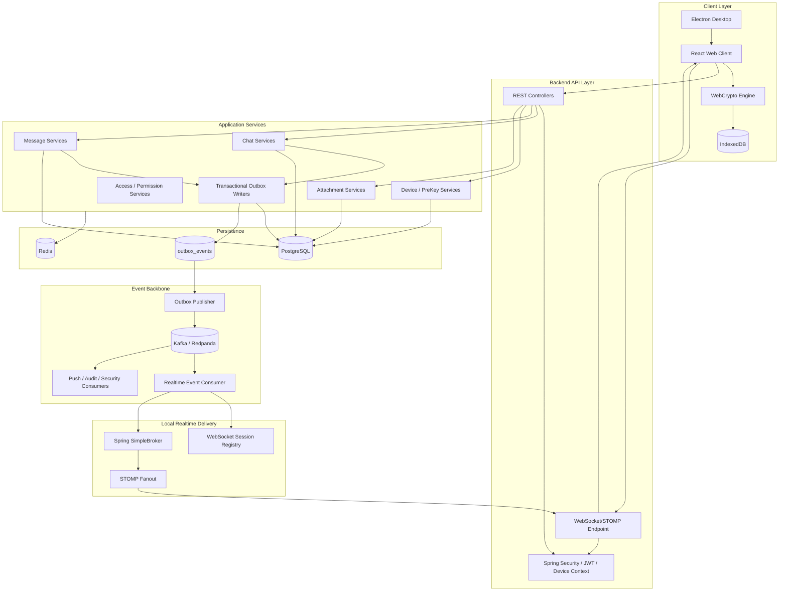

---

## Почему Kafka здесь не “галочка в стеке”

Spring SimpleBroker удобен для dev/single-instance сценария, но он in-memory и не решает горизонтальную доставку между backend-инстансами.

В Chaos Messenger Kafka/Redpanda используется как **durable event backbone**:

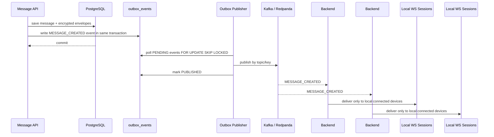

Главный принцип:

> **PostgreSQL transaction сохраняет бизнес-факт, outbox сохраняет событие, Kafka доставляет событие между инстансами, WebSocket доставляет его только локальным клиентам.**

---

## Transactional Outbox

Outbox — это граница между ACID-миром PostgreSQL и event-driven runtime.

Событие не отправляется напрямую из бизнес-сервиса в Kafka. Вместо этого оно пишется в `outbox_events` внутри той же transaction, что и доменные данные.

```mermaid
flowchart LR
    A[Use-case Service] -->|@Transactional| B[Save domain data]
    B --> C[Save outbox event]
    C --> D[Commit]
    D --> E[Outbox Publisher]
    E --> F[Kafka Topic]
    F --> G[Consumers]
```

### Жизненный цикл outbox event

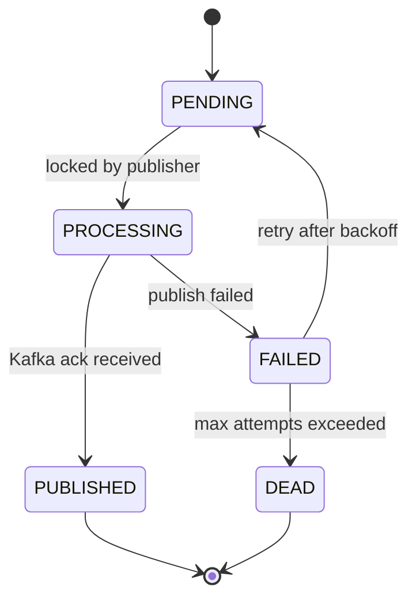

Outbox records include:

- `event_id`
- `aggregate_type`
- `aggregate_id`
- `event_type`
- `event_version`
- `schema_version`
- `payload jsonb`
- `status`
- `attempts`
- `max_attempts`
- `next_attempt_at`
- `locked_at`
- `locked_by`
- `last_error`
- `correlation_id`
- `idempotency_key`
- `occurred_at`
- `published_at`

---

## Realtime delivery model

Realtime теперь устроен так:

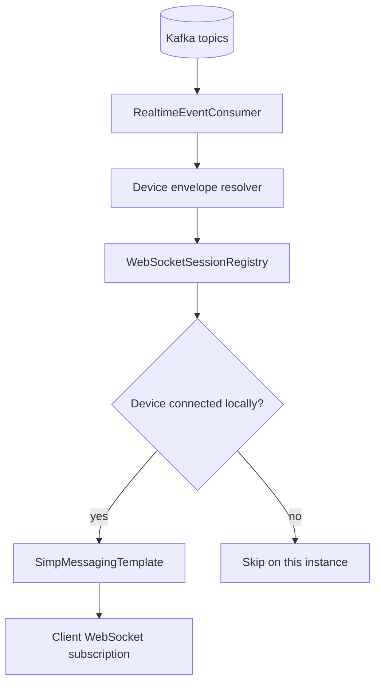

Для realtime важно, что каждый backend-инстанс должен получить событие. Поэтому realtime consumers используют **уникальный consumer group per backend instance**.

```text
backend-1: chaos-realtime-backend-1
backend-2: chaos-realtime-backend-2
backend-3: chaos-realtime-backend-3
```

Для background consumers наоборот используется shared group:

```text
push workers:  chaos-push-workers
audit workers: chaos-audit-workers
```

Иначе push/audit события могли бы обработаться несколько раз.

---

## E2EE message flow

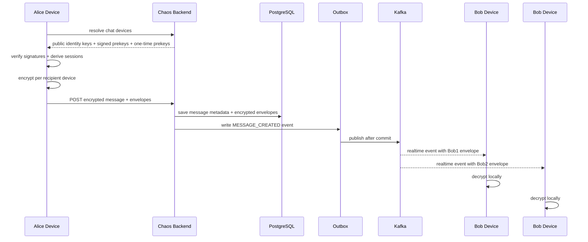

Сервер хранит и доставляет только encrypted payloads. Plaintext существует только на клиентских устройствах.

---

## Device registration and prekeys

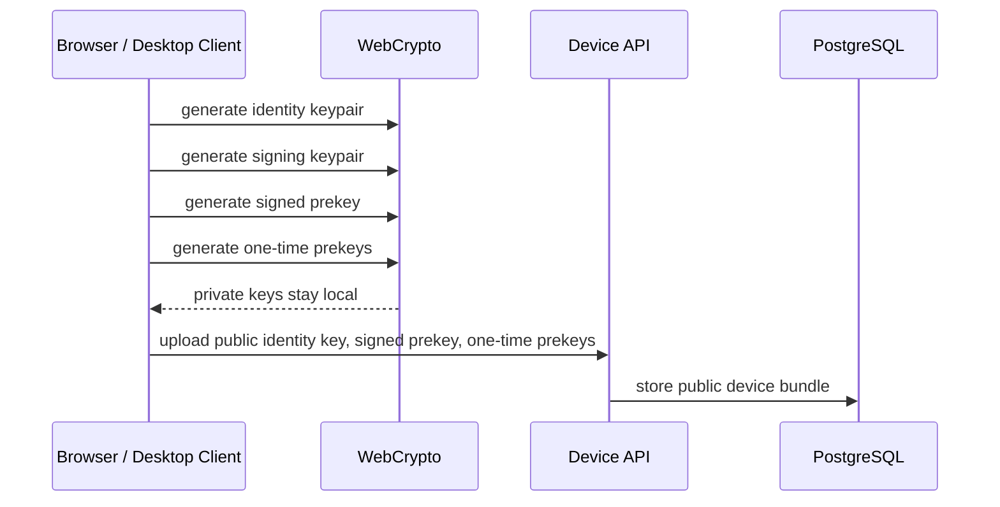

Private keys are client-side material. The backend stores only public key material and encrypted envelopes.

---

## Multi-device delivery

Each message is stored once as a logical message, but delivered as multiple encrypted envelopes:

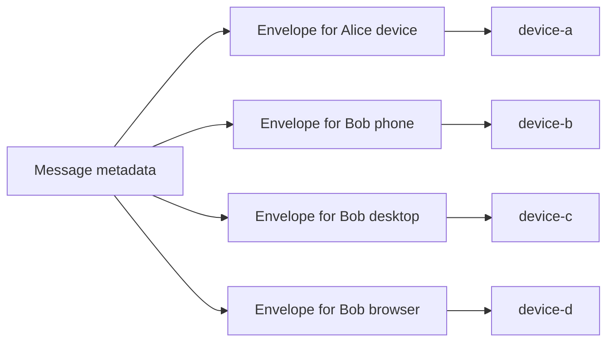

This keeps the backend transport-aware but content-blind.

---

## Attachment security model

Attachments are encrypted client-side and stored server-side as ciphertext. Access is scoped by the exact chat/message relationship.

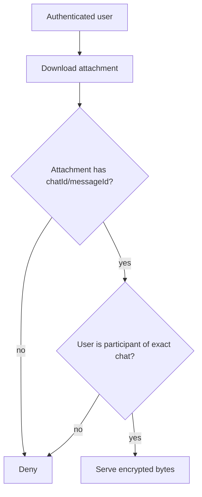

Even though attachments are encrypted, ciphertext is still user data. The server must not expose it outside the exact chat boundary.

---

## Backend module map

```text
backend/src/main/java/ru/messenger/chaosmessenger
├── auth/              # auth, login, verification, refresh tokens
├── user/              # profile, user identity
├── crypto/            # devices, signed prekeys, one-time prekeys, bundles
├── chat/              # direct chats, groups, participants, moderation
├── message/           # encrypted messages, envelopes, receipts, reactions
├── attachment/        # encrypted attachments and access checks
├── outbox/            # transactional outbox, publisher, Kafka config
├── realtime/          # Kafka realtime consumers and local WS fanout
├── push/              # web push subscriptions
├── backup/            # encrypted backups
└── infra/             # security, config, filters, observability
```

---

## Main runtime flows

### Send encrypted message

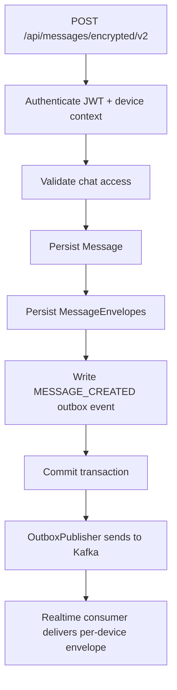

### Update profile

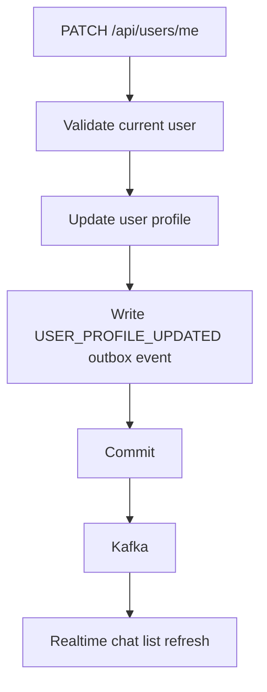

### Kafka failure

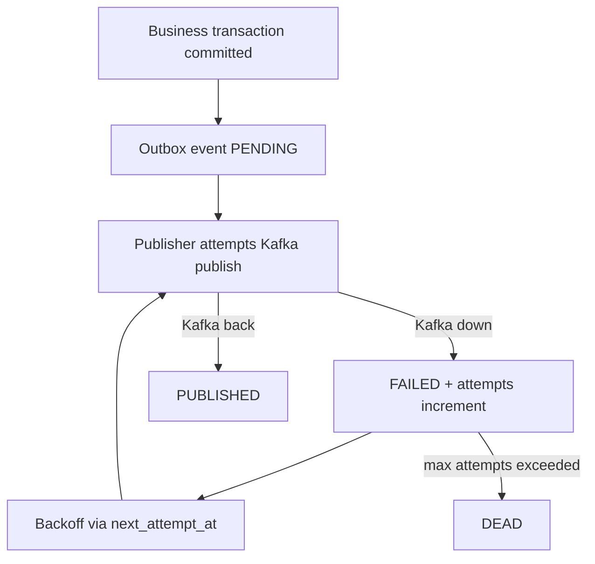

---

## Kafka topics

| Topic | Purpose |
|---|---|
| `chaos.message.events` | message created/edited/deleted/reactions/status |
| `chaos.chat.events` | chat created/updated, members, moderation |
| `chaos.receipt.events` | delivered/read receipts |
| `chaos.user.events` | profile/avatar updates |
| `chaos.security.events` | device/security/prekey events |
| `chaos.push.events` | push notification requests |
| `chaos.audit.events` | audit events |
| `chaos.dead-letter.events` | dead-letter events |

Kafka keys should preserve ordering where it matters. Message events should generally be keyed by `chatId`.

---

## Local development

### Start infrastructure

From `backend/`:

```powershell
cd backend

docker compose -f docker-compose.dev.yml up -d
```

This starts:

- PostgreSQL
- Redis
- Redpanda/Kafka

### IntelliJ / local backend env

```env
SPRING_PROFILES_ACTIVE=dev
SPRING_DATASOURCE_URL=jdbc:postgresql://localhost:5432/chaos_messenger
SPRING_DATASOURCE_USERNAME=postgres
SPRING_DATASOURCE_PASSWORD=postgres
SPRING_DATA_REDIS_HOST=localhost
SPRING_DATA_REDIS_PORT=6379
CHAOS_KAFKA_ENABLED=true
SPRING_KAFKA_BOOTSTRAP_SERVERS=localhost:19092
KAFKA_BOOTSTRAP_SERVERS=localhost:19092
JWT_SECRET=dev-chaos-local-jwt-secret-change-me-32-chars-minimum
CHAOS_CORS_ALLOWED_ORIGINS=http://localhost:5173,http://127.0.0.1:5173,http://localhost:3000
CHAOS_CORS_ALLOWED_ORIGIN_PATTERNS=http://localhost:*,http://127.0.0.1:*,http://192.168.*.*:*
CHAOS_DEMO_ENABLED=true
```

### Backend build

```powershell
cd backend
./mvnw.cmd clean install
```

### Frontend

```powershell
cd frontend
npm install
npm run dev
```

### Check Redpanda

```powershell
docker exec -it chaos-messenger-redpanda rpk cluster info
docker exec -it chaos-messenger-redpanda rpk topic list
```

### Check outbox

```powershell
docker exec -it chaos-messenger-db psql -U postgres -d chaos_messenger -c "select id, aggregate_type, aggregate_id, event_type, status, attempts, last_error, created_at, published_at from outbox_events order by id desc limit 20;"
```

---

## Production-like guarantees

Chaos Messenger currently aims for these engineering properties:

- message persistence and event persistence happen in the same database transaction;
- Kafka publish failures do not silently lose events;
- multiple backend instances can consume realtime events independently;
- every device receives its own encrypted envelope;
- local WebSocket sessions are only local runtime state;
- attachment access is scoped to exact chat participation;
- backend never needs plaintext to route messages.

---

## Security notes

This project intentionally avoids claiming production-grade security.

Known limitations:

- no external cryptographic/security audit;
- web delivery threat model is inherently weaker than native-only clients;
- local key storage still needs stronger hardening;
- safety numbers / explicit device verification are roadmap items;
- metadata protection is limited;
- traffic analysis resistance is out of scope;
- multi-device edge cases need more adversarial testing.

---

## What makes this project interesting

Most chat demos stop at:

```text
REST + WebSocket + database
```

Chaos Messenger goes further:

```text
E2EE + multi-device envelopes + transactional outbox + Kafka realtime fanout + observability + desktop + Docker/K8s
```

The result is not “a Signal replacement”. The result is a serious engineering playground for building and understanding the hard parts of secure realtime systems.

---

## Roadmap

- Safety numbers and explicit device verification.
- Stronger key storage strategy.
- More adversarial E2EE tests.
- Kafka DLQ dashboard and operational tooling.
- Multi-instance realtime integration tests.
- Push notification worker hardening.
- External security review.
- Android client.
- Cleaner frontend module boundaries.

---

## License

Open-source project. See repository license.
