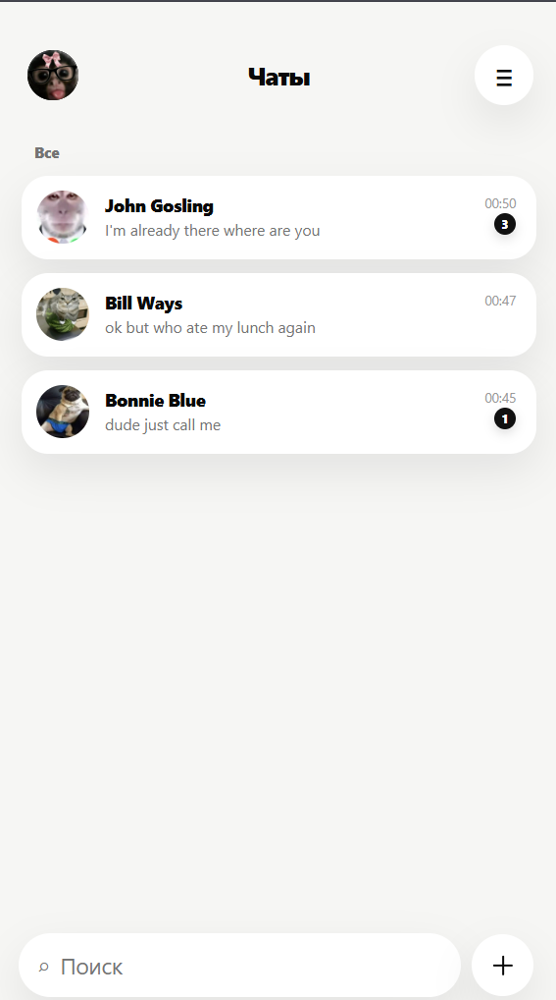
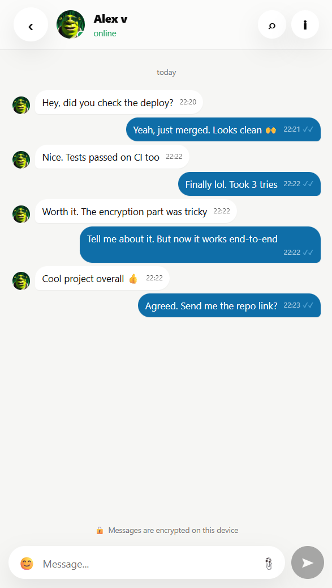
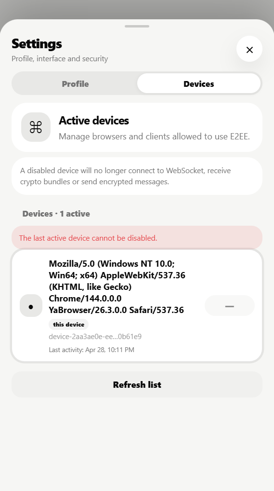
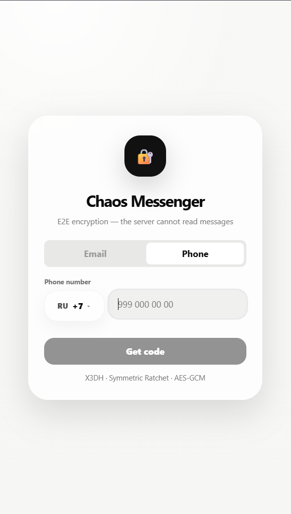
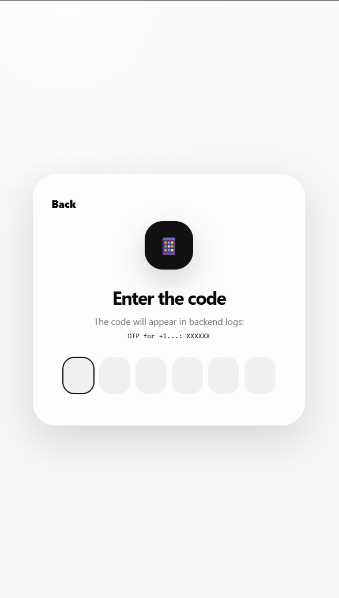
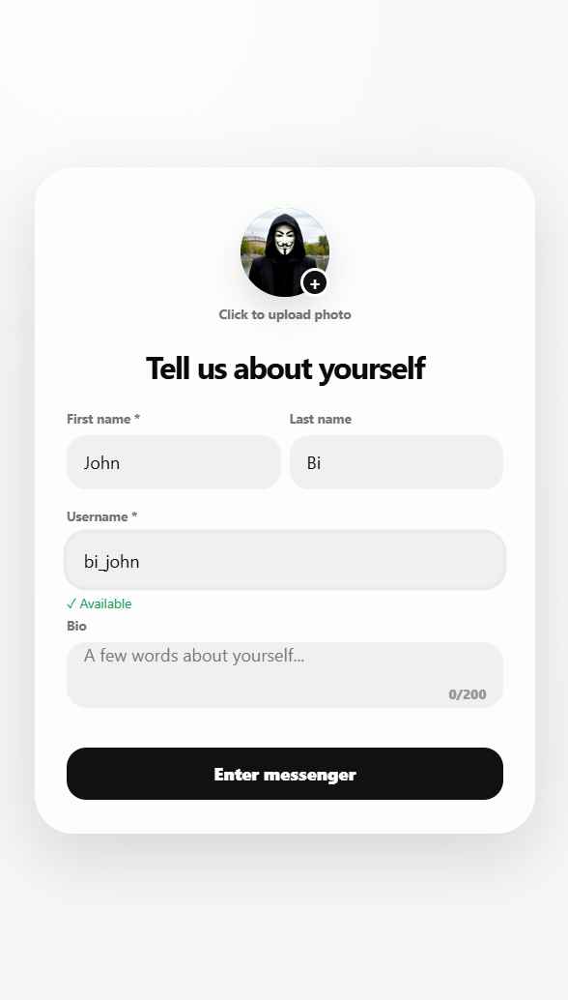
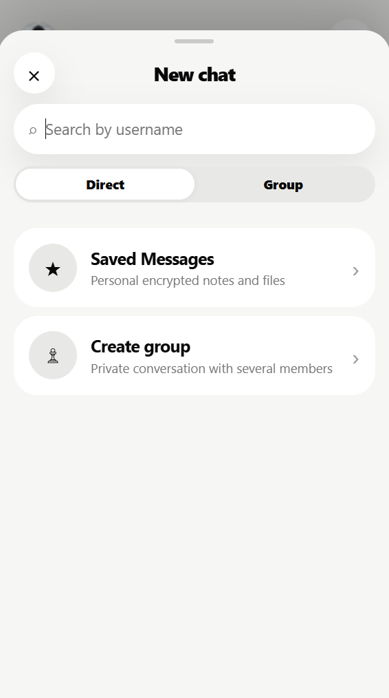
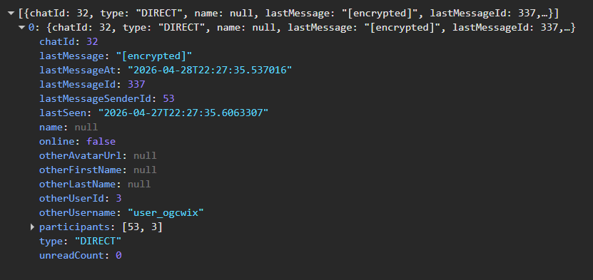
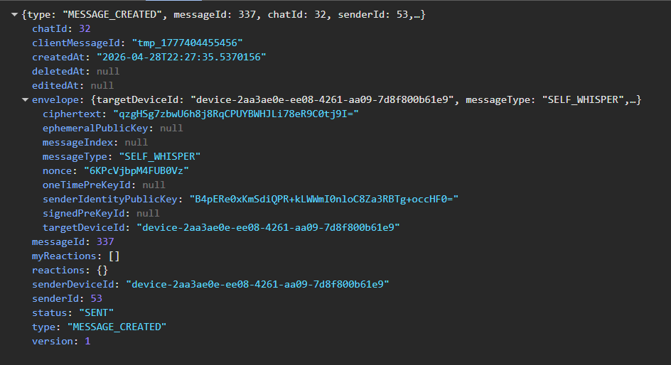
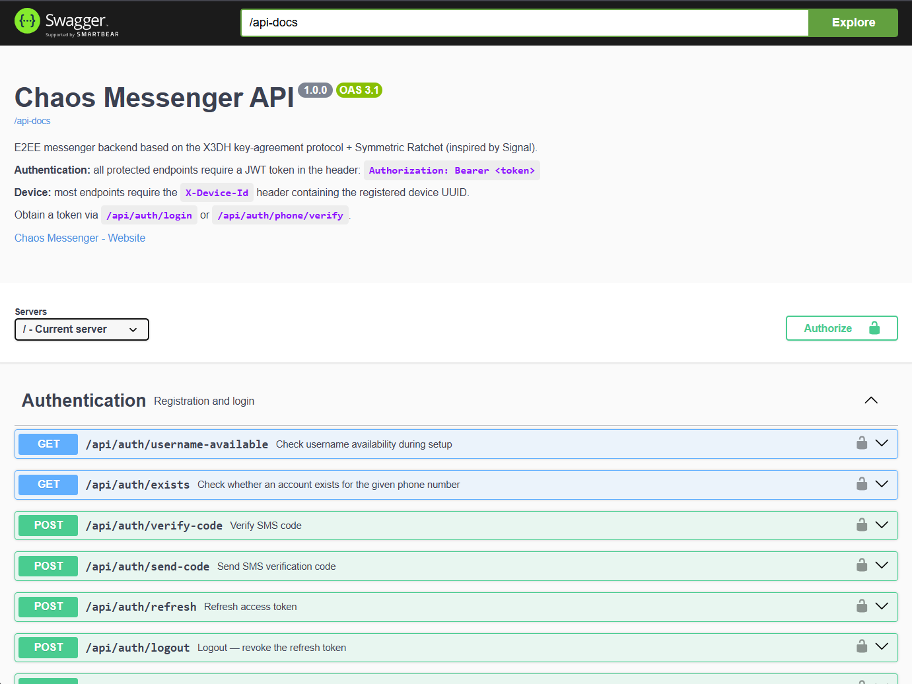

<div align="center">

```
░█████╗░██╗░░██╗░█████╗░░█████╗░░██████╗
██╔══██╗██║░░██║██╔══██╗██╔══██╗██╔════╝
██║░░╚═╝███████║███████║██║░░██║╚█████╗░
██║░░██╗██╔══██║██╔══██║██║░░██║░╚═══██╗
╚█████╔╝██║░░██║██║░░██║╚█████╔╝██████╔╝
░╚════╝░╚═╝░░╚═╝╚═╝░░╚═╝░╚════╝░╚═════╝░
```

**Сервер не может прочитать ваши сообщения. Вот доказательство.**

<br/>

[](https://github.com/vaazhen/chaos-messenger/actions/workflows/ci.yml)
[](https://openjdk.org/)
[](https://spring.io/projects/spring-boot)
[](https://react.dev/)
[](https://www.postgresql.org/)
[](https://redis.io/)
[](#)

<br/>

[🇬🇧 English README](README.md) · [🚀 Быстрый запуск](SETUP_COMPLETE.ru.md) · [🔐 Аудит безопасности](SECURITY_AUDIT_RU.md)

</div>

---

<p align="center">
  
</p>

---

## О проекте

**Chaos Messenger** — full-stack realtime-мессенджер, в котором сквозное шифрование — не маркетинговый тезис, а верифицируемое архитектурное свойство.

Откройте DevTools. Отправьте сообщение. Сервер получает вот это:

```json
{
  "envelope": {
    "ciphertext": "qzgHSg7zbwU6h8j8RqCPUYBWHJLi78eR9C0tj9I=",
    "nonce": "6KPcVjbpM4FUB0Vz",
    "senderIdentityPublicKey": "B4pERe0xKmSdiQPR+kLWWmI0nloC8Za3RBTg+occHF0=",
    "targetDeviceId": "device-2aa3ae0e-ee08-4261-aa09-7d8f800b61e9"
  }
}
```

Спросите сервер, что написано в последнем сообщении:

```json
{ "lastMessage": "[encrypted]" }
```

Не `***`. Не `[скрыто]`. Сервер возвращает `[encrypted]` — потому что у него буквально нет другого значения для ответа.

**Стек:** Spring Boot 3 · React 18 · WebSocket/STOMP · X3DH · Symmetric Ratchet · AES-GCM · WebCrypto API

---

## Как работает шифрование

Большинство приложений, заявляющих об E2EE, всё равно деривируют ключи на сервере, временно держат plaintext для push-уведомлений или хранят достаточно метаданных для восстановления переписки. Вот точная модель, которая используется в Chaos Messenger — и каждый шаг можно проверить в браузере.

### Шаг 1 — Установка сессии через X3DH

При первом открытии переписки ваше устройство получает с сервера **prekey bundle** собеседника — набор публичных ключей, загруженных при регистрации устройства. Ваше устройство локально запускает [Extended Triple Diffie-Hellman (X3DH)](https://signal.org/docs/specifications/x3dh/) и выводит общий секрет. Сервер предоставляет публичные ключи, но никогда не видит выведенный секрет.

```
Вы                         Сервер                      Собеседник
 │                           │                           │
 │── GET /crypto/bundle ────►│                           │
 │◄─ { IK, SPK, OPK } ──────│                           │
 │                           │                           │
 │   X3DH(my_keys,           │                           │
 │        their_bundle)      │                           │
 │   = sharedSecret 🔑       │                           │
 │   (не покидает устройство)│                           │
```

### Шаг 2 — Уникальный ключ на каждое сообщение через Symmetric Ratchet

После установки сессии каждое сообщение получает **уникальный ключ шифрования** через ratchet-цепочку:

```
nextChainKey = HMAC-SHA256(chainKey, 0x02)
messageKey   = HMAC-SHA256(chainKey, 0x01)
```

`messageKey` шифрует ровно одно сообщение через AES-GCM, после чего уничтожается. Компрометация одного ключа не открывает прошлые и будущие сообщения — **forward secrecy на уровне каждого сообщения**.

### Шаг 3 — Слепая доставка на каждое устройство

Сервер никогда не расшифровывает и не перешифровывает. Он маршрутизирует непрозрачный зашифрованный конверт на каждое зарегистрированное устройство получателя через WebSocket. Сервер — **слепой роутер**.

```
Отправитель → [ ciphertext × N устройств ] → Сервер → WebSocket → Устройства получателя
```

> **Важная оговорка.** Здесь реализован *симметричный* ratchet — не полный [Double Ratchet](https://signal.org/docs/specifications/doubleratchet/) из Signal Protocol. DH ratchet step (восстановление после компрометации) — первый пункт в [роадмапе](#роадмап) и задокументирован в [аудите безопасности](SECURITY_AUDIT_RU.md).

---

## Возможности

| | |
|---|---|
| **E2EE** | X3DH key exchange · Symmetric Ratchet · AES-GCM · WebCrypto API · ноль внешних зависимостей |
| **Multi-device** | Отдельный конверт на каждое устройство · UI управления устройствами · Отзыв доступа |
| **Авторизация** | Phone + SMS OTP · Email + пароль · JWT access/refresh · Redis rate limiting |
| **Сообщения** | Личные и групповые чаты · Realtime через WebSocket/STOMP · Индикатор печати |
| **Операции** | Ответ · Редактирование · Soft delete · Фото-вложения · Статусы прочтения ✓✓ · Онлайн-статус |
| **Backend** | Spring Boot 3 · PostgreSQL 16 · Flyway 22 миграции · Redis 7 · Docker Compose |
| **Наблюдаемость** | Actuator · Prometheus · Grafana дашборд (провизионирован, без настройки) |
| **Тесты** | 24 backend (Testcontainers) · 12 frontend (Vitest) · E2E (Playwright) |
| **DX** | GitHub Actions CI · OpenAPI 3.1 · Swagger UI · запуск одной командой |

---

## Архитектура

```
Браузер
├── React 18 + Vite
├── crypto-engine.js     ← X3DH · Ratchet · AES-GCM  (чистый WebCrypto, ноль зависимостей)
├── REST /api/*          ← auth · profile · chats · messages · devices · prekeys
└── WebSocket /ws        ← per-device STOMP topics, JWT аутентификация

Spring Boot Backend
├── auth/                ← phone OTP · email · JWT · refresh tokens
├── crypto/              ← device registry · prekey bundles · envelope fanout
├── chat/                ← чаты · сообщения · статусы прочтения
├── infra/               ← WebSocket config · security · request logging
├── user/                ← профили · поиск по username
└── common/              ← обработка ошибок · i18n · утилиты

Данные
├── PostgreSQL           ← users · devices · chats · encrypted envelopes
└── Redis                ← refresh tokens · online presence · SMS rate limits

Наблюдаемость
└── Actuator → Prometheus → Grafana
```

<p align="center">
  
</p>

---

## Скриншоты

<p align="center">
  
  &nbsp;&nbsp;
  
  &nbsp;&nbsp;
  
</p>
<p align="center">
  <sub>Список чатов с непрочитанными &nbsp;·&nbsp; Живая переписка со статусами прочтения ✓✓ &nbsp;·&nbsp; Активные устройства — multi-device E2EE</sub>
</p>

<br/>

<p align="center">
  
  &nbsp;
  
  &nbsp;
  
  &nbsp;
  
</p>
<p align="center">
  <sub>Вход по телефону &nbsp;·&nbsp; SMS-верификация &nbsp;·&nbsp; Настройка профиля &nbsp;·&nbsp; Новый чат</sub>
</p>

<details>
<summary><b>🔐 Доказательство через DevTools — что реально получает сервер</b></summary>

<br/>

**API списка чатов — сервер возвращает `[encrypted]`, не текст сообщения:**



<br/>

**WebSocket MESSAGE_CREATED — сервер доставляет ciphertext-конверт, не сообщение:**



<br/>

**Swagger UI — полный API включая X3DH и device endpoints:**



</details>

---

## Быстрый запуск

```bash
git clone https://github.com/vaazhen/chaos-messenger.git
cd chaos-messenger
```

**Одной командой:**

```bash
./START.sh        # macOS / Linux
START.bat         # Windows
```

**Или вручную:**

```bash
# 1. Инфраструктура (PostgreSQL + Redis)
cd backend && docker compose -f docker-compose.dev.yml up -d

# 2. Backend
mvn spring-boot:run

# 3. Frontend (новый терминал)
cd frontend && npm install && npm run dev
```

Откройте **[http://localhost:5173](http://localhost:5173)**

> В dev-режиме SMS-коды выводятся в логах backend — SMS-провайдер не нужен.

**Требования:** Java 17+ · Maven 3.8+ · Node.js 18+ · Docker + Compose

---

## Локальные адреса

| Сервис | URL |
|---|---|
| Приложение | http://localhost:5173 |
| API | http://localhost:8080 |
| Swagger UI | http://localhost:8080/swagger-ui/index.html |
| OpenAPI JSON | http://localhost:8080/api-docs |
| Health | http://localhost:8080/actuator/health |
| Prometheus Metrics | http://localhost:8080/actuator/prometheus |
| Prometheus UI | http://localhost:9090 |
| Grafana | http://localhost:3000 · `admin / admin` |

---

## API

Каждый защищённый эндпоинт требует:
- `Authorization: Bearer <jwt>`
- `X-Device-Id: <device-uuid>`

| Группа | Описание |
|---|---|
| **Auth** | Phone OTP flow · Email login · JWT refresh · Logout |
| **Devices** | Регистрация · Загрузка prekeys · Ротация signed prekey · Список активных |
| **Crypto** | Получение prekey bundle для X3DH |
| **Chats** | Создание личного/группового · Список · Информация |
| **Messages** | Отправка · Редактирование · Удаление · Статусы прочтения |
| **Profile** | Получение · Обновление · Аватар · Проверка username |
| **Users** | Поиск по username |

**WebSocket-топики** (STOMP over SockJS, JWT аутентификация):

```
/topic/devices/{deviceId}        ← per-device доставка зашифрованных конвертов
/topic/users/{username}/chats    ← обновления списка чатов
/topic/chats/{chatId}/typing     ← события печати
/topic/user/status               ← online presence
```

---

## Тесты

```bash
# Backend — JUnit 5 + Testcontainers (настоящие PostgreSQL + Redis в Docker)
cd backend && mvn test

# Frontend — Vitest
cd frontend && npm test

# E2E — Playwright (требует запущенное приложение)
cd frontend && npm run test:e2e
```

CI запускает backend-тесты + frontend-тесты + frontend build при каждом push и pull request.

---

## Структура проекта

```
chaos-messenger/
├── .github/workflows/ci.yml
├── backend/
│   ├── src/main/java/ru/messenger/chaosmessenger/
│   │   ├── auth/          # Phone OTP · email · JWT · refresh tokens
│   │   ├── chat/          # Чаты · сообщения · статусы прочтения
│   │   ├── crypto/        # Устройства · prekeys · envelope fanout
│   │   ├── infra/         # WebSocket · security · фильтры
│   │   ├── user/          # Пользователи · профили
│   │   └── common/        # Ошибки · i18n · утилиты
│   ├── src/main/resources/
│   │   ├── db/migration/  # V1–V22 Flyway миграции
│   │   └── i18n/          # EN + RU сообщения об ошибках
│   ├── docker-compose.dev.yml   # PostgreSQL + Redis
│   └── docker-compose.yml       # Полный стек + мониторинг
├── frontend/
│   ├── src/
│   │   ├── crypto-engine.js     # Standalone E2EE — ноль внешних зависимостей
│   │   ├── components/          # AuthScreen · ChatList · MessageInput · ProfileModal…
│   │   ├── hooks/               # useAuth · useChats · useMessages · useWebSocket
│   │   └── i18n/                # EN / RU
│   ├── e2e/                     # Playwright
│   └── src/test/                # Vitest
└── docs/assets/                 # Architecture SVG · скриншоты
```

---

## Переменные окружения

<details>
<summary>Backend + Frontend</summary>

**Backend:**

```env
JWT_SECRET=change-this-to-a-strong-32-plus-character-secret
JWT_EXPIRATION=86400000
CHAOS_CORS_ALLOWED_ORIGINS=http://localhost:5173
SPRING_DATASOURCE_URL=jdbc:postgresql://localhost:5432/chaos_messenger
SPRING_DATASOURCE_USERNAME=postgres
SPRING_DATASOURCE_PASSWORD=postgres
SPRING_DATA_REDIS_HOST=localhost
SPRING_DATA_REDIS_PORT=6379
```

**Frontend `.env`:**

```env
VITE_BACKEND_URL=http://localhost:8080
VITE_API_BASE=http://localhost:8080/api
VITE_WS_URL=http://localhost:8080/ws
```

</details>

---

## Роадмап

```
✅  X3DH key exchange
✅  Symmetric Ratchet + AES-GCM на каждое сообщение
✅  Multi-device envelope fanout
✅  Phone + email авторизация
✅  Групповые чаты
✅  Статусы прочтения · typing · presence
✅  Prometheus + Grafana наблюдаемость
✅  Docker Compose · GitHub Actions CI

🔜  Полный Double Ratchet (DH ratchet step + break-in recovery)
🔜  Android-клиент + Android Keystore
🔜  Push-уведомления
📅  Зашифрованные голосовые сообщения
📅  Зашифрованное медиахранилище
📅  WebRTC звонки (аудио + видео) + TURN/STUN
📅  Самоуничтожающиеся сообщения
💡  Desktop-клиент (Tauri)
💡  Реакции на сообщения
```

---

## Зачем этот проект

Реализация мессенджера с настоящим E2EE заставляет пройти через все слои современных защищённых коммуникаций: деривация ключей, криптография на уровне протокола, multi-device управление состоянием, realtime-инфраструктура и наблюдаемость — в одной цельной кодовой базе.

Хорошая точка старта для:

- Java / Fullstack портфолио — E2EE-угол делает проект запоминающимся
- Изучения realtime-архитектуры на Spring Boot
- Android-клиента с интеграцией Android Keystore
- Пошаговой реализации полного Double Ratchet

---

<div align="center">
<br/>

**Если проект оказался полезным — поставьте ⭐, это помогает развитию**

<br/>

*Написан на Java и React с здоровым недоверием к серверам, которые обещают защищать ваши данные.*

</div>
