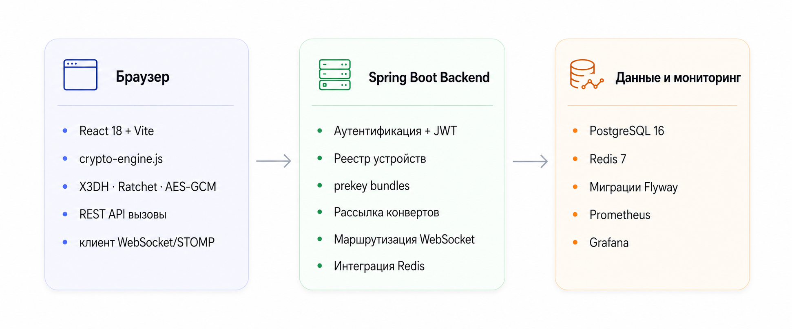
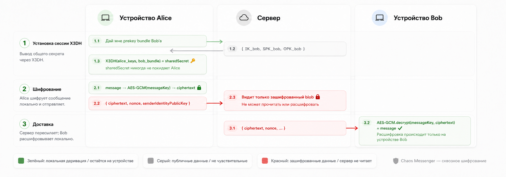
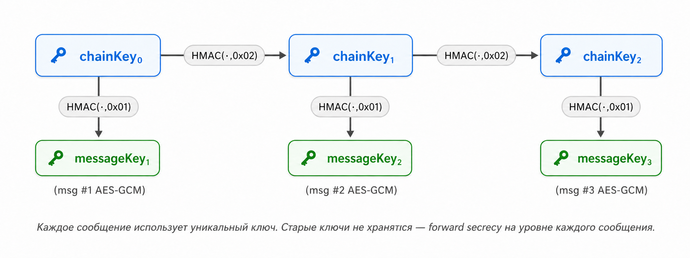
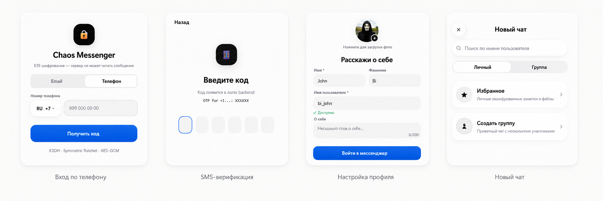

<div align="center">

[🇬🇧 English README](README.md) · [🚀 Быстрый запуск](SETUP_COMPLETE.ru.md) · [🔐 Аудит безопасности](SECURITY_AUDIT_RU.md)

<br/>

[](https://github.com/vaazhen/chaos-messenger/actions/workflows/ci.yml)
[](https://openjdk.org/)
[](https://spring.io/projects/spring-boot)
[](https://react.dev/)
[](https://www.postgresql.org/)
[](https://redis.io/)
[](#)

</div>

---

<div align="center">
  
</div>

<br/>

<p align="center">
  
</p>

<p align="center">
  <sub>Список чатов с непрочитанными · Живая переписка со статусами прочтения ✓✓ · Управление устройствами E2EE</sub>
</p>

---

---

## О проекте

**Chaos Messenger** — full-stack realtime-мессенджер, в котором сквозное шифрование — не маркетинговый тезис, а верифицируемое архитектурное свойство.

Откройте DevTools. Отправьте сообщение. Сервер получает вот это:

```json
{
  "envelope": {
    "ciphertext": "qzgHSg7zbwU6h8j8RqCPUYBWHJLi78eR9C0tj9I=",
    "nonce": "6KPcVjbpM4FUB0Vz",
    "senderIdentityPublicKey": "B4pERe0xKmSdiQPR+kLWWmI0nloC8Za3RBTg+occHF0=",
    "targetDeviceId": "device-2aa3ae0e-ee08-4261-aa09-7d8f800b61e9"
  }
}
```

Спросите сервер, что написано в последнем сообщении:

```json
{ "lastMessage": "[encrypted]" }
```

Не `***`. Не `[скрыто]`. Сервер возвращает `[encrypted]` — потому что у него буквально нет другого значения.

**Стек:** Spring Boot 3 · React 18 · WebSocket/STOMP · X3DH · Symmetric Ratchet · AES-GCM · WebCrypto API

---

## Архитектура

> Три слоя — строго разделённые обязанности. Клиент шифрует, сервер маршрутизирует, база данных хранит блобы.

<p align="center">
  
</p>

| Слой | Ответственность |
|---|---|
| **Браузер** | Создание ключей · Шифрование · Расшифровка · Хранение идентификатора устройства |
| **Backend** | Аутентификация · Маршрутизация · Хранение конвертов · Доставка по WebSocket |
| **PostgreSQL** | Пользователи · устройства · чаты · зашифрованные конверты |
| **Redis** | Refresh tokens · online presence · SMS rate limits |

---

## Как работает E2EE

### Шаг 1 — Обмен ключами X3DH

> Alice получает публичный prekey bundle Bob'а с сервера и выводит общий секрет локально. Сервер никогда не видит секрет.

<p align="center">
  
</p>

При первом открытии переписки ваше устройство запускает [Extended Triple Diffie-Hellman (X3DH)](https://signal.org/docs/specifications/x3dh/) против prekey bundle получателя. Общий секрет выводится локально — он никогда не покидает устройство. Сервер предоставляет публичные ключи, но не может вычислить секрет.

### Шаг 2 — Symmetric Ratchet + AES-GCM

> Каждое сообщение получает собственный уникальный ключ шифрования, который затем уничтожается. Компрометация одного ключа ничего не раскрывает об остальных.

<p align="center">
  
</p>

После установки сессии каждый ключ сообщения выводится через ratchet-цепочку:

```
nextChainKey = HMAC-SHA256(chainKey, 0x02)
messageKey   = HMAC-SHA256(chainKey, 0x01)
```

`messageKey` шифрует ровно одно сообщение через AES-GCM, после чего уничтожается. Это обеспечивает **forward secrecy на уровне каждого сообщения**.

### Шаг 3 — Слепая доставка

Сервер получает непрозрачный зашифрованный конверт и доставляет копию на каждое зарегистрированное устройство получателя через WebSocket. Никакой расшифровки, никакого перешифрования — только **слепая маршрутизация**.

> **Важная оговорка.** Здесь реализован *симметричный* ratchet — не полный [Double Ratchet](https://signal.org/docs/specifications/doubleratchet/) из Signal Protocol. DH ratchet step (восстановление после компрометации) — первый пункт [роадмапа](#роадмап) и описан в [аудите безопасности](SECURITY_AUDIT_RU.md).

---

## Возможности

| | |
|---|---|
| **E2EE** | X3DH · Symmetric Ratchet · AES-GCM · WebCrypto · ноль внешних зависимостей |
| **Multi-device** | Отдельный конверт на устройство · UI управления · Отзыв доступа |
| **Авторизация** | Phone + SMS OTP · Email + пароль · JWT access/refresh · Redis rate limiting |
| **Сообщения** | Личные и групповые чаты · Realtime WebSocket/STOMP · Typing indicator |
| **Операции** | Ответ · Редактирование · Soft delete · Фото · Статусы прочтения ✓✓ · Presence · Поиск пользователей |
| **Backend** | Spring Boot 3 · PostgreSQL 16 · Flyway 21 миграция · Redis 7 · Docker Compose |
| **Наблюдаемость** | Actuator · Prometheus · Grafana (провизионирован, без настройки) |
| **Тесты** | 24 backend (Testcontainers) · 12 frontend (Vitest) · E2E (Playwright) |
| **DX** | GitHub Actions CI · OpenAPI 3.1 · Swagger UI · запуск одной командой |

---

## Онбординг

> Вход по телефону → SMS-верификация → настройка профиля → начало общения. Весь процесс занимает меньше минуты.

<p align="center">
  
</p>

---

## Быстрый запуск

```bash
git clone https://github.com/vaazhen/chaos-messenger.git
cd chaos-messenger
```

**Одной командой:**

```bash
./START.sh        # macOS / Linux
START.bat         # Windows
```

**Или вручную:**

```bash
# 1. Инфраструктура
cd backend && docker compose -f docker-compose.dev.yml up -d

# 2. Backend
mvn spring-boot:run

# 3. Frontend (новый терминал)
cd frontend && npm install && npm run dev
```

Откройте **[http://localhost:5173](http://localhost:5173)**

> В dev-режиме SMS-коды появляются в логах backend — SMS-провайдер не нужен.

**Требования:** Java 17+ · Maven 3.8+ · Node.js 18+ · Docker + Compose

---

## Локальные адреса

| Сервис | URL |
|---|---|
| Приложение | http://localhost:5173 |
| API | http://localhost:8080 |
| Swagger UI | http://localhost:8080/swagger-ui/index.html |
| OpenAPI JSON | http://localhost:8080/api-docs |
| Health | http://localhost:8080/actuator/health |
| Prometheus | http://localhost:9090 |
| Grafana | http://localhost:3000 · `admin / admin` |

---

## API

Каждый защищённый эндпоинт требует `Authorization: Bearer <jwt>` и `X-Device-Id: <uuid>`.

| Группа | Описание |
|---|---|
| **Auth** | Phone OTP · Email login · JWT refresh · Logout |
| **Devices** | Регистрация · Загрузка prekeys · Ротация signed prekey · Список |
| **Crypto** | Получение prekey bundle для X3DH |
| **Chats** | Создание личного/группового · Список · Информация |
| **Messages** | Отправка · Редактирование · Удаление · Статусы |
| **Profile** | Получение · Обновление · Аватар · Проверка username |
| **Users** | Поиск по username |

**WebSocket-топики** (STOMP, JWT аутентификация):

```
/topic/devices/{deviceId}/chats/{chatId}  ← per-device зашифрованный конверт
/topic/devices/{deviceId}/status          ← per-device статус события
/topic/users/{username}/chats             ← обновления списка чатов
/topic/chats/{chatId}/typing              ← события печати
/topic/user/status                        ← online presence
```

---

## Тесты

```bash
cd backend && mvn test                   # JUnit 5 + Testcontainers
cd frontend && npm test                  # Vitest
cd frontend && npm run test:e2e          # Playwright
```

CI запускает все три при каждом push и pull request.

---

## Структура проекта

```
chaos-messenger/
├── backend/src/main/java/ru/messenger/chaosmessenger/
│   ├── auth/          # Phone OTP · email · JWT
│   ├── chat/          # Управление чатами
│   ├── message/       # Сообщения · статусы · реакции · события
│   ├── crypto/        # Устройства · prekeys · envelope fanout
│   ├── infra/         # WebSocket · security · фильтры
│   ├── user/          # Пользователи · профили
│   └── common/        # Ошибки · i18n · утилиты
├── backend/src/main/resources/
│   ├── db/migration/  # V1–V22 Flyway (21 файл, нет V3)
│   ├── messages.properties      # EN сообщения об ошибках
│   └── messages_ru.properties   # RU сообщения об ошибках
├── frontend/src/
│   ├── crypto-engine.js   # X3DH + Ratchet + AES-GCM, ноль зависимостей
│   ├── components/        # AuthScreen · ChatList · MessageInput…
│   ├── hooks/             # useAuth · useChats · useMessages · useWebSocket
│   └── i18n/              # EN / RU
└── docs/assets/screenshots/
    ├── header.png              # Логобаннер
    ├── hero.png                # Три экрана — главный баннер
    ├── architecture.png        # Диаграмма архитектуры
    ├── e2ee-flow.png           # Схема X3DH + шифрования
    ├── ratchet.png             # Схема симметричного ratchet
    └── screens-onboarding.png  # Экраны онбординга
```

---

## Переменные окружения

<details>
<summary>Backend + Frontend</summary>

**Backend:**
```env
JWT_SECRET=change-this-to-a-strong-32-plus-character-secret
JWT_EXPIRATION=86400000
CHAOS_CORS_ALLOWED_ORIGINS=http://localhost:5173
SPRING_DATASOURCE_URL=jdbc:postgresql://localhost:5432/chaos_messenger
SPRING_DATASOURCE_USERNAME=postgres
SPRING_DATASOURCE_PASSWORD=postgres
SPRING_DATA_REDIS_HOST=localhost
SPRING_DATA_REDIS_PORT=6379
```

**Frontend `.env`:**
```env
VITE_BACKEND_URL=http://localhost:8080
VITE_API_BASE=http://localhost:8080/api
VITE_WS_URL=http://localhost:8080/ws
```
</details>

---

## Роадмап

```
✅  X3DH key exchange
✅  Symmetric Ratchet + AES-GCM на каждое сообщение
✅  Multi-device envelope fanout
✅  Phone + email авторизация
✅  Групповые чаты
✅  Статусы прочтения · typing · presence
✅  Prometheus + Grafana
✅  Docker Compose · GitHub Actions CI

🔜  Полный Double Ratchet (DH ratchet + break-in recovery)
🔜  Android-клиент + Android Keystore
🔜  Push-уведомления
📅  Зашифрованные голосовые сообщения
📅  Зашифрованное медиахранилище
📅  WebRTC звонки + TURN/STUN
📅  Самоуничтожающиеся сообщения
💡  Desktop-клиент (Tauri)
🔜  Реакции на сообщения (entity + DB готовы, API в разработке)
```

---

## Зачем этот проект

Реализация мессенджера с настоящим E2EE — один из немногих способов получить практический опыт со всем стеком современных защищённых коммуникаций: деривация ключей, криптография на уровне протокола, multi-device управление состоянием, realtime-инфраструктура и наблюдаемость — в одной цельной кодовой базе.

Хорошая точка старта для:
- Java / Fullstack портфолио — E2EE-угол делает проект запоминающимся
- Изучения realtime-архитектуры на Spring Boot
- Android-клиента с интеграцией Android Keystore
- Пошаговой реализации полного Double Ratchet

---

<div align="center">
<br/>

**Если проект оказался полезным — поставьте ⭐**

*Написан на Java и React с здоровым недоверием к серверам, которые обещают защищать ваши данные.*

</div>
