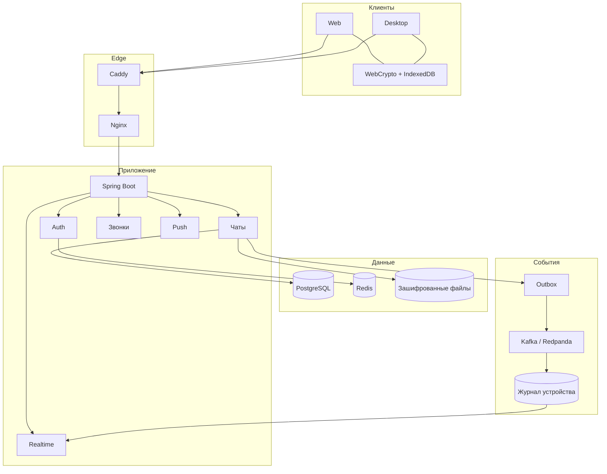

<div align="center">

# Chaos

**Self-hosted зашифрованный мессенджер для web и desktop.**

Личные чаты · Группы · Голос и кружки · 1:1 звонки · Мультидевайсное E2EE

[](https://github.com/vaazhen/chaos-e2ee-messenger/actions/workflows/ci.yml)
[](backend/)
[](backend/)
[](frontend/)
[](LICENSE)

[English](README.md) · [Запуск](#запуск) · [Безопасность](#безопасность) · [Архитектура](#архитектура) · [Self-host](#self-host)

</div>

Chaos — мессенджер, который ты поднимаешь сам. Сообщения, фото, файлы, голосовые и видео-кружки шифруются на устройстве до отправки на сервер. Для команды это похоже на Slack или Mattermost, по контенту — на Signal: хост переписку не читает.

Проект не связан с Signal и не копирует Signal Protocol. Независимого криптоаудита пока нет. Это не готовый продукт для высокорисковых секретов.

---

## Продукт

| | |
|---|---|
| **Чаты** | Личные, группы и сохранённые сообщения. Ответы, правки, удаление, реакции, typing, delivery/read receipts, исчезающие сообщения. |
| **Медиа** | Зашифрованные фото, файлы, голосовые и кружки. Запись с удержанием, lock или отмена, окно отправки, листание в чате. |
| **Звонки** | 1:1 аудио и видео, своя камера в картинке. |
| **Доверие** | Safety Number и QR. Смена ключа устройства — security event, не тихий апдейт. |
| **Устройства** | У каждого устройства свои ключи. Сообщение шифруется отдельно на каждое, включая твои другие устройства. |
| **Клиенты** | Web и Electron. Web Push. |
| **Backup** | Зашифрованная копия ключей. Passphrase не уходит на сервер. Восстанавливает identity, не историю чатов. |

Сервер хранит аккаунты, состав чатов, ciphertext, метаданные доставки и signaling звонков. Он не получает открытый текст сообщений и файлов, приватные ключи и passphrase backup. Связи, время и размер ciphertext он всё равно видит — тот же класс метаданных, который честно описывают Signal и Mattermost: контент закрыт, трафик-анализ нет.

Звонки идут по DTLS-SRTP. Signaling (кто кому звонил, SDP, ICE) проходит через сервер. В production звонки выключены, пока перед WebRTC нет TURN.

---

## Запуск

Нужны Docker Engine, Docker Compose v2 и примерно 4 ГБ свободной памяти.

```bash
git clone https://github.com/vaazhen/chaos-e2ee-messenger.git
cd chaos-e2ee-messenger
cp .env.example .env
```

Замени все `CHANGE_ME`:

```bash
openssl rand -base64 32   # POSTGRES_PASSWORD
openssl rand -base64 32   # REDIS_PASSWORD
openssl rand -base64 48   # JWT_SECRET
openssl rand -base64 32   # GRAFANA_ADMIN_PASSWORD
```

Для localhost:

```dotenv
DOMAIN=localhost
CORS_ORIGINS=https://localhost
CHAOS_DEMO_ENABLED=false
KAFKA_BOOTSTRAP_SERVERS=localhost:19092
```

```bash
docker compose up --build -d
```

Открой [https://localhost](https://localhost). Зарегистрируй два аккаунта и напиши в личку. На localhost Caddy использует локальный CA, на реальном домене — публичный сертификат.

Остановка: `docker compose down`. Стереть данные: `docker compose down -v`.

### Разработка

```bash
cd backend && docker compose -f docker-compose.dev.yml up -d && ./mvnw spring-boot:run
cd frontend && cp .env.example .env && npm ci && npm run dev
```

API: `http://localhost:8080`. Приложение: `http://localhost:5173`. Dev-compose поднимает PostgreSQL, Redis, Redpanda и coturn, чтобы два браузера на одной машине могли звонить друг другу.

Desktop:

```bash
cd frontend
cp .env.electron.example .env.electron
npm run electron:dev
```

Сборка Electron требует абсолютные `https` / `wss` endpoints.

---

## Безопасность

Клиент шифрует через WebCrypto: X25519 identity, X3DH-inspired handshake, Double Ratchet-style цепочки и AES-256-GCM для сообщений и вложений. На каждое устройство получателя — свой envelope.

| Сервер может видеть | Сервер не должен получать |
|---|---|
| Аккаунты, профили, состав чатов | Открытый текст сообщений |
| Id устройств и публичные pre-key bundles | Приватные identity и pre-keys |
| Зашифрованные envelopes и файлы | Plaintext вложений и ratchet-ключи |
| Время доставки и размер ciphertext | Passphrase backup |
| Signaling звонка (участники, SDP, ICE) | Открытое call media |

E2EE не спасает от взломанной ОС, вредоносного расширения браузера, подменённого JavaScript на доверенном origin и незаблокированного рабочего стола.

Backup восстанавливает криптографическую identity. Историю сообщений и все старые ratchet-сессии он не обещает.

---

## Архитектура


```mermaid
flowchart TB
    subgraph Clients[Клиенты]
        WEB[Web]
        DESKTOP[Desktop]
        CRYPTO[WebCrypto + IndexedDB]
        WEB --- CRYPTO
        DESKTOP --- CRYPTO
    end

    subgraph Edge
        CADDY[Caddy]
        NGINX[Nginx]
    end

    subgraph Application[Приложение]
        API[Spring Boot]
        AUTH[Auth]
        CHAT[Чаты]
        RT[Realtime]
        CALLS[Звонки]
        PUSH[Push]
    end

    subgraph Data[Данные]
        PG[(PostgreSQL)]
        REDIS[(Redis)]
        BLOB[(Зашифрованные файлы)]
    end

    subgraph Events[События]
        OUTBOX[Outbox]
        KAFKA[Kafka / Redpanda]
        DURABLE[(Журнал устройства)]
    end

    WEB --> CADDY
    DESKTOP --> CADDY
    CADDY --> NGINX
    NGINX --> API
    API --> AUTH
    API --> CHAT
    API --> RT
    API --> CALLS
    API --> PUSH
    AUTH --> REDIS
    CHAT --> PG
    CHAT --> BLOB
    CHAT --> OUTBOX
    OUTBOX --> KAFKA
    KAFKA --> DURABLE
    DURABLE --> RT
```

Отправка — одна транзакция: сообщение, envelopes, строка outbox. После commit publisher пишет в Kafka. Consumer сначала пишет durable-лог устройства, потом уведомляет по WebSocket и push. Если брокер лежит, outbox ретраится. Клиенты догоняют через `/api/realtime/sync`. Typing и presence в этот контур не входят.

Стек: React 18, Vite, Electron, Java 17, Spring Boot 3.5, PostgreSQL 16, Redis 7, Kafka-compatible брокер, Caddy, Nginx, Prometheus, Grafana, Loki.

```text
backend/     API, Flyway, тесты
frontend/    Web, Electron, crypto-движок
infra/       Caddy, Prometheus, Loki
k8s/         Stateless production-манифесты
docs/        Runbooks и production checklist
```

---

## Self-host

Манифесты в `k8s/` поднимают stateless-приложение. PostgreSQL, Redis, Kafka, object storage и secret manager — снаружи.

```bash
kubectl kustomize k8s/
kubectl apply -k k8s/
```

Подробнее: [k8s/README.md](k8s/README.md) и [docs/PRODUCTION_READINESS.md](docs/PRODUCTION_READINESS.md).

<details>
<summary>Переменные окружения</summary>

| Переменная | Назначение |
|---|---|
| `POSTGRES_PASSWORD` | Пароль БД |
| `REDIS_PASSWORD` | Пароль Redis |
| `JWT_SECRET` | Секрет подписи JWT |
| `DOMAIN` | Публичный hostname для Caddy |
| `CORS_ORIGINS` | Доверенный web origin |
| `KAFKA_BOOTSTRAP_SERVERS` | Kafka-compatible брокеры |
| `CHAOS_ATTACHMENTS_MAX_BYTES` | Максимальный размер encrypted upload |
| `CHAOS_CALLS_ENABLED` | Signaling 1:1 звонков; вне `dev` выключено |
| `VAPID_PUBLIC_KEY` / `VAPID_PRIVATE_KEY` | Web Push |

Полные примеры: `.env.example`, `backend/.env.example`, `frontend/.env.example`.

</details>

CI собирает, тестирует, сканирует и публикует образы. Staging и production закрыты гейтами. Runbooks по авариям — в [`docs/runbooks/`](docs/runbooks/).

### Проверки

```bash
cd backend && ./mvnw --batch-mode --no-transfer-progress verify
cd ../frontend && npm ci && npm run lint && npm run typecheck && npm run test:coverage -- --run && npm run build
```

---

## Roadmap

- Закончить strict TypeScript-миграцию crypto-движка
- Production object storage для зашифрованных вложений
- Production TURN, устойчивый call state и групповые звонки
- Внешний pentest и криптоаудит
- Формальная спецификация протокола и тестовые векторы

---

## Вклад

Небольшие сфокусированные PR. Перед отправкой:

```bash
cd backend && ./mvnw verify
cd ../frontend && npm run lint && npm run typecheck && npm run test:coverage -- --run && npm run build
```

Уязвимости лучше не светить публично до фикса.

## Лицензия

[Apache License 2.0](LICENSE).
